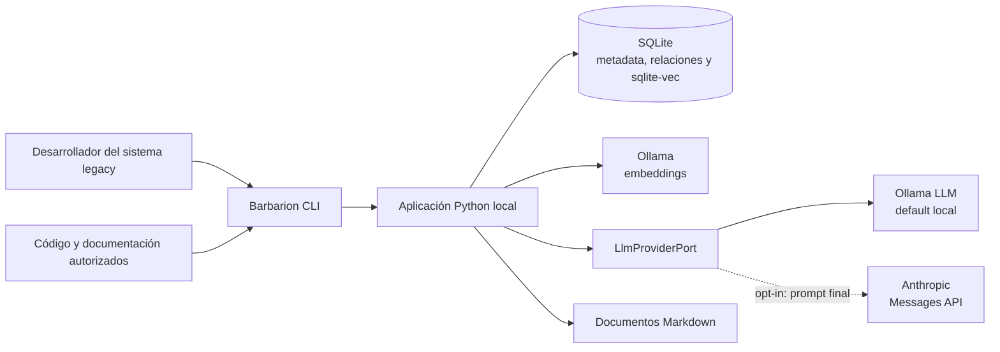
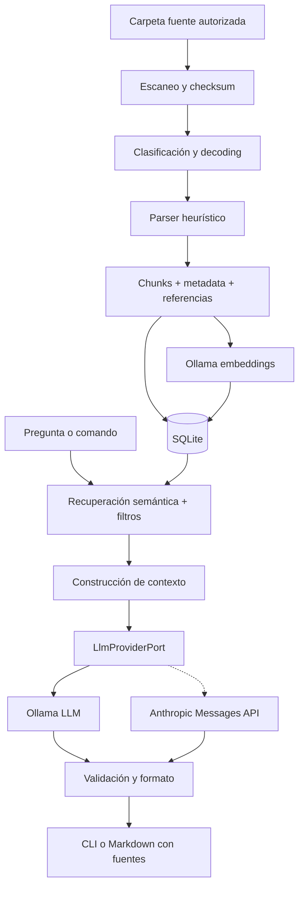
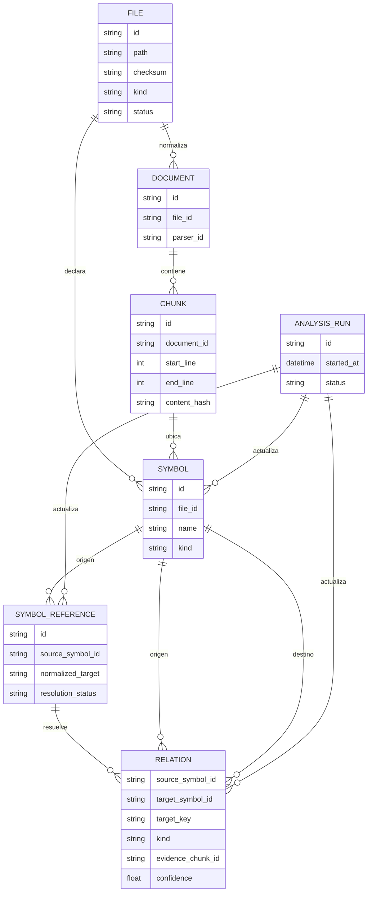
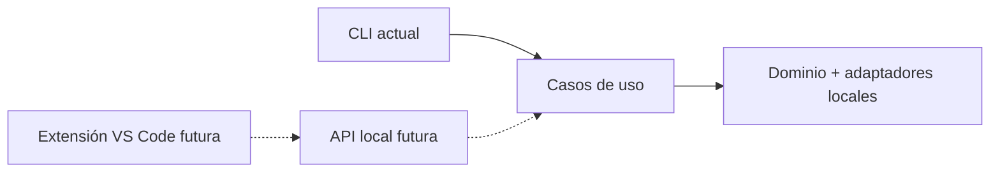

# Barbarion — Arquitectura vigente

## 1. Objetivo arquitectónico

La arquitectura soporta un flujo local completo de construcción de conocimiento —ingestar, buscar, analizar y documentar— con la menor cantidad razonable de componentes. La generación final puede ejecutarse localmente o mediante Anthropic sin mover embeddings, retrieval, SQLite, ingeniería inversa ni validación. Barbarion es una **aplicación Python modular de un solo proceso**, invocada desde CLI y respaldada por almacenamiento local.

La separación entre módulos existe para mantener el código comprensible y comprobable, no para desplegar servicios independientes.

## 2. Decisiones principales

| Área | Decisión del MVP | Motivo |
|---|---|---|
| Interfaz | CLI | Menor costo, fácil de automatizar y suficiente para validar valor |
| Backend | Python 3.12, una aplicación | Ecosistema sólido para parsing, RAG y adaptadores generativos pequeños |
| API HTTP | No usar inicialmente | FastAPI no aporta al flujo CLI de un solo usuario; puede añadirse como adaptador futuro |
| Metadata | SQLite | Local, transaccional, inspeccionable y sin servidor |
| Vectores | SQLite + sqlite-vec | Mantiene metadata y vectores en el mismo archivo local y conserva el índice reconstruible |
| Embeddings | Ollama | La construcción semántica del conocimiento permanece local |
| LLM | Ollama por defecto o Anthropic | El puerto estable desacopla la generación del hardware sin crear una plataforma multiproveedor |
| Entregables | Markdown | Legible, editable, versionable y adecuado para specs |
| Parsing | Heurísticas por tipo + fallback de texto | Valor temprano sin intentar compiladores completos |
| Arquitectura | Monolito modular con puertos pequeños | Evoluciona sin introducir distribución prematura |

Los nombres concretos de modelos se definen en configuración. Los modelos Ollama se validan en el hardware objetivo y el modelo Anthropic debe estar autorizado para la cuenta. Ningún nombre forma parte del dominio ni queda codificado en la lógica.

## 3. Contexto del sistema



El corpus, SQLite, vectores y análisis se ejecutan dentro del entorno controlado. Barbarion no necesita conectarse a una base Oracle productiva: analiza artefactos exportados y documentación autorizada. La única frontera cloud implementada es la solicitud generativa a Anthropic cuando se selecciona explícitamente.

## 4. Flujo principal



### Ingesta

1. El escáner aplica rutas incluidas, exclusiones y límites.
2. Se calcula un checksum para decidir si el archivo debe procesarse.
3. El decoder conserva información sobre encoding y registra sustituciones o fallos.
4. El parser extrae unidades lógicas y referencias conocidas; si falla, se usa texto segmentado.
5. SQLite guarda la identidad, procedencia, estado y relaciones.
6. Ollama genera embeddings y SQLite/sqlite-vec almacena cada vector con un identificador estable.
7. Una operación de sincronización retira metadata y vectores obsoletos.

### Consulta RAG

1. La consulta se convierte en embedding.
2. sqlite-vec recupera candidatos, opcionalmente filtrados por metadata.
3. SQLite aporta datos de archivo, objeto y relaciones simples.
4. Un ensamblador limita y ordena el contexto según presupuesto configurable.
5. La factoría cerrada selecciona Ollama o Anthropic sin modificar el texto construido por `PromptBuilder`.
6. El proveedor responde bajo la misma plantilla que exige evidencia, supuestos y límites.
7. La salida valida que las referencias apunten a fragmentos recuperados.

La validación de referencias reduce afirmaciones no sustentadas, pero no convierte la salida del modelo en una verdad automática. La revisión humana sigue siendo obligatoria.

## 5. Componentes internos

### 5.1 CLI

Responsabilidades:

- interpretar comandos y opciones;
- cargar configuración;
- presentar progreso, resultados y errores;
- devolver códigos de salida útiles.

Comandos previstos, incorporados por hito:

```text
barbarion doctor
barbarion models list
barbarion models show <modelo>
barbarion models install <modelo>
barbarion models validate <modelo>
barbarion models select <modelo>
barbarion models benchmark --models <modelo-1> <modelo-2>
barbarion ingest <ruta>
barbarion status
barbarion search "consulta"
barbarion ask "pregunta"
barbarion describe <objeto>
barbarion impact <objeto>
barbarion spec create <nombre>
```

Los comandos expresan casos de uso. No deben contener lógica de parsing, recuperación ni generación.

### 5.2 Configuración

Un archivo local, por ejemplo `barbarion.toml`, define:

- identificador del único dominio configurado para la validación;
- rutas de entrada, salida y datos;
- inclusiones y exclusiones;
- URL local de Ollama, proveedor generativo y modelos seleccionados;
- timeout, temperatura y opciones exclusivas de Ollama o Anthropic;
- tamaños y solapamiento de chunks;
- top-k y límites de contexto;
- ubicación de SQLite y configuración de sqlite-vec;
- nivel de logging.

Se versiona un archivo de ejemplo, no la configuración con rutas, secretos o datos reales. `ANTHROPIC_API_KEY` se obtiene únicamente del entorno y se valida tarde, al generar; TOML y CLI no admiten credenciales. Los valores efectivos pueden mostrarse sin acceder ni revelar la key.

### 5.3 Ingesta y parsers

Se define un contrato pequeño para los parsers: reciben texto y contexto del archivo; devuelven fragmentos, símbolos, referencias, advertencias y posición de origen.

Parsers iniciales:

- **PLSQL:** detecta package, procedure, function, trigger, view y bloques; busca referencias frecuentes a tablas, vistas y llamadas a otros objetos;
- **PowerBuilder:** reconoce cabeceras exportadas, objetos, eventos, funciones, DataWindows, SQL embebido y llamadas comunes;
- **Markdown/texto:** segmenta por encabezados y bloques;
- **fallback:** divide texto por ventanas controladas cuando no reconoce estructura.

Reglas importantes:

- nunca descartar el contenido porque una heurística no lo entienda;
- conservar archivo, líneas y parser utilizado;
- distinguir símbolo declarado, referencia detectada e inferencia;
- registrar confianza o método, no inventar certeza;
- probar parsers con fixtures pequeños y casos reales anonimizados.

No se usará un AST universal ni una gramática completa durante el MVP.

### 5.4 Metadata en SQLite

Modelo conceptual mínimo:



Este modelo puede evolucionar mediante migraciones pequeñas. Las tablas permanentes de reverse engineering usan nombres sin prefijo de hito: `analysis_runs`, `symbols`, `symbol_references`, `relations`, `relation_candidates` y `generated_artifacts`. `target_key` permite registrar una referencia aunque el destino aún no se haya resuelto.

### 5.5 Vector store local

sqlite-vec guarda en SQLite:

- ID estable del chunk;
- vector de embedding;
- metadata mínima para filtros: dominio, tipo, ruta y símbolo principal;
- hash del contenido y versión del modelo de embedding.

SQLite es la fuente de verdad de procedencia, estado y vectores. El índice vectorial es reconstruible desde `chunks` y los manifiestos de embeddings. Si cambia el modelo de embedding, se crea o reconstruye el manifiesto; no se mezclan dimensiones ni modelos silenciosamente.

Durante el MVP se usa SQLite + sqlite-vec. Qdrant queda como alternativa futura si aparecen límites reales de volumen, filtros, bloqueo o concurrencia.

### 5.6 RAG

El RAG básico tendrá cuatro pasos explícitos:

1. **retrieve:** similitud vectorial y filtros;
2. **assemble:** deduplicación, orden y límite de contexto;
3. **generate:** prompt con la pregunta y fragmentos numerados;
4. **ground:** comprobación de que las citas correspondan a los fragmentos entregados.

Formato recomendado de respuesta:

```markdown
## Conclusión
...

## Evidencia
- [F1] `ruta/archivo.sql`, objeto `...`, líneas 10–42

## Supuestos y límites
- ...
```

No se implementarán planificación multiagente, memoria conversacional compleja ni cadenas autónomas. Si una pregunta necesita varios pasos, el usuario los ejecutará como comandos explícitos.

### 5.7 Reverse engineering

La capa de análisis combina:

- símbolos y relaciones deterministas o heurísticas guardadas en SQLite;
- fragmentos recuperados por RAG;
- plantillas específicas para descripción e impacto;
- LLM para sintetizar, nunca para ocultar la procedencia.

Las relaciones se recorren con consultas SQL y profundidad limitada. Esto cubre los primeros casos sin introducir una base de grafos. Los documentos deben separar:

- **detectado:** respaldado directamente por código o metadata;
- **inferido:** conclusión razonable del modelo;
- **por confirmar:** falta evidencia o requiere validación funcional.

### 5.8 Generación de Markdown y Spec Mode

Los renderers reciben datos estructurados y producen archivos Markdown mediante plantillas versionadas. La generación debe ser determinista en estructura aunque el contenido sintetizado provenga del LLM.

Tipos iniciales:

- inventario técnico;
- ficha de componente;
- análisis de impacto;
- spec con `requirements.md`, `design.md`, `tasks.md` y `test-plan.md`.

Antes de escribir se valida la ruta de salida. Un archivo existente no se reemplaza sin una opción o confirmación explícita. Los artefactos incluyen fecha, versión de plantilla, fuentes y advertencias; no necesitan metadata propietaria.

Spec Mode coordina evidencia documental H3, impacto técnico H4, síntesis conservadora, Review de `SpecDraft`, render Markdown, `SpecValidator` y escritura segura. La CLI solo orquesta argumentos y presentación; no recalcula RAG/H4 ni reemplaza revisión humana.

### 5.9 Gestión y evaluación de modelos locales

H1.1 agrega una capacidad lateral al monolito y no modifica ingesta, retrieval, embeddings, conocimiento persistido, reverse engineering ni Spec Mode.

- Ollama es la fuente de verdad del catálogo de modelos instalados.
- `[llm].model` en la configuración efectiva es la única fuente de verdad del modelo del proveedor generativo activo; `[embeddings].model` permanece independiente y Ollama-only.
- Los servicios de aplicación listan, inspeccionan, instalan, validan y seleccionan modelos mediante un cliente pequeño de la API local de Ollama.
- La selección valida previamente el modelo y edita de forma atómica solo `[llm].model` cuando `[llm].provider = "ollama"`; con Anthropic se bloquea para no reemplazar el modelo Claude.
- `models validate` exige un modelo Ollama explícito cuando Anthropic está activo. Listar, mostrar, instalar y ejecutar el benchmark continúan disponibles y nunca usan la factoría generativa.
- El benchmark reutiliza el constructor de contexto, el prompt y el validador RAG existentes sobre un dataset sintético congelado. Ejecuta los modelos secuencialmente, aplica scoring determinista y produce JSON y Markdown locales.
- Los reportes del benchmark no se guardan en SQLite y una recomendación nunca selecciona automáticamente un modelo; la adopción requiere `models select` explícito y revisión humana.

### 5.10 Inferencia remota con Anthropic

H1.2 cambia únicamente el adaptador que genera la respuesta final:

- `LlmProviderPort.generate()` conserva su firma y `AskService`, `PromptBuilder`, reparación y validación de citas mantienen sus contratos.
- `_build_llm_provider` es una factoría cerrada de dos ramas: Ollama o Anthropic. No existe registry dinámico ni abstracción para otros proveedores cloud.
- `AnthropicLlmProvider` usa `urllib` y realiza un único `POST` no streaming a Messages API, con endpoint y `anthropic-version` fijos.
- La key se resuelve desde `ANTHROPIC_API_KEY` al iniciar `generate`; cargar configuración, evidencia insuficiente y `--no-llm` no requieren secreto ni red.
- `max_output_tokens` solo es válido para Anthropic; `think` y `num_ctx` solo son válidos para Ollama.
- Generación y reparación usan el mismo proveedor. No existen retries, fallback entre proveedores ni respuesta parcial cuando `stop_reason = max_tokens`.
- `describe` e `impact --with-llm` usan la misma factoría y conservan su fallback determinista ante un error del proveedor.
- El adaptador agrega uso de tokens y tiempo transcurrido sin cambiar el puerto. No calcula costos ni denomina créditos a los tokens.

La frontera remota contiene únicamente el payload de Messages API y el prompt ya
construido. Ninguna tabla, vector, manifest, variable de entorno o archivo
completo adicional se serializa. Prompts, respuestas, key, request-id y uso no
se persisten en SQLite ni generan cachés o artefactos H1.2.

## 6. Estructura de referencia

La siguiente estructura es un objetivo incremental. **No es necesario crear todas las carpetas hasta que el hito correspondiente las use.**

```text
Barbarion/
├── README.md
├── LICENSE
├── .gitattributes
├── .gitignore
├── pyproject.toml                 # H1
├── barbarion.example.toml        # H1
├── docs/
│   ├── README.md
│   ├── VISION.md
│   ├── ROADMAP.md
│   ├── ARCHITECTURE.md
│   ├── DECISIONS.md
│   └── references/                # Propuestas históricas
├── src/
│   └── barbarion/
│       ├── __init__.py
│       ├── cli.py                # Adaptador CLI
│       ├── config.py             # Configuración validada
│       ├── application/          # Casos de uso, sin detalles de CLI
│       │   ├── ingest.py
│       │   ├── local_models.py
│       │   ├── model_benchmark.py
│       │   ├── query.py
│       │   ├── analyze.py
│       │   └── specs.py
│       ├── domain/               # Modelos y reglas pequeñas
│       │   ├── models.py
│       │   └── ports.py
│       └── infrastructure/       # Adaptadores de persistencia y proveedores
│           ├── parsers/
│           │   ├── plsql.py
│           │   ├── powerbuilder.py
│           │   └── text.py
│           ├── sqlite.py
│           ├── ollama.py
│           ├── anthropic.py
│           ├── ollama_models.py
│           ├── model_config.py
│           └── markdown.py
├── templates/                    # Plantillas Markdown versionadas
├── tests/
│   ├── fixtures/                 # Corpus sintético/anonimizado
│   ├── unit/
│   └── integration/
├── specs/
│   ├── H1-Foundation/
│   ├── H1.1-LocalModelManagement/
│   ├── H1.2-RemoteInference/
│   ├── H2-Ingestion/
│   ├── H3-RAG/
│   ├── H4-ReverseEngineering/
│   └── H5-SpecMode/
├── data/                         # Local, ignorado por Git
│   ├── sqlite/
│   └── cache/
└── output/                       # Documentos generados; política por definir
```

La división `application/domain/infrastructure` debe mantenerse ligera. Si un archivo simple basta, no se crea una jerarquía adicional. Los archivos `__init__.py` se añaden solo cuando el paquete correspondiente exista.

## 7. Límites y dependencias

### Dependencias permitidas con intención clara

- una biblioteca CLI madura;
- validación de configuración;
- cliente de Ollama;
- cliente HTTP Anthropic directo sobre biblioteca estándar;
- acceso estándar o liviano a SQLite;
- sqlite-vec para búsqueda vectorial local;
- motor de plantillas Markdown;
- framework de pruebas y herramientas de calidad.

Se evitará adoptar un framework RAG grande al inicio. Las cuatro operaciones del RAG son suficientemente pequeñas para implementarlas de forma explícita, facilitar diagnóstico y limitar dependencias.

### Fronteras de seguridad

- solo se procesan rutas configuradas y autorizadas;
- se excluyen por defecto secretos, binarios, carpetas de build y control de versiones;
- los logs no vuelcan prompts, respuestas, headers ni secretos; el modo `--debug` es explícito y efímero, trunca contenido y enmascara patrones sensibles reconocidos;
- no se ejecuta código fuente ingerido;
- no se conecta a Oracle productivo;
- Ollama apunta al endpoint local configurado;
- Anthropic apunta a un endpoint HTTPS fijo, rechaza redirects y nunca reenvía key o contexto a otro destino;
- la key no se representa, registra ni persiste, y una coincidencia exacta dentro del prompt o la respuesta se bloquea.

## 8. Observabilidad y manejo de errores

Para un MVP local basta con:

- logs estructurados legibles con nivel configurable;
- ID de corrida de ingesta;
- conteos de procesados, omitidos, actualizados y fallidos;
- tiempos por etapa y latencia de consulta;
- proveedor, modelo, tamaños, tokens informados y tiempo de generación sin contenido sensible;
- comando `doctor` para rutas, SQLite, sqlite-vec y Ollama;
- mensajes de error con archivo y acción recomendada.

No se requiere una plataforma de métricas, trazas distribuidas ni telemetría remota.

H3.1 agrega `h31_observability_v1` como resumen efimero y seguro para comparar
politicas RAG. Contiene composicion y estimacion local por solicitud, presupuesto,
decisiones de candidatos, redundancia y cobertura de citas; generation y repair
permanecen separadas. `repair_outcome` agrega causas por categoría, intento y
éxito sin copiar claims; el repair recibe el mismo diagnóstico seguro y no puede
agregar hechos. No contiene pregunta, prompt, respuesta ni contenido de
fuentes. Los contadores reales opcionales se etiquetan `provider_*_tokens` y
nunca se derivan de `chars4_v1`. La CLI los presenta en stderr; SQLite conserva
su esquema vigente y los reportes versionados usan solo agregados sinteticos.
La selección `baseline_v1` continúa como default. `optimized_v1` es opt-in,
requiere el presupuesto estimado del input completo y fusiona rangos relativos
de las familias H3/H4.1 sin alterar sus scores originales. Usa desempates
deterministas antes de ordenar la presentación. `trim_overlap_v1` recorta solo
igualdad sufijo/prefijo con documento y continuidad de rangos demostrables. La
guía operativa y de métricas está en
[`H31-RAG-CONTEXT.md`](H31-RAG-CONTEXT.md).
Los candidatos sin contenido materializable se trazan como `missing_content`
antes de gastar `top_k` en `optimized_v1`. En un indexado global con limpieza
habilitada, el adaptador vectorial elimina entradas cuyo `chunk_id` ya no existe;
los alcances parciales no aplican esa limpieza global.

## 9. Estrategia de pruebas

- **Unitarias:** chunking, checksums, parsers, filtros, renderers y validadores de citas.
- **Integración:** SQLite, sqlite-vec, Ollama y Anthropic sustituibles por fakes estables.
- **Golden files:** Markdown esperado para entradas controladas.
- **Evaluación RAG:** conjunto versionado de preguntas, fuentes esperadas y métrica top-k.
- **Smoke test:** recorrido CLI mínimo sobre un corpus pequeño.
- **Validación humana:** tres casos del dominio configurado para utilidad y falsos positivos.

La suite normal bloquea conexiones externas salvo loopback y no requiere modelos, API keys ni servicios reales. Las integraciones reales con Ollama o Anthropic se ejecutan de forma separada y explícita; Anthropic solo puede validarse con datos sintéticos y autorización.

## 10. Evolución futura sin implementarla ahora

Una extensión de VS Code puede añadirse después como un adaptador que invoque la CLI o una API local estable:



FastAPI solo se justificará cuando una interfaz futura necesite comunicación persistente o múltiples clientes. La lógica de negocio permanecerá fuera de la API, por lo que añadirla no exigirá reescribir el núcleo.

Otras evoluciones posibles —un segundo dominio, más formatos, Qdrant como alternativa vectorial o un grafo— requieren evidencia de necesidad, una spec propia y métricas que justifiquen el costo.

## 11. Criterios de calidad arquitectónica

La arquitectura se considera adecuada para el MVP si:

- el flujo completo puede ejecutarse desde CLI en una máquina local con Ollama o `--no-llm`, y puede delegar solo la generación a Anthropic;
- cada fragmento y relación puede rastrearse a su fuente;
- el índice sqlite-vec puede reconstruirse desde chunks y manifiestos en SQLite;
- un fallo de parser o archivo no invalida toda la ingesta;
- modelos y rutas cambian por configuración;
- los módulos centrales pueden probarse sin ejecutar un LLM real;
- la generación no sobrescribe trabajo humano por defecto;
- agregar una interfaz futura no exige mover la lógica de aplicación;
- el repositorio sigue siendo comprensible para una persona sin operar infraestructura adicional.
