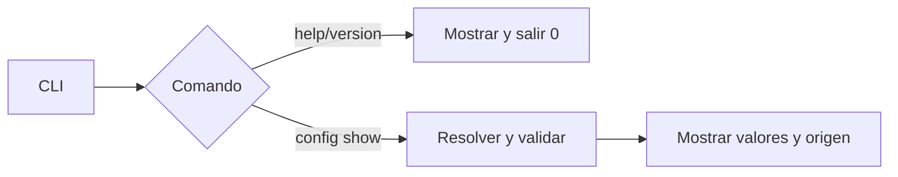
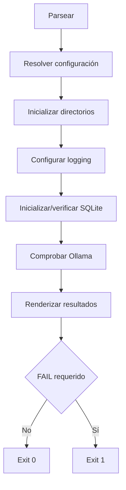

# H1 — Foundation: Diseño

## 1. Objetivo

Construir una base Python local, instalable y comprobable sin capacidades del dominio. El diseño privilegia biblioteca estándar, módulos pequeños y flujo explícito.

## 2. Decisiones cerradas

| Tema | Decisión | Justificación |
|---|---|---|
| Python | CPython `>=3.12,<3.13` | Coincide con la arquitectura y permite `tomllib` |
| Packaging | `pyproject.toml` con `setuptools.build_meta` | Convención estándar sin herramienta adicional |
| Layout | `src/` layout | Evita importar código no instalado |
| CLI | `argparse`, con ayuda y mensajes en español | Cubre los comandos sin dependencia runtime |
| Configuración | `tomllib`, dataclass inmutable y validación propia | El esquema H1 es pequeño |
| Rutas | `pathlib.Path` | Portabilidad y normalización explícita |
| Logging | `logging` estándar | Suficiente para consola y archivo |
| Persistencia | `sqlite3` y SQL explícito | Solo hay una migración y health check |
| Ollama | `urllib.request` contra `/api/tags` | Diagnóstico simple sin SDK |
| Pruebas | `pytest` como única dependencia dev obligatoria | Fixtures temporales con poco código |
| Arquitectura | Módulos directos en un proceso | No hay complejidad que justifique capas |

No quedan elecciones de framework abiertas para implementar H1.

## 3. Estructura final

```text
Barbarion/
├── pyproject.toml
├── barbarion.example.toml
├── README.md
├── src/
│   └── barbarion/
│       ├── __init__.py
│       ├── __main__.py
│       ├── cli.py
│       ├── config.py
│       ├── bootstrap.py
│       ├── logging_config.py
│       ├── database.py
│       └── doctor.py
├── tests/
│   ├── unit/
│   │   ├── test_config.py
│   │   ├── test_bootstrap.py
│   │   ├── test_logging_config.py
│   │   ├── test_database.py
│   │   └── test_doctor.py
│   └── smoke/
│       └── test_cli_smoke.py
└── specs/H1-Foundation/
```

No se crean todavía `application/`, `domain/`, `infrastructure/`, parsers, clientes de modelos ni módulos vacíos de hitos futuros.

## 4. Módulos

### `__init__.py`

- define `__version__` como fuente única de versión;
- no ejecuta inicialización ni imports con efectos secundarios.

La versión inicial será `0.1.0`; `pyproject.toml` la obtiene dinámicamente desde `barbarion.__version__`.

### `__main__.py`

- permite `python -m barbarion`;
- llama a `cli.main()` y transforma su retorno en `SystemExit`;
- no contiene lógica propia.

### `cli.py`

- construye el árbol `argparse`;
- implementa `--version`, `--config PATH`, `doctor` y `config show`;
- traduce errores conocidos a mensaje y código;
- maneja `KeyboardInterrupt` como `130`.

Ayuda y versión no cargan configuración ni inicializan el filesystem.

### `config.py`

- define `Settings` como `@dataclass(frozen=True, slots=True)`;
- resuelve precedencia y carga TOML;
- rechaza claves desconocidas y valida tipos/valores;
- normaliza rutas sin exigir existencia;
- produce salida ordenada para `config show`.

| Campo | Tipo | Default |
|---|---|---|
| `domain` | `str` no vacío | `default` |
| `data_dir` | `Path` | `./data` |
| `output_dir` | `Path` | `./output` |
| `logs_dir` | `Path` | `./logs` |
| `database_path` | `Path` | `./data/barbarion.db` |
| `log_level` | nivel textual | `INFO` |
| `ollama_url` | URL HTTP(S) sin credenciales | `http://127.0.0.1:11434` |
| `ollama_timeout_seconds` | `float`, `0 < value <= 10` | `2.0` |

El TOML usa claves de nivel raíz. `Settings` conserva además `config_source: Path | None`, que no forma parte del archivo.

Hitos futuros podrán incorporar secciones como `[ingestion]`, `[rag]` y `[spec]` cuando existan requisitos concretos. H1 no crea secciones vacías ni las acepta anticipadamente; sus claves planas permanecen sin cambios.

### `bootstrap.py`

- crea directorios con `mkdir(parents=True, exist_ok=True)`;
- verifica que cada ruta esperada sea directorio;
- comprueba escritura mediante un temporal que elimina de inmediato;
- devuelve resultados estructurados, sin imprimir;
- deduplica rutas, incluido el padre de `database_path`.

### `logging_config.py`

- configura el logger `barbarion`;
- añade `StreamHandler(stderr)` y `FileHandler(<logs_dir>/barbarion.log, encoding="utf-8", delay=True)`;
- usa `%(asctime)s %(levelname)s %(name)s %(message)s`;
- reemplaza handlers gestionados previamente;
- establece `propagate = False`.

Solo se llama después de inicializar `logs_dir`. `delay=True` impide abrir el archivo hasta emitir el primer registro; ayuda, versión y `config show` nunca configuran logging. No hay rotación, JSON logging ni telemetría en H1.

### `database.py`

- conecta con `sqlite3.connect(path, timeout=5.0)`;
- habilita `PRAGMA foreign_keys = ON`;
- aplica una lista local ordenada de migraciones;
- ejecuta `SELECT 1` y consulta versión;
- usa context managers y rollback ante error;
- no expone ORM, repositorios ni modelos de dominio.

Migración `1`:

```sql
CREATE TABLE IF NOT EXISTS schema_migrations (
    version INTEGER PRIMARY KEY,
    applied_at TEXT NOT NULL
);
```

Se inserta versión `1` con fecha UTC ISO 8601 si no existe. Una versión detectada mayor que la soportada falla sin modificar la base y produce exactamente:

```text
La versión X del esquema de base de datos es más reciente que la admitida por esta versión de Barbarion.
```

`X` se sustituye por la versión detectada.

### `doctor.py`

- define `CheckResult(name, status, detail, required)`;
- ejecuta checks en orden estable;
- recibe una función `ollama_probe` reemplazable en pruebas;
- calcula estado global sin imprimir ni terminar el proceso.

Orden: Python, configuración, data, output, logs, SQLite y Ollama.

## 5. Configuración de ejemplo

```toml
domain = "default"
data_dir = "./data"
output_dir = "./output"
logs_dir = "./logs"
database_path = "./data/barbarion.db"
log_level = "INFO"
ollama_url = "http://127.0.0.1:11434"
ollama_timeout_seconds = 2.0
```

Precedencia:

```text
--config PATH
      │
BARBARION_CONFIG
      │
./barbarion.toml
      │
defaults
```

Una ruta explícita ausente falla; no existe fallback silencioso. Las rutas relativas se resuelven desde el archivo que las define o desde el cwd al usar defaults.

## 6. Flujos

### Comandos informativos



### `doctor`



Configuración no cargable produce código `2` antes de inicializar rutas.

H1 no expone `barbarion init`. De acuerdo con [D-012](../../docs/DECISIONS.md), `doctor` realiza también el bootstrap idempotente. Un comando separado podrá evaluarse cuando exista una necesidad operativa demostrada.

## 7. Salida de `doctor`

```text
PASS  Python          3.12.x
PASS  Configuración   ./barbarion.toml
PASS  Directorio de datos   /ruta/normalizada/data
PASS  Directorio de salida  /ruta/normalizada/output
PASS  Directorio de logs    /ruta/normalizada/logs
PASS  SQLite          schema version 1
WARN  Ollama           no disponible en http://127.0.0.1:11434

Resumen: 6 PASS, 1 WARN, 0 FAIL
```

Nombres, estados, orden y semántica son parte del contrato; el espaciado exacto puede ajustarse.

## 8. Manejo de errores

Solo se necesitan:

- `ConfigError`: archivo ausente explícito, TOML inválido o validación fallida;
- `FoundationError`: inicialización esperada fallida con mensaje de usuario.

Pueden vivir en el módulo que las origina; no se crea una jerarquía general.

Reglas:

- capturar en el límite CLI;
- preservar la causa para pruebas;
- incluir acción y recurso afectado;
- no capturar `BaseException`;
- no borrar SQLite, configuración o directorios para recuperarse;
- presentar en español toda ayuda, diagnóstico y error dirigido al usuario;
- no mostrar traceback en errores esperados.

## 9. Seguridad y privacidad

- Los módulos son import-safe: importar no crea recursos, configura logging, abre SQLite ni llama a la red;
- no ejecutar contenido TOML;
- rechazar credenciales embebidas en `ollama_url`;
- no registrar variables de entorno completas ni corpus;
- operar únicamente sobre rutas configuradas;
- ignorar en Git `barbarion.toml`, `data/`, `output/`, `logs/` y SQLite.

## 10. Decisiones diferidas

H1 no decide modelos, embeddings, Qdrant, parsers, chunking, esquema de ingesta, plantillas, API HTTP, integración con editores, múltiples dominios ni multiusuario. Tampoco crea módulos vacíos para ellos.
