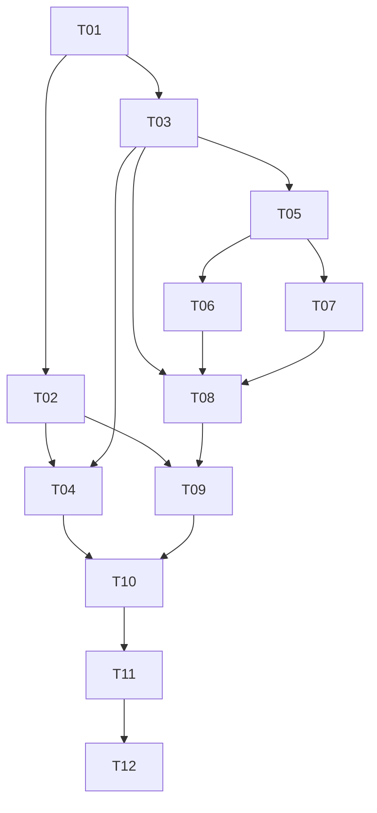

# H1 — Foundation: Plan de tareas

## 1. Reglas

- Cada tarea produce un cambio pequeño y verificable.
- Ninguna debe superar 3 horas; si crece, se divide antes de implementarla.
- Las pruebas se construyen junto con cada capacidad.
- Una tarea termina solo cuando pasan sus verificaciones y no añade alcance excluido.

## 2. Tareas

### H1-T01 — Crear packaging mínimo

**Estado:** completado.

**Estimación:** 1 h  
**Dependencias:** ninguna.  
**Requisitos:** H1-REQ-001, H1-NFR-003, H1-NFR-004.

- crear `pyproject.toml` con `setuptools.build_meta`;
- declarar Python, entry point y extra `dev` con `pytest`;
- crear `__init__.py`, `__main__.py` y `cli.py` mínimo;
- fijar versión `0.1.0`.

**Verificación:** instalación editable; ayuda por ejecutable y módulo.

### H1-T02 — Definir árbol CLI y códigos base

**Estado:** completado.

**Estimación:** 1.5 h  
**Dependencias:** H1-T01.  
**Requisitos:** H1-REQ-002, H1-REQ-010.

- construir parser `argparse`;
- agregar `--version`, `--config`, `doctor` y `config show`;
- implementar despacho, mensajes en español y `KeyboardInterrupt`;
- probar ayuda, versión y códigos base.

**Verificación:** ayuda y versión no crean recursos.

### H1-T03 — Implementar configuración

**Estado:** completado.

**Estimación:** 2.5 h  
**Dependencias:** H1-T01.  
**Requisitos:** H1-REQ-003, H1-REQ-004, H1-NFR-002.

- crear `Settings` y `ConfigError`;
- implementar precedencia, TOML, validación y rutas;
- crear `barbarion.example.toml`;
- probar defaults, orígenes, errores y claves desconocidas.

**Verificación:** `test_config.py` pasa usando rutas temporales.

### H1-T04 — Implementar `config show`

**Estimación:** 1 h  
**Dependencias:** H1-T02, H1-T03.  
**Requisitos:** H1-REQ-005.

- conectar configuración con CLI;
- imprimir origen y campos en orden;
- traducir `ConfigError` a código `2`;
- comprobar ausencia de efectos secundarios.

**Verificación:** stdout estable y filesystem temporal vacío.

### H1-T05 — Inicializar directorios

**Estimación:** 1.5 h  
**Dependencias:** H1-T03.  
**Requisitos:** H1-REQ-006, H1-NFR-002.

- crear `bootstrap.py`;
- deduplicar, crear y comprobar escritura;
- devolver resultados sin imprimir;
- probar idempotencia, archivo en lugar de directorio y permisos mediante monkeypatch si es necesario.

**Verificación:** `test_bootstrap.py` pasa.

### H1-T06 — Configurar logging

**Estimación:** 1 h  
**Dependencias:** H1-T05.  
**Requisitos:** H1-REQ-007.

- crear `logging_config.py`;
- configurar consola y archivo;
- evitar handlers duplicados;
- probar nivel, UTF-8, apertura diferida del archivo y una emisión por evento.

**Verificación:** pruebas pasan sin alterar el root logger.

### H1-T07 — Implementar SQLite inicial

**Estimación:** 2 h  
**Dependencias:** H1-T05.  
**Requisitos:** H1-REQ-008.

- crear `database.py` y migración `1`;
- implementar conexión, transacción, idempotencia y salud;
- detectar versión futura;
- probar base nueva, repetición, rollback, versión futura y su mensaje exacto.

**Verificación:** una sola fila en `schema_migrations` y mensaje estable para versión futura.

### H1-T08 — Implementar checks de `doctor`

**Estimación:** 2 h  
**Dependencias:** H1-T03, H1-T05, H1-T06, H1-T07.  
**Requisitos:** H1-REQ-009, H1-NFR-001.

- crear `doctor.py` y `CheckResult`;
- implementar checks en orden;
- añadir probe Ollama con timeout;
- inyectar el probe para pruebas;
- cubrir disponibilidad, ausencia, timeout y respuesta inválida.

**Verificación:** `test_doctor.py` pasa sin red.

### H1-T09 — Integrar `doctor` con CLI

**Estimación:** 1.5 h  
**Dependencias:** H1-T02, H1-T08.  
**Requisitos:** H1-REQ-006 a H1-REQ-010.

- orquestar configuración, directorios, logging, SQLite y Ollama;
- renderizar resultados y resumen en español;
- aplicar códigos `0`, `1` y `2`;
- asegurar mensajes breves sin traceback.

**Verificación:** éxito, warning de Ollama y fallo requerido.

### H1-T10 — Completar smoke tests

**Estimación:** 1.5 h  
**Dependencias:** H1-T04, H1-T09.  
**Requisitos:** H1-REQ-011, H1-NFR-004.

- crear `tests/smoke/test_cli_smoke.py`;
- probar los cuatro comandos del contrato como subproceso;
- comprobar efectos secundarios, imports puros y segunda ejecución de `doctor`.

**Verificación:** `python -m pytest` pasa sin Ollama ni internet.

### H1-T11 — Documentar operación

**Estimación:** 1 h  
**Dependencias:** H1-T10.  
**Requisitos:** H1-REQ-012.

- documentar instalación, configuración, comandos, códigos y pruebas;
- distinguir capacidades disponibles de las diferidas;
- añadir `logs/` a `.gitignore` y revisar archivos locales;
- comprobar ausencia de rutas o información sensible.

**Verificación:** seguir README desde un entorno limpio.

### H1-T12 — Ejecutar aceptación

**Estimación:** 1.5 h  
**Dependencias:** H1-T01 a H1-T11.  
**Requisitos:** todos.

- ejecutar el test plan;
- revisar trazabilidad;
- verificar Git y exclusiones;
- registrar decisiones nuevas;
- actualizar estado solo si todos los Must pasan.

**Verificación:** evidencia de aceptación y cero capacidades excluidas.

## 3. Dependencias

## 4. Estimación

| Grupo | Horas |
|---|---:|
| Packaging, CLI y configuración | 6.0 |
| Directorios, logging y SQLite | 4.5 |
| Doctor e integración | 3.5 |
| Smoke, documentación y aceptación | 4.0 |
| **Total** | **18.0** |

La estimación se alinea con las 18 horas asignadas a H1 en el roadmap. La reserva transversal permanece disponible para contingencias del MVP; no se usa para ampliar el alcance de H1.
