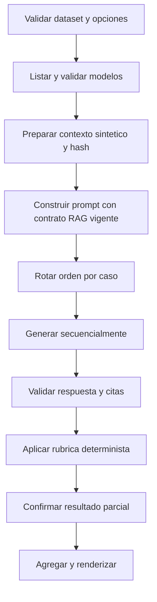
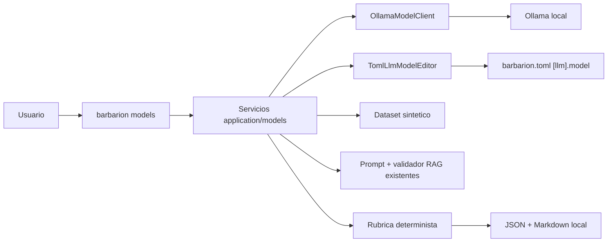

# H1.1 - Gestion y Evaluacion de Modelos Locales: Diseno

## 1. Objetivo de diseno

Agregar administracion y evaluacion del LLM generativo de Ollama como una
capacidad lateral del monolito existente. H1.1 conserva `[llm].model` como fuente
de verdad, encapsula la API local de Ollama en un adaptador pequeno y ejecuta un
benchmark sintetico sobre contratos RAG vigentes, sin introducir otro pipeline
de conocimiento ni un framework de evaluacion.

## 2. Principios aplicados

1. Local primero: no hay proveedores ni evaluadores externos.
2. Configuracion explicita: el modelo activo sigue en TOML.
3. Evidencia antes que elocuencia: cada score expone reglas y casos.
4. Comparacion justa: misma entrada y contexto congelado para todos.
5. Heuristicas honestas: metricas deterministas y limites visibles.
6. Una aplicacion modular: nuevos casos de uso, no un servicio separado.
7. Sin ramas por modelo: Ollama define los modelos instalados.
8. Cambios seguros: no hay instalacion o seleccion implicita.
9. Reutilizacion: prompt, formato y validador RAG siguen siendo los existentes.

## 3. Decisiones de diseno

### H1.1-DD-001 - Un cliente Ollama local pequeno

Se agrega un `OllamaModelClient` bajo `infrastructure/` para las operaciones que
Ollama expone: listar, inspeccionar, instalar y generar con telemetria. Usa
`urllib` como los adaptadores actuales; no agrega SDK ni abstraccion de
proveedores.

El cliente tolera campos opcionales y conserva un error tipado reducido:

- `unavailable`;
- `timeout`;
- `model_not_found`;
- `invalid_response`;
- `operation_failed`;
- `interrupted`.

No ejecuta el binario `ollama`, no construye comandos shell y nunca se conecta a
una URL distinta de `settings.ollama_url`.

### H1.1-DD-002 - `[llm].model` permanece como fuente de verdad

No se crea un registro paralelo en SQLite ni una variable de entorno nueva. El
modelo activo es el valor efectivo ya mostrado por `config show` y consumido por
`OllamaLlmProvider`.

Esto mantiene compatibilidad con todas las configuraciones actuales y evita
precedencias nuevas. `models select` es un editor seguro de esa unica
asignacion, no un nuevo sistema de perfiles.

### H1.1-DD-003 - Casos de uso de administracion en `application`

Los servicios `ListModelsService`, `ShowModelService`, `InstallModelService`,
`SelectModelService` y `ValidateModelService` orquestan modelos de dominio,
cliente Ollama y filesystem. CLI solo transforma argumentos y presenta
resultados.

Modelos de dominio minimos:

```text
LocalModel
  name
  size_bytes?
  modified_at?
  digest?
  metadata limitada

ModelValidation
  model
  available
  installed
  generation_ready
  benchmark_eligible
  marker_found
  duration_ms
  diagnostics
```

No se persiste un catalogo: Ollama es la fuente de verdad de disponibilidad.

### H1.1-DD-004 - Instalacion explicita mediante pull de Ollama

`install` envia el nombre exacto a la operacion de pull soportada por la API
local de Ollama. Puede consumir eventos de progreso, pero el dominio normaliza
solo estado, porcentaje cuando sea calculable y error. Los payloads completos no
se registran.

La operacion termina con una nueva consulta de modelos. No selecciona, valida por
generacion ni modifica TOML automaticamente. Ctrl+C cierra la lectura y devuelve
130; Ollama puede continuar su descarga y esa limitacion se informa.

### H1.1-DD-005 - Edicion TOML acotada y atomica

`TomlLlmModelEditor` trabaja solo sobre `settings.config_source`:

1. lee bytes UTF-8 y detecta newline;
2. localiza una unica seccion `[llm]` y una unica asignacion simple `model =`;
3. sustituye solo el literal de cadena usando escape TOML seguro;
4. escribe un temporal en el mismo directorio;
5. carga el temporal mediante `load_settings` y confirma el valor efectivo;
6. reemplaza atomicamente el original.

Si el archivo usa defaults, no contiene la forma soportada, tiene duplicados,
no es escribible o cambia entre lectura y reemplazo, se aborta. H1.1 no incorpora
una libreria de round-trip TOML ni reserializa todo el archivo. `--dry-run` no
llama al LLM y muestra un resumen sin revelar el contenido completo.

### H1.1-DD-006 - Validacion sintetica minima

La sonda usa un texto constante y no sensible que solicita devolver un marcador
estable, con temperatura cero y limite de salida acotado cuando Ollama lo
admita. Valida:

```text
conectividad -> modelo instalado -> respuesta no vacia -> marcador presente
```

El benchmark requiere esta sonda previa. `doctor` solo puede verificar
conectividad y presencia del activo para conservar su costo y semantica base.

### H1.1-DD-007 - Dataset declarativo JSON

El dataset vive inicialmente en `tests/fixtures/model_benchmark.json` y una
copia operativa versionada se ubica donde la CLI pueda resolverla como recurso
del paquete. Usa JSON por ser inspeccionable y consistente con la evaluacion H3.

Esquema conceptual:

```json
{
  "schema_version": 1,
  "dataset_id": "barbarion-local-llm-synthetic-v1",
  "cases": [
    {
      "id": "syn-001",
      "category": "respuesta_factual",
      "question": "...",
      "context": [
        {"citation_id": "F1", "content": "...", "source": "synthetic/a.txt"}
      ],
      "expected_facts": [
        {"id": "fact-1", "all_terms": ["..."], "citations": ["F1"]}
      ],
      "forbidden_claims": [{"id": "forbidden-1", "any_terms": ["..."]}],
      "instructions": [{"id": "ins-1", "kind": "required_section", "value": "Conclusion"}],
      "expected_validator": "accepted"
    }
  ]
}
```

Las reglas admitidas son cerradas y validadas. No hay expresiones regulares
arbitrarias, codigo ejecutable ni callbacks en el dataset.

### H1.1-DD-008 - Contexto congelado, no nuevo retrieval

Cada caso aporta fragmentos sinteticos ya numerados. El runner los transforma a
los mismos objetos de contexto que recibe actualmente el constructor de prompt.
El contexto serializado se hashea y ese hash debe ser identico para todos los
modelos del caso.

Esta eleccion aisla el LLM generativo. El benchmark H3 existente continua
midiendo retrieval por separado; H1.1 no mezcla recall/MRR con calidad del LLM.
No se ingesta el dataset en la SQLite principal ni se crean embeddings.

### H1.1-DD-009 - Runner secuencial y orden rotado

`ModelBenchmarkService` ejecuta una sola generacion medida por caso/modelo:



La rotacion es `offset = case_index % model_count`. No hay warm-up configurable,
repeticiones, aleatoriedad ni concurrencia. La sonda previa deja el modelo
`generation_ready`, pero no forma parte de las metricas. Ante Ctrl+C se escribe
una unica vez el resultado parcial acumulado; no existe checkpoint reanudable.

### H1.1-DD-010 - Metricas versionadas sin LLM juez

Metricas por ejecucion de caso, todas en escala `0..1` salvo tiempos/tokens:

| Metrica | Calculo inicial v1 |
|---|---|
| `answer_quality` | hechos esperados satisfechos / hechos esperados, menos penalizacion acotada por afirmaciones prohibidas |
| `instruction_following` | instrucciones verificables satisfechas / instrucciones aplicables |
| `groundedness` | afirmaciones evaluables soportadas / afirmaciones evaluables; contradicciones conocidas cuentan como no soportadas |
| `context_use` | hechos que requieren contexto y estan presentes con cita permitida / hechos requeridos |
| `citation_score` | promedio de presencia, validez y cobertura de citas |
| `validator_acceptance` | 1 aceptada, 0 rechazada |

Las afirmaciones evaluables son unidades declaradas por `expected_facts` y
`forbidden_claims`; H1.1 no pretende extraer todas las proposiciones del texto.
La normalizacion es Unicode casefold, espacios canonicos y comparacion de grupos
de terminos declarados. Esto es reproducible pero lexical; el reporte lo dice.

Score agregado v1:

```text
quality_score =
  0.20 * answer_quality +
  0.10 * instruction_following +
  0.20 * groundedness +
  0.10 * context_use +
  0.15 * citation_score +
  0.25 * validator_acceptance
```

Si una metrica no aplica, sus pesos se renormalizan y se registra. Una respuesta
rechazada conserva sus scores parciales pero no puede ser candidata recomendada
si su tasa de aceptacion queda bajo el umbral versionado del reporte.

Telemetria opcional normalizada desde Ollama:

- `total_duration_ns`;
- `load_duration_ns`;
- `prompt_eval_duration_ns`;
- `eval_duration_ns`;
- `prompt_eval_count`;
- `eval_count`.

El tiempo wall-clock de Barbarion siempre se mide. Tokens son aproximados y
`null` si el servidor no los informa.

### H1.1-DD-011 - Recomendacion como regla, no decision automatica

El reporte ordena modelos elegibles por:

1. tasa de aceptacion del validador descendente;
2. `quality_score` descendente;
3. mediana de latencia ascendente;
4. nombre exacto ascendente para desempate estable.

Elegibilidad v1: corrida completa, todos los casos ejecutados y tasa de
aceptacion `>= 0.90`. Si nadie cumple, no hay candidato. El reporte muestra que
la recomendacion solo aplica al dataset, opciones, version Ollama y hardware
registrados. `models select` queda como accion humana separada.

### H1.1-DD-012 - Dos artefactos, sin esquema SQLite nuevo

Cada corrida se escribe en un directorio propio:

```text
<output_dir>/model-benchmarks/<YYYYMMDDTHHMMSSZ-short-id>/model-benchmark.json
<output_dir>/model-benchmarks/<YYYYMMDDTHHMMSSZ-short-id>/model-benchmark.md
```

JSON es la fuente detallada; Markdown resume configuracion, comparacion, fallas,
casos y limites. Stdout muestra un resumen breve y la ruta absoluta. `--output`
cambia el directorio padre. No hay overwrite, historico JSONL, respuestas
completas ni esquema SQLite nuevo en H1.1.

### H1.1-DD-013 - Errores y observabilidad estables

Codigos tecnicos iniciales:

```text
OLLAMA_UNAVAILABLE
OLLAMA_TIMEOUT
MODEL_NOT_INSTALLED
MODEL_NOT_GENERATION_READY
MODEL_PULL_FAILED
MODEL_RESPONSE_INVALID
MODEL_CONFIG_NOT_EDITABLE
MODEL_DATASET_INVALID
MODEL_BENCHMARK_INCOMPLETE
```

Los logs incluyen comando, etapa, nombre de modelo, caso, duracion y
codigo; no incluyen prompt, contexto o respuesta completa.

## 4. Arquitectura



No existe flecha hacia ingestion, indices, extractores H4/H4.1 o Spec Mode.

## 5. Componentes

| Componente | Capa | Responsabilidad |
|---|---|---|
| `LocalModel`, `ModelValidation` | `domain` | estados puros de modelo y validacion |
| `BenchmarkCase`, `BenchmarkRun`, `CaseScore` | `domain` | dataset, resultados y invariantes |
| servicios `*ModelService` | `application` | casos de uso de administracion |
| `ModelBenchmarkService` | `application` | orquestacion reproducible |
| `DeterministicModelScorer` | `application` o `domain` | metricas v1 sin I/O |
| `OllamaModelClient` | `infrastructure` | API local, pull y telemetria |
| `TomlLlmModelEditor` | `infrastructure` | cambio atomico acotado |
| `ModelBenchmarkRenderer` | `infrastructure/markdown.py` o reporting | JSON/Markdown estable |
| CLI `models` | `cli.py` | argumentos, progreso, salida y codigos |

Los nombres finales pueden adaptarse a la organizacion vigente, pero no se crea
un paquete raiz paralelo a `domain/application/infrastructure`.

## 6. Contrato del cliente Ollama

El puerto interno minimo:

```python
class LocalModelProvider(Protocol):
    def list_models(self, *, timeout_seconds: float) -> tuple[LocalModel, ...]: ...
    def show_model(self, name: str, *, timeout_seconds: float) -> LocalModelDetails: ...
    def pull_model(self, name: str, *, timeout_seconds: float, on_progress=None) -> PullResult: ...
    def generate_detailed(self, request: ModelGenerationRequest) -> ModelGenerationResult: ...
```

`OllamaLlmProvider.generate() -> str` se conserva para H3-H5. La nueva operacion
detallada puede compartir transporte y parseo, pero no obliga a cambiar el
puerto productivo ni su respuesta.

## 7. Configuracion

No se agregan valores obligatorios. Se reutiliza:

```toml
ollama_url = "http://127.0.0.1:11434"
ollama_timeout_seconds = 2.0

[llm]
provider = "ollama"
model = "modelo-local:tag"
temperature = 0.1
```

El benchmark fuerza temperatura cero en su request y no persiste ese valor. Sus
opciones pertenecen a CLI/dataset para evitar ampliar configuracion global antes
de demostrar uso recurrente.

## 8. Flujo de administracion

### List/show

1. Cargar y validar configuracion existente.
2. Consultar Ollama con timeout.
3. Normalizar respuesta tolerante a campos opcionales.
4. Marcar coincidencia exacta con `[llm].model`.
5. Renderizar text o JSON.

### Install

1. Validar nombre y conectividad.
2. Consultar si ya esta instalado.
3. Con `--dry-run`, informar `ya instalado` o `se solicitaría la descarga` y
   terminar sin pull; H1.1 no estima tamano ni solicita confirmacion interactiva.
4. Sin `--dry-run`, solicitar pull solo por accion explicita.
5. Mostrar progreso normalizado.
6. Verificar presencia final.

### Select

1. Resolver archivo de configuracion efectivo.
2. Con `--dry-run`, validar forma editable y mostrar cambio solamente.
3. Sin dry-run, verificar instalacion y ejecutar sonda.
4. Preparar temporal, recargar settings y reemplazar atomicamente.
5. Mostrar modelo anterior, nuevo y archivo.

## 9. Flujo del benchmark y aislamiento RAG

El benchmark no llama `SearchService` ni modifica `AskService`. Reutiliza los
contratos inmediatamente posteriores a retrieval:

```text
BenchmarkCase.context sintetico
  -> adaptador a ContextItem vigente
  -> ContextBuilder/constructor de prompt vigente
  -> OllamaModelClient.generate_detailed(model variable)
  -> parser/validador de respuesta y citas vigente
  -> scorer H1.1
```

Si los contratos vigentes no exponen una funcion reusable, H1.1 extrae la
logica existente sin cambiar comportamiento y mantiene pruebas de caracterizacion
antes/despues. No se copia una segunda plantilla de prompt.

## 10. Dataset minimo

Categorias iniciales y cobertura minima (8 casos):

| Categoria | Casos minimos | Proposito |
|---|---:|---|
| respuesta_factual | 2 | recuperar hechos explicitos y citar |
| instrucciones | 1 | estructura, idioma y limites |
| evidencia_insuficiente | 2 | rechazar respuesta no sustentada |
| ambiguedad | 1 | separar alternativas y por confirmar |
| contexto_y_citas | 2 | combinar fragmentos y cubrir fuentes correctas |

Los textos usan objetos abstractos (`Componente A`, `Modulo B`, `Fuente F1`) y
datos inventados, nunca lenguajes, nombres o reglas de un dominio real si no son
necesarios para la capacidad evaluada.

## 11. Resultados y agregacion

Unidad confirmada:

```text
run_id + dataset_hash + case_id + model_name
```

Por unidad se registra:

- hashes de pregunta, contexto y prompt;
- respuesta validada o codigo de falla;
- estado y diagnostics del validador;
- scores y reglas satisfechas/fallidas;
- wall-clock y telemetria opcional;
- orden de ejecucion.

Agregados por modelo:

- tasa de casos completados;
- tasa de aceptacion;
- media por metrica y score;
- promedio y mediana de wall-clock;
- tokens de prompt/salida totales y medianos cuando disponibles;
- fallas por codigo.

No se comparan tokens entre modelos cuando algun modelo no los reporta sin
marcar explicitamente la cobertura de la metrica.

## 12. Reporte Markdown

Secciones estables:

```markdown
# Benchmark de modelos locales
## Resumen y alcance
## Condiciones de ejecucion
## Comparacion
## Candidato recomendado
## Resultados por categoria
## Resultados por caso
## Rendimiento y tokens
## Fallas y diagnostics
## Metodologia y formulas
## Limitaciones
```

El reporte usa nombres exactos de modelo, pero no presupone arquitectura,
parametros, contexto maximo ni licencia si Ollama no los informa.

## 13. CLI

```text
barbarion models list [--format text|json]
barbarion models show <modelo> [--format text|json]
barbarion models install <modelo> [--dry-run] [--timeout SEGUNDOS]
barbarion models select <modelo> [--dry-run]
barbarion models validate [<modelo>] [--format text|json] [--timeout SEGUNDOS]
barbarion models benchmark --models <modelo> [<modelo> ...]
    [--dataset RUTA] [--timeout SEGUNDOS] [--output DIRECTORIO_PADRE]
```

`--models` deduplica conservando la primera aparicion y exige nombres exactos.
El contrato funcional requiere dos o mas modelos. Como proteccion inicial de
implementacion, CLI acepta hasta 10; ampliar ese limite no cambia Requirements.
Tambien se aplica una ejecucion por caso/modelo, timeout `1..3600` segundos por
generacion y maximo de 50 casos.

## 14. Privacidad y seguridad

- No hay destinos HTTP derivados del dataset o CLI.
- No se aceptan URLs como identificador de modelo.
- La API de Ollama recibe solo sonda o dataset sintetico durante benchmark.
- La CLI no registra payloads completos.
- Los reportes omiten rutas absolutas y variables de entorno.
- La seleccion valida symlinks/ruta resuelta y escribe solo el config efectivo.
- La instalacion informa que Ollama puede usar red y consumir disco antes de
  iniciar, pero no agrega confirmacion interactiva que rompa automatizacion.
- Si el usuario interrumpe un pull, CLI muestra: `Solicitud interrumpida.
  Barbarion dejo de esperar la descarga. Ollama podria continuarla localmente.`

## 15. Compatibilidad con hitos existentes

- **H1:** reutiliza configuracion, doctor, codigos CLI y Ollama local.
- **H2:** no lee ni modifica corpus, documentos o chunks.
- **H3:** conserva benchmark de retrieval; reutiliza prompt/validador sin
  cambiar `search`, `ask`, embeddings o sqlite-vec.
- **H4/H4.1:** no ejecuta `analyze`, no modifica simbolos ni relaciones.
- **H5:** no crea ni valida specs y no cambia sus plantillas.

La regresion debe demostrar que cambiar `[llm].model` solo afecta invocaciones
generativas posteriores, como ya ocurre por configuracion.

## 16. Observabilidad

Metricas de comando:

- `models_discovered`;
- `active_model_installed`;
- `pull_duration_ms` y estado final;
- `validation_duration_ms` y checks;
- `benchmark_cases_total/completed/failed`;
- `benchmark_generations_total/completed/failed`;
- duracion por modelo/caso;
- coverage de telemetria Ollama;
- codigo de falla por unidad.

No se crea telemetria remota ni se guardan metricas en la SQLite principal.

## 17. Alternativas descartadas

| Alternativa | Motivo |
|---|---|
| Registro de modelos en SQLite | Duplica la fuente de verdad de Ollama |
| Override `active-model.json` | Introduce nueva precedencia incompatible con TOML |
| Perfiles por modelo | No son necesarios para seleccionar `[llm].model` |
| SDK de Ollama | `urllib` vigente cubre el contrato pequeno |
| Ejecutar CLI `ollama` | Menos portable, requiere shell y dificulta fakes |
| Benchmark con corpus real | Riesgo de privacidad y baja reproducibilidad |
| Reindexar por cada LLM | Embeddings y retrieval no dependen del LLM generativo |
| LLM juez | Agrega sesgo, costo y posible dependencia circular |
| Benchmark paralelo | Contencion de hardware invalida latencias comparables |
| Repeticiones y warm-up configurables | Amplian superficie; H1.1 usa una ejecucion y registra la limitacion |
| Historico JSONL/checkpoint reanudable | No es necesario para producir la comparacion inicial |
| Guardar respuestas completas | Aumenta exposicion y superficie sin ser necesario para el reporte v1 |
| Auto-seleccionar al ganador | La adopcion requiere decision humana explicita |
| Eliminar modelos desde Barbarion | Accion destructiva no necesaria para el objetivo |
| Framework generico de evaluacion | Sobreingenieria para un dataset local pequeno |

## 18. Trazabilidad hacia requisitos

| Decision | Requisitos |
|---|---|
| H1.1-DD-001 | RF-001, RF-002, RF-003 |
| H1.1-DD-002 | RF-004 |
| H1.1-DD-003 | RF-001, RF-002, RF-005, RF-010 |
| H1.1-DD-004 | RF-003 |
| H1.1-DD-005 | RF-004 |
| H1.1-DD-006 | RF-005, RF-007 |
| H1.1-DD-007 | RF-006 |
| H1.1-DD-008 | RF-006, RF-007 |
| H1.1-DD-009 | RF-007 |
| H1.1-DD-010 | RF-008 |
| H1.1-DD-011 | RF-009 |
| H1.1-DD-012 | RF-009 |
| H1.1-DD-013 | RF-010 |
