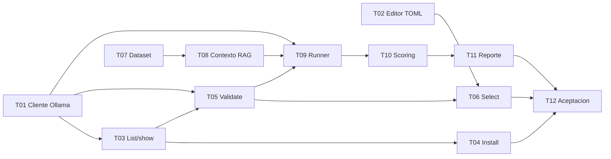

# H1.1 - Gestion y Evaluacion de Modelos Locales: Plan de tareas

## 1. Reglas

- Implementar tareas en orden.
- Estados iniciales: `pendiente`.
- Cada tarea incluye pruebas y documentacion operativa cuando corresponda.
- No implementar codigo productivo durante la elaboracion de esta especificacion.
- No modificar specs H1-H5/H4.1 salvo actualizacion documental final justificada.
- No crear `acceptance.md` hasta la ultima tarea de implementacion.
- No ejecutar aceptacion durante la elaboracion de esta spec.
- No agregar cloud, multiproveedor, UI, API HTTP, plugins, perfiles, registro de
  modelos en SQLite ni framework externo de evaluacion.
- No modificar retrieval, chunking, embeddings, prompts productivos, validador,
  ingenieria inversa ni Spec Mode; una extraccion de funcion reusable debe estar
  cubierta por pruebas de caracterizacion sin cambio de comportamiento.
- No usar datos reales en dataset, pruebas o reportes versionados.
- Mensajes CLI y documentacion de usuario en espanol.
- Identificadores de codigo en ingles; comentarios y docstrings en espanol.
- Cada tarea cierra con verificaciones ejecutables y no concentra pruebas al final.

Estado actual del hito: en implementacion. H1.1-T01 a H1.1-T11 completadas;
H1.1-T12 pendiente.

Precondicion general: Barbarion `0.6.0`, H1-H5 y H4.1 completados.

## 2. Tareas

### H1.1-T01 - Definir dominio, puerto y cliente Ollama de modelos

**Estado:** completada.

**Objetivo:** soportar catalogo, detalle, pull y generacion detallada con un
contrato local pequeno.  
**Descripcion:** Crear modelos puros, errores tipados y puerto
`LocalModelProvider`; implementar `OllamaModelClient` con `urllib`, parsing
tolerante a campos opcionales, progreso acotado y telemetria de generacion.
Reutilizar transporte donde sea razonable sin romper `OllamaLlmProvider`.  
**Dependencias:** precondicion general del hito.  
**Resultado esperado:** cliente comprobable con fakes para todas las operaciones
necesarias, sin SDK ni shell.  
**Requisitos:** H1.1-RF-001, RF-002, RF-003; RNF-001, RNF-006, RNF-010.  
**Checkpoint:** `python -m pytest tests/unit/test_local_model_provider.py tests/unit/test_ollama_model_client.py`.

### H1.1-T02 - Implementar editor atomico de `[llm].model`

**Estado:** completada.

**Objetivo:** cambiar el modelo activo sin introducir otra fuente de verdad.  
**Descripcion:** Implementar editor TOML acotado, deteccion de seccion/asignacion
unica, escape seguro, temporal en mismo directorio, recarga completa de settings,
control de cambio concurrente y reemplazo atomico. Cubrir dry-run y fallas sin
alterar el original.  
**Dependencias:** ninguna de H1.1-T01; reutiliza configuracion H1.  
**Resultado esperado:** edicion preserva bytes ajenos a la asignacion objetivo y
configuraciones existentes siguen validas.  
**Requisitos:** H1.1-RF-004; RNF-002, RNF-005, RNF-009.  
**Checkpoint:** `python -m pytest tests/unit/test_llm_model_config_editor.py tests/unit/test_config.py`.

### H1.1-T03 - Agregar `models list` y `models show`

**Estado:** completada.

**Objetivo:** descubrir e inspeccionar modelos instalados desde CLI.  
**Descripcion:** Incorporar grupo `models`, servicios application, formatos
text/json, marca de activo, orden estable y manejo accionable de Ollama ausente,
modelo inexistente y respuestas parciales. No mostrar metadata extensa por
defecto.  
**Dependencias:** H1.1-T01.  
**Resultado esperado:** catalogo local visible sin cambiar estado.  
**Requisitos:** H1.1-RF-001, RF-002, RF-010.  
**Checkpoint:** `python -m pytest tests/unit/test_models_cli.py tests/integration/test_models_list_show_cli.py`.

### H1.1-T04 - Agregar `models install`

**Estado:** completada.

**Objetivo:** instalar explicitamente un modelo mediante Ollama local.  
**Descripcion:** Validar identificador como dato, comprobar estado previo,
ejecutar pull con progreso, verificar presencia final, soportar reintento y
Ctrl+C, e informar que Ollama puede continuar el pull despues de que Barbarion
deje de esperar. Agregar `--dry-run` para mostrar si el pull seria necesario sin
iniciarlo; no estimar tamano ni pedir confirmacion. No seleccionar ni
validar generacion automaticamente.  
**Dependencias:** H1.1-T01, H1.1-T03.  
**Resultado esperado:** instalacion observable, idempotente y sin comandos shell.  
**Requisitos:** H1.1-RF-003, RF-010; RNF-001, RNF-007.  
**Checkpoint:** `python -m pytest tests/unit/test_model_install_service.py tests/integration/test_models_install_cli.py`.

### H1.1-T05 - Agregar validacion funcional y `models validate`

**Estado:** completada.

**Objetivo:** verificar que un modelo puede responder la sonda minima de
Barbarion.  
**Descripcion:** Implementar solicitud sintetica constante, temperatura cero,
marcador, timeout, checks separados y text/json. Extender `doctor` solo con la
presencia del activo si puede hacerse sin generacion ni cambio de severidad base.  
**Dependencias:** H1.1-T01, H1.1-T03.  
**Resultado esperado:** diagnostico distingue conectividad, instalacion y
generacion sin exponer respuesta completa.  
**Requisitos:** H1.1-RF-005, RF-010; RNF-001, RNF-011.  
**Checkpoint:** `python -m pytest tests/unit/test_model_validation_service.py tests/integration/test_models_validate_cli.py tests/integration/test_doctor_cli.py`.

### H1.1-T06 - Agregar `models select`

**Estado:** completada.

**Objetivo:** seleccionar el LLM generativo activo con validacion previa.  
**Descripcion:** Orquestar presencia, sonda de H1.1-T05 y editor TOML; implementar
`--dry-run`, mensajes de anterior/nuevo, codigos de salida y verificacion final
mediante carga de configuracion. No instalar ni cambiar embeddings.  
**Dependencias:** H1.1-T02, H1.1-T03, H1.1-T05.  
**Resultado esperado:** `[llm].model` cambia solo tras validacion completa y
cualquier falla conserva el archivo original.  
**Requisitos:** H1.1-RF-004, RF-010; RNF-002, RNF-005.  
**Checkpoint:** `python -m pytest tests/unit/test_model_select_service.py tests/integration/test_models_select_cli.py`.

### H1.1-T07 - Definir loader y dataset sintetico v1

**Estado:** completada.

**Objetivo:** crear entradas y rubricas reproducibles, genericas y privadas.  
**Descripcion:** Definir esquema cerrado, validacion estricta, hash canonico y al
menos 8 casos en cinco categorias. Incorporar recurso operativo y fixture de
tests equivalentes. Ejecutar scan para asegurar ausencia de datos reales.  
**Dependencias:** ninguna funcional; alinear objetos de contexto con H3.  
**Resultado esperado:** dataset valido, versionado, inspeccionable y totalmente
sintetico.  
**Requisitos:** H1.1-RF-006; RNF-001, RNF-004, RNF-012.  
**Checkpoint:** `python -m pytest tests/unit/test_model_benchmark_dataset.py`.

### H1.1-T08 - Reutilizar constructor y validador RAG con contexto congelado

**Estado:** completada.

**Objetivo:** preparar la misma solicitud RAG para cada modelo sin tocar
retrieval ni duplicar prompts.  
**Descripcion:** Adaptar fragmentos sinteticos a contratos de contexto vigentes,
calcular hashes, invocar constructor de prompt y validador existentes. Si hace
falta extraer una funcion reusable, agregar primero caracterizacion de `ask` y
demostrar salida equivalente. Prohibido cambiar templates o reglas de citas.  
**Dependencias:** H1.1-T07.  
**Resultado esperado:** cada modelo recibe bytes semanticamente equivalentes por
caso y H3 conserva comportamiento exacto.  
**Requisitos:** H1.1-RF-006, RF-007; RNF-003, RNF-004.  
**Checkpoint:** `python -m pytest tests/unit/test_model_benchmark_context.py tests/unit/test_rag_context_ask.py tests/integration/test_h3_rag_cli.py`.

### H1.1-T09 - Implementar runner y `models benchmark`

**Estado:** completada.

**Objetivo:** ejecutar comparaciones secuenciales reproducibles.  
**Descripcion:** Validar opciones/modelos, ejecutar una generacion por caso y
modelo, aplicar rotacion determinista, timeouts, resultado parcial simple y Ctrl+C.
Registrar orden y fallas; no cambiar activo ni instalar faltantes.  
**Dependencias:** H1.1-T01, H1.1-T05, H1.1-T08.  
**Resultado esperado:** matriz completa modelo/caso con contexto
identico y salidas validadas.  
**Requisitos:** H1.1-RF-007, RF-010; RNF-004, RNF-007, RNF-011.  
**Checkpoint:** `python -m pytest tests/unit/test_model_benchmark_service.py tests/integration/test_models_benchmark_cli.py`.

### H1.1-T10 - Implementar scoring y agregacion

**Estado:** completada.

**Objetivo:** calcular metricas objetivas y transparentes sin LLM juez.  
**Descripcion:** Implementar normalizacion, evaluacion de hechos, prohibiciones,
instrucciones, groundedness acotado, uso de contexto, citas, validador, score v1,
latencia, tokens opcionales y agregados. Cubrir no aplicable, null, fallas y
redondeo.  
**Dependencias:** H1.1-T07, H1.1-T09.  
**Resultado esperado:** cada numero se rastrea a reglas satisfechas/fallidas y
ningun dato ausente se convierte en cero.  
**Requisitos:** H1.1-RF-008; RNF-004, RNF-008, RNF-012.  
**Checkpoint:** `python -m pytest tests/unit/test_model_benchmark_scoring.py tests/unit/test_model_benchmark_aggregation.py`.

### H1.1-T11 - Generar reporte comparativo y documentacion operativa

**Estado:** completada.

**Objetivo:** entregar JSON/Markdown seguro que facilite la decision humana.  
**Descripcion:** Implementar renderers, regla de elegibilidad/recomendacion,
directorio unico por `run-id`, resumen stdout, escritura segura y golden files.
Actualizar README, ejemplo de uso y ayuda CLI solo tras estabilizar contratos.  
**Dependencias:** H1.1-T09, H1.1-T10.  
**Resultado esperado:** reporte estable con condiciones, comparacion, candidato,
fallas, formulas y limites, sin seleccionar automaticamente.  
**Requisitos:** H1.1-RF-009, RF-010; RNF-005, RNF-008, RNF-012.  
**Checkpoint:** `python -m pytest tests/unit/test_model_benchmark_reporting.py tests/golden/test_model_benchmark_markdown.py tests/unit/test_readme.py`.

### H1.1-T12 - Regresion, validacion manual y aceptacion tecnica

**Estado:** pendiente.  
**Objetivo:** demostrar el hito completo despues de terminar la implementacion.  
**Descripcion:** Ejecutar suite, smoke instalado y regresion H1-H5/H4.1; probar
administracion con fake y realizar una comparacion manual opcional de al menos
dos modelos reales instalados cuando el hardware lo permita. Consolidar
versiones, condiciones, resultados, limites, scan de privacidad y revision
humana. Crear `acceptance.md` solo durante esta tarea. Si no existen dos modelos
reales, aceptar funcionalidad con fakes y dejar la comparacion real como revision
pendiente, sin inventar metricas.  
**Dependencias:** H1.1-T01 a H1.1-T11.  
**Resultado esperado:** H1.1 aceptado tecnicamente o con bloqueos reales
documentados; ninguna regresion de RAG, H4/H4.1 o H5.  
**Requisitos:** todos los RF y RNF H1.1.  
**Checkpoint:** `python -m pytest --basetemp .pytest-tmp/h11` y smoke CLI en venv editable.

## 3. Orden de implementacion

## 4. Trazabilidad de tareas

| Tarea | Requisitos principales |
|---|---|
| H1.1-T01 | RF-001, RF-002, RF-003; RNF-001, RNF-006, RNF-010 |
| H1.1-T02 | RF-004; RNF-002, RNF-005, RNF-009 |
| H1.1-T03 | RF-001, RF-002, RF-010 |
| H1.1-T04 | RF-003, RF-010; RNF-001, RNF-007 |
| H1.1-T05 | RF-005, RF-010; RNF-001, RNF-011 |
| H1.1-T06 | RF-004, RF-010; RNF-002, RNF-005 |
| H1.1-T07 | RF-006; RNF-001, RNF-004, RNF-012 |
| H1.1-T08 | RF-006, RF-007; RNF-003, RNF-004 |
| H1.1-T09 | RF-007, RF-010; RNF-004, RNF-007, RNF-011 |
| H1.1-T10 | RF-008; RNF-004, RNF-008, RNF-012 |
| H1.1-T11 | RF-009, RF-010; RNF-005, RNF-008, RNF-012 |
| H1.1-T12 | Todos los RF y RNF |

## 5. Evidencia que debe recopilar la ultima tarea

- commit o version evaluada;
- sistema operativo, Python, Ollama y hardware observable;
- archivo de configuracion sintetico usado;
- `models list` y `models show`;
- instalacion fake completa y, si se autoriza, instalacion real;
- `models validate` para activo y modelo indicado;
- `models select --dry-run` y seleccion sobre config temporal;
- confirmacion de que embeddings no cambiaron;
- dataset, schema version y hash;
- opciones, orden, `run-id`, ruta de salida y hashes de contexto del benchmark;
- reporte JSON y Markdown;
- metricas por modelo/caso y cobertura de tokens;
- fallas y resultados parciales;
- suite completa, smoke y regresion H1-H5/H4.1;
- prueba de caracterizacion RAG antes/despues si hubo extraccion;
- scan de secretos, rutas personales y datos reales;
- confirmacion de ausencia de llamadas cloud;
- revision humana de utilidad o estado pendiente;
- limitaciones de hardware y reproducibilidad;
- decision final documentada solo en `acceptance.md` de T12.
