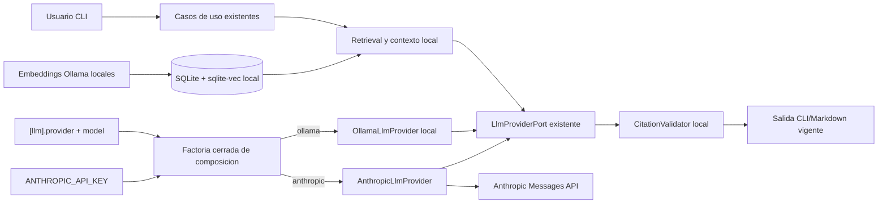

# H1.2 - Inferencia Remota con Anthropic: Diseno

## 1. Objetivo de diseno

Agregar Anthropic Claude como adaptador remoto de generacion final reutilizando
el puerto LLM y la raiz de composicion existentes. El diseno conserva intactos
retrieval, prompts, validacion de citas, servicios de aplicacion, formatos,
SQLite, embeddings Ollama y benchmark H1.1.

H1.2 no diseña una plataforma multiproveedor. La unica seleccion admitida es
entre el adaptador Ollama existente y un adaptador Anthropic directo.

## 2. Principios aplicados

1. Arquitectura existente: reutilizar `LlmProviderPort` y el monolito modular.
2. Frontera explicita: conocimiento local; solo el prompt generativo sale.
3. Configuracion explicita: proveedor/modelo en TOML, credencial en entorno.
4. Sin fallback: ningun cambio de proveedor implicito ante fallas.
5. Evidencia intacta: respuesta y reparacion pasan por el validador vigente.
6. Minima dependencia: `urllib`, sin SDK ni framework multiproveedor.
7. Defaults compatibles: Ollama continua activo en configuraciones existentes.
8. Cancelacion honesta: Ctrl+C detiene la espera, no promete rollback remoto.
9. Pruebas offline: HTTP fake y caracteres canario, sin API real en CI.
10. Alcance cerrado: solo Anthropic Messages API no streaming.

## 3. Decisiones de diseno

### H1.2-DD-001 - Reutilizar `LlmProviderPort` sin cambiar su firma

El puerto actual ya expresa la variacion necesaria:

```python
class LlmProviderPort(Protocol):
    provider: str
    model: str

    def generate(self, *, prompt: str, timeout_seconds: float) -> str: ...
```

H1.2 no modifica el archivo ni la firma del puerto. No agrega mensajes, roles,
tokens, credenciales o tipos Anthropic al contrato. `AskService`,
`DescribeService` e `ImpactService` continúan recibiendolo sin cambios.

### H1.2-DD-002 - Seleccion concreta en una factoria cerrada

La funcion de composicion que hoy retorna `OllamaLlmProvider` pasara a retornar
`LlmProviderPort`:

```text
provider=ollama     -> OllamaLlmProvider
provider=anthropic  -> AnthropicLlmProvider
cualquier otro      -> ConfigError antes de componer
```

Se usa un `if`/`match` cerrado de dos ramas, no registry, entry points, plugins,
reflection, factory package ni clases base nuevas. Incorporar un tercer
proveedor exige otra spec.

### H1.2-DD-003 - Adaptador Anthropic HTTP pequeño y directo

Se agrega `AnthropicLlmProvider` bajo `infrastructure/`. Usa `urllib` y un opener
inyectable igual que los adaptadores existentes. El destino es constante:

```text
POST https://api.anthropic.com/v1/messages
anthropic-version: 2023-06-01
```

La version API se fija en codigo para que los cambios sean revisables. No hay
base URL, version, beta headers, proxy, gateway ni endpoint derivados del TOML,
modelo o prompt. No se agrega el SDK Anthropic a `pyproject.toml`.

La credencial se recibe como campo privado/no representable o callable interno;
si falta, `generate` falla antes de abrir red. Esto permite construir los
servicios y ejecutar `--no-llm` sin credencial.

### H1.2-DD-004 - Configuracion compartida minima

`[llm]` sigue siendo la unica configuracion generativa:

```toml
[llm]
provider = "anthropic"
model = "modelo-claude-autorizado"
timeout_seconds = 120.0
temperature = 0.1
max_output_tokens = 4096
```

`max_output_tokens` es necesario porque Messages API exige un limite de salida.
Solo se interpreta cuando el proveedor efectivo es Anthropic y usa default
`4096` si se omite. Si se configura explicitamente con Ollama, la carga se
rechaza para no admitir una propiedad silenciosamente inutil. La validacion
inicial limita valores positivos a un maximo defensivo de implementacion de
128000; el limite no afirma capacidad de ningun modelo.

`think` y `num_ctx` conservan exactamente su comportamiento Ollama. Con
Anthropic deben ser `None`/no configurados; rechazarlos evita aparentar que se
traducen a capacidades Anthropic.

La key no pertenece a `Settings`. La factoria consulta exclusivamente
`ANTHROPIC_API_KEY` y la pasa sin mostrarla. `config show` no informa presencia,
prefijo ni longitud del secreto.

### H1.2-DD-005 - Egress limitado al prompt vigente

El pipeline local permanece:

```text
pregunta
  -> retrieval local
  -> contexto local numerado
  -> PromptBuilder vigente
  -> frontera de red solo si provider=anthropic
  -> texto remoto
  -> CitationValidator local
  -> reparacion opcional por el mismo proveedor
  -> salida vigente
```

Anthropic recibe el prompt completo construido por Barbarion, que incluye la
pregunta, instrucciones y fragmentos seleccionados. Esa realidad se documenta;
no se afirma que el contenido permanezca on-premise. No se envian SQLite,
vectores, manifests, archivos completos ni artefactos fuera del prompt.

### H1.2-DD-006 - Payload, respuesta y errores acotados

Payload inicial:

```json
{
  "model": "<settings.llm.model>",
  "max_tokens": 4096,
  "temperature": 0.1,
  "messages": [
    {"role": "user", "content": "<prompt vigente>"}
  ]
}
```

No se usa `system`, tools, thinking, metadata, streaming o campos beta. El
parser acepta campos adicionales, recorre `content` en orden y concatena bloques
`{"type":"text","text":"..."}`. Exige texto no vacio. Un
`stop_reason=max_tokens` produce `ANTHROPIC_LLM_TRUNCATED` para no presentar una
respuesta parcial como completa; otros bloques desconocidos se ignoran.

Codigos internos iniciales:

```text
ANTHROPIC_API_KEY_MISSING
ANTHROPIC_AUTHENTICATION_ERROR
ANTHROPIC_PERMISSION_ERROR
ANTHROPIC_BILLING_ERROR
ANTHROPIC_MODEL_NOT_FOUND
ANTHROPIC_RATE_LIMITED
ANTHROPIC_REQUEST_INVALID
ANTHROPIC_REQUEST_TOO_LARGE
ANTHROPIC_TIMEOUT
ANTHROPIC_OVERLOADED
ANTHROPIC_HTTP_ERROR
ANTHROPIC_UNAVAILABLE
ANTHROPIC_LLM_TRUNCATED
ANTHROPIC_RESPONSE_INVALID
```

Los HTTP 400/401/402/403/404/409/413/429/500/504/529 se normalizan sin incluir
el mensaje remoto completo. Se puede conservar `request-id` si cumple longitud y
caracteres acotados. No se registra el cuerpo de error.

### H1.2-DD-007 - No streaming, retries ni fallback en v1

Cada `generate` realiza una solicitud no streaming con el timeout recibido. Los
errores transitorios se devuelven al usuario; Barbarion no reintenta 429/5xx ni
respeta `retry-after` automaticamente para evitar costo y duplicacion ocultos.

El contexto manager cierra la respuesta. `KeyboardInterrupt` no se captura en el
adaptador salvo para limpieza y se propaga a CLI. Barbarion puede dejar de
esperar, pero no puede garantizar que el servidor no complete o facture la
solicitud.

### H1.2-DD-008 - Mismo proveedor para generacion y reparacion

`AskService` conserva su secuencia y la misma instancia del puerto. Por lo tanto,
si la primera respuesta falla validacion, el prompt de reparacion se envia al
mismo proveedor seleccionado. No se mezcla Ollama y Anthropic dentro de una
consulta ni se añade routing por etapa.

`AskService` no se modifica. La observabilidad especifica de Anthropic se agrega
en el adaptador y la traduccion de errores en CLI, sin alterar campos publicos
del resultado ni la secuencia H3.

### H1.2-DD-009 - Credencial tardia para conservar `--no-llm`

La composicion puede crear `AnthropicLlmProvider` sin key valida. La validacion
de la key ocurre al iniciar `generate`, no al cargar TOML ni construir
`AskService`. De ese modo los caminos que retornan por evidencia insuficiente o
`--no-llm` no acceden a red ni exigen secreto.

No se introduce un proveedor nulo. La ausencia de key solo es error cuando el
usuario solicita efectivamente generacion Anthropic.

### H1.2-DD-010 - H1.1 permanece local y separado

`LocalModelProvider`, `OllamaModelClient`, el dataset y
`ModelBenchmarkService` no se generalizan. `barbarion models` significa modelos
Ollama locales aun cuando `[llm].provider` sea Anthropic.

Para evitar escritura incoherente en el modelo de configuracion actual:

- mientras `[llm].model` represente el modelo del proveedor activo,
  `models select` se rechaza si el proveedor efectivo no es Ollama; es una
  limitacion temporal para no reemplazar accidentalmente el modelo Claude, no
  el diseño ideal de una futura configuracion por proveedor;
- `models validate` sin nombre se rechaza si no hay modelo Ollama activo;
- list/show/install/benchmark y validate con nombre explicito siguen usando
  Ollama;
- no se agrega `anthropic` como competidor ni metadata cloud al reporte H1.1.

### H1.2-DD-011 - Errores y observabilidad provider-neutral

`LlmProviderError` conserva el tipo publico. Los adaptadores emiten codigos
tecnicos estables prefijados. La CLI transforma esos codigos en mensajes y
sugerencias segun proveedor sin inspeccionar payloads.

Logs de cada generacion:

```text
provider, model, stage, timeout_seconds,
prompt_chars, prompt_tokens_est, duration_ms,
result, response_chars?, error_code?, request_id?
```

Nunca se registran key, headers, prompt, respuesta o body remoto. El debug RAG
local conserva su semantica actual; H1.2 no amplía lo que muestra.

### H1.2-DD-012 - Sin persistencia ni migracion

H1.2 no agrega tablas, migraciones, manifests, reportes o cache. Las metricas RAG
vigentes conservan solo duracion agregada. La key y los identificadores remotos
no se persisten. No se crea historial de uso o costos.

## 4. Arquitectura



No existe flecha desde Anthropic hacia ingesta, embeddings, SQLite, reverse
engineering, Spec Mode o benchmark H1.1.

## 5. Componentes

| Componente | Capa | Responsabilidad |
|---|---|---|
| `LlmSettings` | config/Foundation | permitir proveedor, modelo y limite de salida |
| `LlmProviderPort` | domain | contrato generativo existente sin cambios de firma |
| `AnthropicLlmProvider` | infrastructure | autenticacion, request Messages API y parseo seguro |
| `OllamaLlmProvider` | infrastructure | adaptador local vigente sin cambio funcional |
| `_build_llm_provider` | composicion CLI | elegir una de dos implementaciones cerradas |
| `AskService` | application H3 | secuencia vigente, sin modificaciones |
| `DescribeService`/`ImpactService` | application H4 | reciben el mismo puerto opcional, sin cambio funcional |
| CLI error renderer | cli | mensaje accionable segun codigo/proveedor |
| `OllamaModelClient`/benchmark | H1.1 | permanecen locales y separados |

## 6. Contrato HTTP Anthropic

Request:

```text
method: POST
url: https://api.anthropic.com/v1/messages
timeout: argumento de LlmProviderPort.generate
headers:
  content-type: application/json
  x-api-key: valor de ANTHROPIC_API_KEY
  anthropic-version: 2023-06-01
body:
  model
  max_tokens
  temperature
  messages[0].role=user
  messages[0].content=prompt
```

Respuesta minima aceptada:

```json
{
  "content": [{"type": "text", "text": "respuesta"}],
  "stop_reason": "end_turn"
}
```

Se aceptan varios bloques text y campos adicionales. No se copian bloques de
thinking/tool use a la respuesta. La validacion de citas sigue siendo la de
Barbarion, no la funcionalidad nativa de citas Anthropic.

## 7. Configuracion

Ollama existente:

```toml
[llm]
provider = "ollama"
model = "llama3.1:8b"
timeout_seconds = 600.0
temperature = 0.1
think = false
num_ctx = 16384
```

Anthropic:

```toml
[llm]
provider = "anthropic"
model = "modelo-claude-autorizado"
timeout_seconds = 120.0
temperature = 0.1
max_output_tokens = 4096
# think y num_ctx deben omitirse
```

Entorno:

```text
ANTHROPIC_API_KEY=<secreto provisionado fuera del repositorio>
```

No se versiona un valor, placeholder con forma de key ni archivo `.env`.

## 8. Flujo de composicion y generacion

### Composicion

1. Cargar settings con defaults actuales.
2. Validar proveedor y campos compatibles.
3. Construir repositorios, embeddings y contexto locales igual que hoy.
4. Seleccionar adaptador generativo en `_build_llm_provider`.
5. Para Anthropic, capturar la key sin validarla ni mostrarla.
6. Inyectar el mismo puerto en servicios existentes.

### Generacion `ask`

1. Ejecutar search y structured retrieval locales.
2. Construir contexto y retornar temprano si no hay evidencia.
3. Si `--no-llm`, retornar antes de resolver credencial/red.
4. Construir el prompt vigente.
5. Invocar el proveedor con timeout vigente.
6. Validar citas localmente.
7. Si falla, construir reparacion vigente e invocar el mismo proveedor.
8. Persistir solo metricas RAG actuales y renderizar salida vigente.

### Sintesis H4 opcional

1. Construir relaciones y resumen determinista local.
2. Si no se solicita LLM, retornar localmente.
3. Invocar el mismo puerto seleccionado.
4. Conservar el fallback determinista actual ante error.

## 9. Frontera de datos

| Dato | Local | Enviado a Anthropic cuando se genera |
|---|---:|---:|
| Archivos fuente completos | Si | No, salvo texto seleccionado incluido en prompt |
| SQLite, vectores y manifests | Si | No |
| Inventario, simbolos y relaciones | Si | Solo fragmentos/sintesis incluidos en prompt vigente |
| Pregunta del usuario | Si | Si |
| Contexto numerado seleccionado | Si | Si |
| Prompt de generacion/reparacion | Si | Si |
| API key | Entorno/memoria | Solo header de autenticacion |
| Respuesta Anthropic | Memoria local | Origen remoto; no persistida por H1.2 |
| Validacion de citas | Si | No |

Seleccionar Anthropic es una decision de egress, no solo una optimizacion de
hardware.

## 10. Manejo de errores

| Condicion | Codigo interno | Resultado CLI |
|---|---|---|
| key ausente | `ANTHROPIC_API_KEY_MISSING` | 1, instruccion de entorno |
| 401 | `ANTHROPIC_AUTHENTICATION_ERROR` | 1, revisar key |
| 402 | `ANTHROPIC_BILLING_ERROR` | 1, revisar cuenta/billing |
| 403 | `ANTHROPIC_PERMISSION_ERROR` | 1, revisar acceso/modelo |
| 404 | `ANTHROPIC_MODEL_NOT_FOUND` | 1, revisar modelo |
| 400/409/413 | request tipado | 1, revisar config/tamaño |
| 429 | `ANTHROPIC_RATE_LIMITED` | 1, reintento manual |
| 500/529 | servidor/sobrecarga | 1, reintento manual |
| 504/socket timeout | `ANTHROPIC_TIMEOUT` | 1, timeout/reintento manual |
| red/TLS/DNS | `ANTHROPIC_UNAVAILABLE` | 1, revisar conectividad |
| `max_tokens` | `ANTHROPIC_LLM_TRUNCATED` | 1, aumentar limite |
| JSON/texto invalido | `ANTHROPIC_RESPONSE_INVALID` | 1, sin body |
| Ctrl+C | `KeyboardInterrupt` | 130, estado remoto no afirmado |

No se interpreta el texto libre del error remoto para decidir flujo.

## 11. Compatibilidad con H1.1

`barbarion models` no usa la factoria generativa. Construye directamente
`OllamaModelClient`, por lo que catalogo, instalacion y benchmark permanecen
locales. Solo se agregan guards de coherencia para operaciones que asumen que el
modelo generativo activo pertenece a Ollama.

No se modifica `LocalModelProvider`, `ModelGenerationRequest`, dataset, scorer,
agregador, renderer ni golden files salvo pruebas que confirmen identidad.

## 12. Compatibilidad con hitos existentes

- **H1:** amplía validacion/configuracion y composicion; no cambia CLI.
- **H2:** sin imports, llamadas, migraciones ni egress.
- **H3:** mismos archivos de aplicacion, servicios, prompt, contexto, repair y
  validador; solo cambia el adaptador inyectado desde composicion.
- **H4/H4.1:** archivos y construccion local intactos; sintesis opcional recibe
  el mismo puerto desde la composicion existente.
- **H5:** no se cambian analyzer, collectors, templates, validator ni writer.
- **H1.1:** modelos y benchmark siguen siendo Ollama-only.

## 13. CLI

No se agregan comandos ni flags. Permanecen, entre otros:

```text
barbarion ask "pregunta" [--no-llm]
barbarion describe OBJETO [--with-llm|--no-llm]
barbarion impact OBJETO [--with-llm|--no-llm]
barbarion models ...
```

La seleccion se hace en TOML para conservar contratos. Mensajes de error y debug
usan proveedor/modelo efectivos sin cambiar la forma de las salidas exitosas.

## 14. Seguridad

- HTTPS y host Anthropic fijos.
- No se sigue redirect hacia otro host; un redirect inesperado debe rechazarse o
  permanecer sujeto a una politica de opener comprobada que no reenvie la key.
- La key se excluye de repr y se enmascara en excepciones defensivamente.
- No se registran headers ni bodies.
- Se validan modelo y limites como datos, nunca como URL o codigo.
- No se habilitan beta headers, herramientas o contenido remoto adicional.
- Tests usan key canario y comprueban todos los canales observables.
- Una prueba real usa solamente fixtures sinteticos H1.1 o equivalentes.

## 15. Observabilidad

Metricas ya disponibles se conservan. La generacion agrega contexto suficiente
para operar dos adaptadores:

- proveedor/modelo efectivos;
- etapa `generation|repair|h4_summary`;
- timeout;
- caracteres y tokens estimados del prompt;
- duracion y resultado;
- caracteres de respuesta solo en exito;
- codigo tecnico y request-id acotado en error.

No se crea telemetria remota, medicion de costo ni persistencia adicional.

## 16. Estrategia de dependencias

Se conserva la biblioteca estandar. Un SDK Anthropic se descarta porque el
contrato v1 requiere una sola operacion no streaming y el repositorio ya usa
`urllib` con fakes. Si el API exige posteriormente streaming, retries complejos
o nuevas operaciones, su adopcion requerira una decision separada.

## 17. Alternativas descartadas

| Alternativa | Motivo |
|---|---|
| SDK Anthropic | Dependencia innecesaria para una operacion HTTP pequena |
| Registry/plugin multiproveedor | Sobreingenieria; solo existe un proveedor cloud objetivo |
| OpenAI-compatible gateway | Amplia proveedores y destinos fuera de alcance |
| Embeddings Anthropic/cloud | Rompe construccion local del conocimiento |
| Base URL configurable | Puede filtrar key/contexto a destinos arbitrarios |
| API key en TOML | Riesgo de versionado y contradice el requisito explicito |
| API key por CLI | Puede quedar en historial y lista de procesos |
| Validar key durante load/config show | Rompe caminos locales y `--no-llm` |
| Nuevo comando `providers` | Cambia CLI sin necesidad funcional |
| Generalizar `LocalModelProvider` | Mezcla administracion Ollama con generacion remota |
| Benchmark Ollama-Claude | Cambia H1.1 y no es necesario para habilitar generacion |
| Fallback automatico a Ollama | Oculta egress, costo y causa de error |
| Retries automaticos | Pueden duplicar costo y dificultar cancelacion |
| Streaming v1 | Amplia contrato y manejo de errores sin ser necesario |
| Citas nativas Anthropic | Sustituirian el contrato de citas Barbarion |
| Persistir uso/costo | Requiere nuevo modelo de datos y politica |

## 18. Trazabilidad hacia requisitos

| Decision | Requisitos |
|---|---|
| H1.2-DD-001 | RF-003, RF-004 |
| H1.2-DD-002 | RF-001 |
| H1.2-DD-003 | RF-002, RF-003 |
| H1.2-DD-004 | RF-001, RF-002, RF-010 |
| H1.2-DD-005 | RF-004, RF-008, RF-010 |
| H1.2-DD-006 | RF-003, RF-006 |
| H1.2-DD-007 | RF-005 |
| H1.2-DD-008 | RF-004 |
| H1.2-DD-009 | RF-007 |
| H1.2-DD-010 | RF-009 |
| H1.2-DD-011 | RF-002, RF-006 |
| H1.2-DD-012 | RF-008 |
