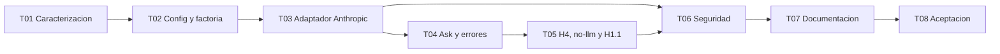

# H1.2 - Inferencia Remota con Anthropic: Plan de tareas

## 1. Reglas

- Implementar tareas en orden.
- Estados iniciales: `pendiente`.
- Cada tarea incluye sus pruebas y documentacion operativa cuando corresponda.
- No implementar codigo productivo durante la elaboracion de esta spec.
- No modificar specs H1-H5/H4.1/H1.1 salvo referencias finales justificadas.
- No crear `acceptance.md` hasta la ultima tarea de implementacion y solo tras
  aprobacion para ejecutar la aceptacion.
- No ejecutar llamadas Anthropic reales durante la definicion de la spec.
- No agregar OpenAI, Bedrock, Gemini, Groq, Vertex, gateways, plugins, registry
  dinamico ni arquitectura multiproveedor.
- No modificar retrieval, chunking, embeddings, prompts, citas, modelos de
  salida, SQLite, reverse engineering ni Spec Mode.
- No almacenar credenciales ni usar datos reales en pruebas o validacion manual.
- Mensajes CLI y documentacion de usuario en espanol.
- Identificadores de codigo en ingles; comentarios y docstrings en espanol.
- Cada tarea cierra con verificaciones ejecutables y no concentra pruebas al
  final.

Estado actual del hito: implementacion iniciada. H1.2-T01 a H1.2-T04
completadas; H1.2-T05 a H1.2-T08 pendientes.

Precondicion general: Barbarion `0.6.0`, H1-H5, H4.1 y H1.1 completados; spec
H1.2 aprobada antes de comenzar codigo.

## 2. Tareas

### H1.2-T01 - Caracterizar contratos y aislar composicion LLM

**Estado:** completada.

**Objetivo:** proteger el comportamiento vigente antes de agregar Anthropic.  
**Descripcion:** Agregar pruebas de caracterizacion para `LlmProviderPort`,
`OllamaLlmProvider`, `_build_llm_provider`, prompts de generacion/reparacion,
validacion, formatos, codigos y benchmark H1.1. No modificar el puerto ni los
casos de uso caracterizados.  
**Dependencias:** precondicion general.  
**Resultado esperado:** baseline ejecutable que detecta cualquier cambio en RAG,
Ollama, H4 opcional o H1.1 antes del nuevo adaptador.  
**Requisitos:** H1.2-RF-001, RF-003, RF-004, RF-009; RNF-002..004.  
**Checkpoint:** `python -m pytest tests/unit/test_llm_provider.py tests/unit/test_rag_context_ask.py tests/integration/test_ask_ollama_http.py tests/integration/test_models_benchmark_cli.py`.

### H1.2-T02 - Ampliar configuracion y factoria cerrada

**Estado:** completada.

**Objetivo:** seleccionar Ollama o Anthropic sin cambiar CLI ni defaults.  
**Descripcion:** Permitir `anthropic` en `[llm].provider`, incorporar
`max_output_tokens` con default y limites solo para Anthropic, rechazarlo con
Ollama, validar incompatibilidad de `think/num_ctx`, conservar configuraciones
Ollama y cambiar la composicion a una factoria de dos ramas que retorna
`LlmProviderPort`. Leer
`ANTHROPIC_API_KEY` sin validarla ni mostrarla durante composicion.  
**Dependencias:** H1.2-T01.  
**Resultado esperado:** settings y `config show` compatibles; proveedor
desconocido o campos incompatibles fallan antes de red; no existe registry.  
**Requisitos:** H1.2-RF-001, RF-002; RNF-002, RNF-003, RNF-012.  
**Checkpoint:** `python -m pytest tests/unit/test_config.py tests/unit/test_cli.py tests/unit/test_llm_provider_factory.py`.

### H1.2-T03 - Implementar `AnthropicLlmProvider`

**Estado:** completada.

**Objetivo:** satisfacer el puerto existente mediante Messages API directa.  
**Descripcion:** Crear adaptador `urllib` con endpoint/version fijos, opener
inyectable, request no streaming, key no representable, payload acotado, parseo
de bloques text, deteccion de truncamiento, request-id seguro y mapeo de
HTTP/red/timeout. Propagar Ctrl+C, cerrar recursos y no agregar retries o SDK.  
**Dependencias:** H1.2-T02.  
**Resultado esperado:** generacion Anthropic comprobable completamente con fakes,
sin secretos en errores ni dependencia nueva.  
**Requisitos:** H1.2-RF-002, RF-003, RF-005, RF-006; RNF-005..011.  
**Checkpoint:** `python -m pytest tests/unit/test_anthropic_llm_provider.py tests/integration/test_ask_anthropic_http.py`.

### H1.2-T04 - Integrar `ask`, reparacion y errores CLI

**Estado:** completada.

**Objetivo:** usar el proveedor seleccionado sin cambiar el contrato RAG.  
**Descripcion:** Cablear la factoria desde la composicion que construye
`AskService`; agregar observabilidad Anthropic en infraestructura y mensajes en
CLI; conservar sin alterar los contratos del caso de uso, prompts, validacion,
un intento de reparacion, formatos, metricas y codigos. Mantener el uso remoto
en el adaptador y mostrar tokens de entrada/salida/total y tiempo transcurrido
sin costos ni cambios en `LlmProviderPort`. Verificar que key ausente no afecta
evidencia insuficiente o `--no-llm`, y que timeout/Ctrl+C no persisten un exito.  
**Dependencias:** H1.2-T03.  
**Resultado esperado:** la misma consulta controlada produce el mismo contrato
de salida con fake Ollama o Anthropic y ningun cambio en retrieval/citas.  
**Requisitos:** H1.2-RF-004..008; RNF-001..008, RNF-011.  
**Checkpoint:** `python -m pytest tests/unit/test_rag_context_ask.py tests/unit/test_cli.py tests/integration/test_h3_rag_cli.py tests/integration/test_ask_anthropic_http.py`.

### H1.2-T05 - Proteger H4 opcional, `--no-llm` y H1.1

**Estado:** pendiente.

**Objetivo:** demostrar que solo cambia el adaptador generativo.  
**Descripcion:** Verificar `describe/impact --with-llm` con el mismo puerto y
fallback determinista vigente, todos los modos `--no-llm`, y agregar guards para
`models select/validate` cuando Anthropic sea activo. Documentar el bloqueo de
`models select` como limitacion temporal mientras `[llm].model` represente el
modelo activo. Ejecutar golden/regresion del benchmark H1.1 sin cambiar dataset,
scoring ni reportes.  
**Dependencias:** H1.2-T04.  
**Resultado esperado:** H4/H4.1/H5 no cambian funcionalmente; H1.1 permanece
Ollama-only y una config Anthropic no puede ser corrompida por `models select`.  
**Requisitos:** H1.2-RF-007, RF-008, RF-009; RNF-002..004, RNF-009.  
**Checkpoint:** `python -m pytest tests/integration/test_describe_cli.py tests/integration/test_impact_cli.py tests/integration/test_h5_spec_create_cli.py tests/integration/test_models_select_cli.py tests/integration/test_models_validate_cli.py tests/integration/test_models_benchmark_cli.py tests/golden/test_model_benchmark_markdown.py`.

### H1.2-T06 - Cerrar seguridad, privacidad y regresion offline

**Estado:** pendiente.

**Objetivo:** demostrar que secreto, red y conocimiento respetan la frontera.  
**Descripcion:** Incorporar key canario, bloqueo de red, redirects, payload
inspection, scans de stdout/stderr/logs/debug/repr/artefactos y snapshots de
SQLite/manifests antes/despues. Cubrir errores Anthropic, max tokens,
interrupcion, key ausente y ausencia de persistencia. Ejecutar suite completa
offline.  
**Dependencias:** H1.2-T03 a H1.2-T05.  
**Resultado esperado:** solo el request esperado puede salir; ningun secreto o
contenido aparece en canales no autorizados; H1-H5/H4.1/H1.1 pasan.  
**Requisitos:** H1.2-RF-002, RF-008; todos los RNF de seguridad y regresion.  
**Checkpoint:** `python -m pytest --basetemp .pytest-tmp/h12-offline`.

### H1.2-T07 - Actualizar documentacion operativa y decisiones

**Estado:** pendiente.

**Objetivo:** documentar el cambio de alcance solo despues de estabilizarlo.  
**Descripcion:** Actualizar `barbarion.example.toml`, README, CLI, VISION,
ARCHITECTURE, DECISIONS, EVOLUTION, ROADMAP y `specs/README.md` con proveedor,
modelo, `ANTHROPIC_API_KEY`, egress del prompt, embeddings locales, defaults,
errores y limites. Marcar como reemplazadas o acotadas las decisiones locales
afectadas sin reescribir historia. No incluir secretos ni declarar otros
proveedores.  
**Dependencias:** H1.2-T02 a H1.2-T06.  
**Resultado esperado:** documentacion principal y operativa consistente con la
implementacion, revisada por tests/enlaces y sin afirmaciones ambiguas de
on-premise total cuando Anthropic esta activo.  
**Requisitos:** H1.2-RF-010; RNF-001, RNF-002, RNF-012.  
**Checkpoint:** `python -m pytest tests/unit/test_readme.py` mas `git diff --check` y verificacion de enlaces.

### H1.2-T08 - Validacion manual opt-in y aceptacion

**Estado:** pendiente.

**Objetivo:** demostrar el hito completo y registrar una decision honesta.  
**Descripcion:** Tras aprobacion explicita, ejecutar suite, smoke instalado y
regresion; validar con fake y opcionalmente una solicitud real Anthropic usando
solo el dataset sintetico. Registrar proveedor/modelo, version API, timeout,
limite, request-id acotado, citas, cancelacion probada con fake, ausencia de
secreto y no cambio al conocimiento. Crear `acceptance.md` exclusivamente en
esta tarea. Si no hay key/red/autorizacion, aceptar tecnicamente con fakes y
dejar la validacion real pendiente sin inventar resultados.  
**Dependencias:** H1.2-T01 a H1.2-T07 completadas y autorizacion de aceptacion.  
**Resultado esperado:** H1.2 aceptado, rechazado o bloqueado con evidencia; la
validacion real pendiente no se oculta.  
**Requisitos:** todos los RF y RNF H1.2.  
**Checkpoint:** `python -m pytest --basetemp .pytest-tmp/h12` y smoke CLI en venv editable.

## 3. Orden de implementacion

## 4. Trazabilidad de tareas

| Tarea | Requisitos principales |
|---|---|
| H1.2-T01 | RF-001, RF-003, RF-004, RF-009; RNF-002..004 |
| H1.2-T02 | RF-001, RF-002; RNF-002, RNF-003, RNF-012 |
| H1.2-T03 | RF-002, RF-003, RF-005, RF-006; RNF-005..011 |
| H1.2-T04 | RF-004..008; RNF-001..008, RNF-011 |
| H1.2-T05 | RF-007..009; RNF-002..004, RNF-009 |
| H1.2-T06 | RF-002, RF-008; RNF-001, RNF-004..011 |
| H1.2-T07 | RF-010; RNF-001, RNF-002, RNF-012 |
| H1.2-T08 | Todos los RF y RNF |

## 5. Evidencia que debe recopilar la ultima tarea

- commit o version evaluada;
- sistema operativo, Python y version Barbarion;
- configuracion Ollama compatible y configuracion Anthropic sintetica;
- confirmacion de que `ANTHROPIC_API_KEY` no aparece en archivos ni salidas;
- endpoint y `anthropic-version` usados;
- modelo, timeout, temperatura y max output tokens no sensibles;
- payload fake inspeccionado sin persistir prompt productivo;
- generacion y reparacion con citas validas/invalidas;
- matriz de HTTP, red, timeout, truncamiento y Ctrl+C;
- request-id acotado cuando exista;
- `--no-llm` sin key ni red;
- hashes/prompts y formatos equivalentes entre proveedores;
- snapshot de tablas, manifests, chunks, simbolos y relaciones sin cambios;
- benchmark H1.1 y comandos models sin cambio funcional;
- suite completa, smoke y regresion H1-H5/H4.1/H1.1;
- scan de secretos, rutas personales y datos reales;
- prueba Anthropic real sintetica si fue autorizada, o pendiente explicita;
- revision humana de privacidad/utilidad;
- decision final documentada solo en `acceptance.md` de H1.2-T08.
