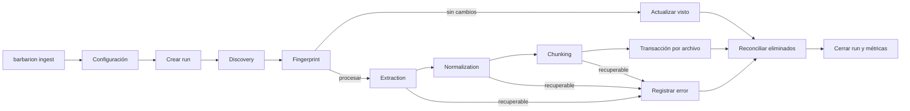
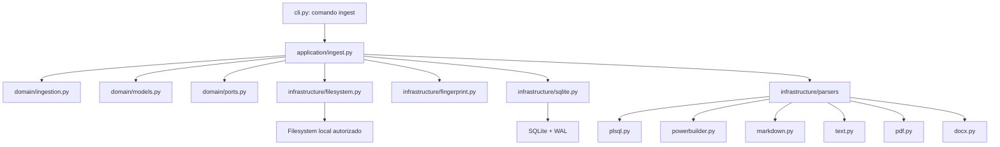
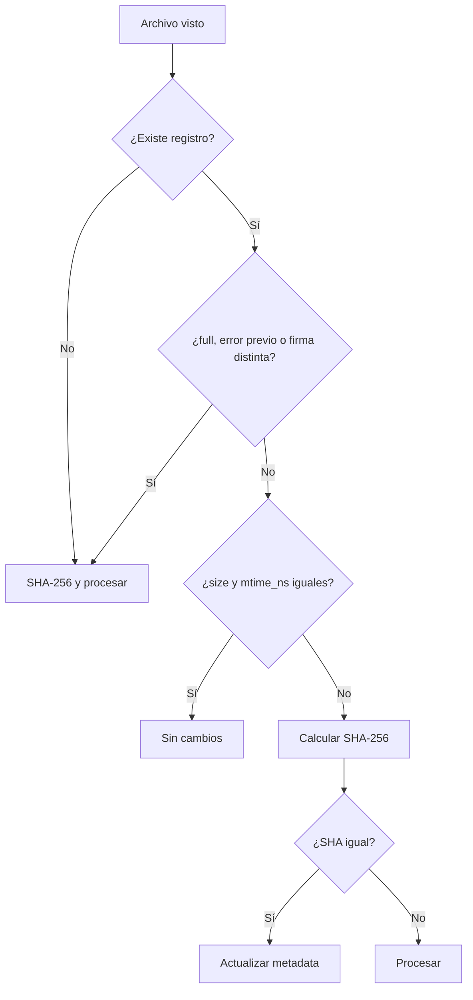
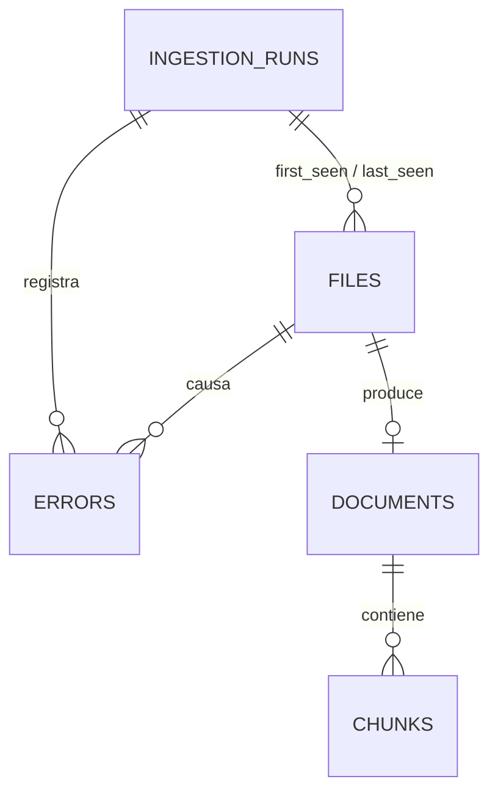

# H2 — Ingestion: Diseño

## 1. Objetivo

Definir una implementación mínima para convertir archivos autorizados en documentos y chunks locales, trazables e incrementales. El diseño extiende H1 sin introducir servicios, procesos adicionales ni dependencias de H3.

## 2. Decisiones cerradas

| Tema | Decisión H2 |
|---|---|
| Ejecución | CLI, un proceso, secuencial |
| Arquitectura | Separación ligera `application/`, `domain/` e `infrastructure/` definida en la arquitectura maestra |
| Persistencia | SQLite como fuente de verdad |
| Almacenamiento | Se acepta la duplicación de almacenamiento para privilegiar simplicidad y trazabilidad |
| Journal | `PRAGMA journal_mode=WAL`, obligatorio y verificado |
| Extensibilidad | `BaseParser` + registro interno explícito |
| Fingerprint | tamaño + `mtime_ns` como fast path; SHA-256 canónico |
| Normalización | conservadora, sin reformatear código |
| Chunking | semántico heurístico + ventanas por caracteres |
| PDF/DOCX | `pypdf` y `python-docx`, open source y locales |
| Vector store | fuera de H2; contrato neutral para H3 |
| `.pbl` | binaria no soportada; requiere export textual |
| Concurrencia | no se implementa hasta medir necesidad |
| Plugins | no hay carga dinámica en H2 |

## 3. Arquitectura

### 3.1 Flujo general



### 3.2 Componentes



`application/ingest.py` orquesta el caso de uso. `domain/` contiene contratos y reglas puras. `infrastructure/` contiene adaptadores locales: filesystem, hashing, parsers y SQLite. Esta distribución respeta la arquitectura base y evita crear un árbol paralelo de ingesta.
## 4. Estructura Python

H2 usa la separación ya definida en `docs/ARCHITECTURE.md`; no crea un paquete paralelo `src/barbarion/ingestion/`. Los módulos H1 existentes permanecen y los componentes nuevos se incorporan en la capa que corresponde.

```text
src/barbarion/
├── cli.py                         # Adaptador CLI existente; agrega comando ingest
├── config.py                      # Configuración existente; agrega sección ingestion
├── database.py                    # Bootstrap, conexión y migraciones base existentes
├── application/
│   └── ingest.py                  # Caso de uso y consulta de inventario
├── domain/
│   ├── models.py                  # LogicalUnit, documentos, chunks y outcomes
│   ├── ingestion.py               # Normalización, chunking y reglas incrementales puras
│   └── ports.py                   # Contratos mínimos de parser y persistencia
└── infrastructure/
    ├── filesystem.py              # Discovery y lectura autorizada
    ├── fingerprint.py             # SHA-256 y metadata de archivos
    ├── sqlite.py                  # Adaptador H2 y consultas del inventario
    └── parsers/
        ├── base.py
        ├── registry.py
        ├── plsql.py
        ├── powerbuilder.py
        ├── markdown.py
        ├── text.py
        ├── pdf.py
        └── docx.py
```

| Capa/módulo | Responsabilidad |
|---|---|
| `cli.py` | parsear opciones, presentar mensajes y códigos; no contiene pipeline |
| `config.py` | cargar y validar configuración efectiva |
| `application/ingest.py` | orquestar el caso de uso, runs, errores, métricas y consulta de inventario |
| `domain/models.py` | contratos y enums sin I/O, incluido `LogicalUnit.confidence` |
| `domain/ingestion.py` | reglas puras de normalización, decisión incremental y chunking |
| `domain/ports.py` | puertos mínimos requeridos por el caso de uso |
| `infrastructure/filesystem.py` | recorrido, ignores, límites y clasificación inicial |
| `infrastructure/fingerprint.py` | lectura/hash de archivos |
| `infrastructure/sqlite.py` | SQL explícito de H2, transacciones, stats e inventario |
| `infrastructure/parsers/*` | extracción específica por formato |

La separación se mantiene ligera: no se crean subcapas, repositorios genéricos ni duplicados de DTOs. La frontera de persistencia queda explícita:

- `database.py`: bootstrap, apertura de conexión, validación de versión y ejecución de migraciones.
- `infrastructure/sqlite.py`: SQL propio de H2 para insertar, actualizar, consultar y agregar datos de ingesta.

No debe quedar SQL de ingesta repartido entre ambos archivos. `infrastructure/sqlite.py` puede apoyarse en las primitivas de `database.py`, pero no reemplaza el mecanismo de migración ni crea un segundo bootstrap de base de datos.
## 5. Contratos internos

| Contrato | Campos mínimos |
|---|---|
| `DiscoveredFile` | root, path relativo, path runtime, extensión, tamaño, `mtime_ns` |
| `FileFingerprint` | tamaño, `mtime_ns`, SHA-256 opcional, versión |
| `ExtractionResult` | texto, título, encoding, unidades, metadata, warnings |
| `LogicalUnit` | tipo, nombre, rangos de línea/carácter/página, `confidence` (`high`, `medium`, `low`) y metadata |
| `NormalizedDocument` | texto, unidades ajustadas, hashes, metadata |
| `ChunkCandidate` | ordinal, tipo, contenido, localizadores, objeto, hashes |
| `IngestionOutcome` | status, métricas y error opcional |

Son estructuras internas simples ubicadas en `domain/models.py`. No requieren DTOs duplicados ni serialización pública.
`confidence` se implementa en H2 como enum mínimo con valores `high`, `medium` y `low`. En el código debe comentarse que el enum es extensible para hitos posteriores, donde H4 podría necesitar niveles más específicos como detección exacta, heurística o inferida. H2 no agrega esos valores todavía.

## 6. Configuración

```toml
domain = "legacy-validation"
data_dir = "data"
output_dir = "output"
logs_dir = "logs"
database_path = "data/barbarion.db"
log_level = "INFO"
ollama_url = "http://127.0.0.1:11434"

[ingestion]
paths = ["sources/oracle", "sources/powerbuilder", "sources/docs"]
extensions = [
  ".sql", ".pks", ".pkb", ".prc", ".fnc", ".trg",
  ".pck", ".vw", ".vws", ".pkg", ".tps",
  ".srw", ".sru", ".srf", ".srm", ".srj", ".srd", ".pbl",
  ".md", ".txt", ".docx", ".pdf",
  ".yaml", ".yml", ".json", ".ini"
]
chunk_size = 4000
chunk_overlap = 400
max_file_size_mb = 50
max_extracted_chars = 5000000
max_pdf_pages = 1000
encodings = ["utf-8", "cp1252", "latin-1"]
ignore_patterns = [
  ".git/**", ".barbarion/**", ".venv/**",
  "**/__pycache__/**", "data/**", "output/**", "logs/**",
  "**/node_modules/**"
]
```

### Reglas

- paths relativos se resuelven respecto del TOML;
- `--path` puede repetirse múltiples veces; todos sus valores forman las roots efectivas y, en conjunto, reemplazan `paths` solo para esa ejecución;
- extensiones se normalizan a minúscula con punto inicial;
- patterns se evalúan contra ruta relativa con `/`;
- `chunk_size`: 500 a 100 000 caracteres;
- `chunk_overlap`: 0 a `chunk_size - 1`;
- `max_file_size_mb`: mayor a 0, máximo 1024;
- `max_extracted_chars`: al menos `chunk_size`;
- encodings deben existir en codecs Python;
- se rechazan claves desconocidas dentro y fuera de `[ingestion]`.

## 7. Pipeline

### 7.1 Discovery

**Entrada:** roots, extensiones, ignores y límites.

**Proceso:** normaliza y deduplica roots, recorre sin symlinks, ordena rutas, poda directorios ignorados, obtiene `stat` y clasifica candidatos.

**Salida:** iterador ordenado de `DiscoveredFile`, omissions y errores por root.

Reglas:

- los ignorados por patrón solo incrementan métricas;
- archivos compatibles demasiado grandes se persisten `skipped`;
- si un archivo desaparece antes de leerlo, se registra `FILE_DISAPPEARED`;
- una root incompleta nunca participa en reconciliación.

### 7.2 Fingerprinting



SHA-256 se calcula sobre bytes originales, en bloques de 1 MiB. El fast path puede no detectar contenido alterado preservando exactamente tamaño y timestamp; `--full` es la mitigación MVP.

La firma de procesamiento es SHA-256 de JSON canónico con parser/versiones, normalizador, chunker, tamaños, overlap, política de encoding y límites. Cambiar paths, ignores o logging no la altera.

### 7.3 Extraction

`BaseParser` expone conceptualmente:

```text
parser_id
parser_version
supported_extensions
extract(SourceFile, ExtractionContext) -> ExtractionResult
```

El registro extensión → parser es explícito y valida duplicados. No usa imports dinámicos, entry points ni clases nombradas en TOML.

#### OracleParser

- conserva el script completo;
- reconoce `CREATE [OR REPLACE] PACKAGE [BODY]`, `TYPE`, `VIEW`, `PROCEDURE`, `FUNCTION`, `TRIGGER` y las variantes asociadas a `.pck`, `.vw`, `.vws`, `.pkg` y `.tps`;
- intenta delimitar subprogramas internos solo con límites confiables;
- produce tipo, nombre, breadcrumb, líneas y `confidence`;
- asigna `high` a delimitación explícita validada, `medium` a estructura reconocida con límites parcialmente heurísticos y `low` al fallback;
- usa unidad `file` con confidence `low` si no reconoce estructura.

#### PowerBuilderParser

- procesa exports textuales `.srw`, `.sru`, `.srf`, `.srm`, `.srj`, `.srd`;
- reconoce cabecera, objeto, eventos, funciones y SQL DataWindow cuando sea posible;
- conserva propiedades y texto completo;
- tolera variantes mediante warnings y fallback;
- asigna `confidence` a cada unidad con los mismos niveles `high`, `medium` y `low`;
- `.pbl` binaria produce `UNSUPPORTED_BINARY_PBL`.

#### MarkdownParser y TextParser

- Markdown detecta headings ATX/Setext y conserva bloques de código;
- texto/configuración preserva contenido y líneas;
- JSON/YAML/INI no se parsean semánticamente ni reserializan.

#### PdfParser

- usa `pypdf` y extrae página por página;
- no ejecuta acciones o adjuntos;
- no hace OCR;
- cifrado, corrupción o falta de texto son errores recuperables.

#### DocxParser

- usa `python-docx`;
- extrae headings, párrafos y tablas en orden estable;
- representa filas de tabla como texto delimitado;
- no ejecuta vínculos, macros o embebidos.

### 7.4 Encoding

Orden: BOM UTF, UTF-8 estricto y después encodings configurados. Default: UTF-8, cp1252, Latin-1. Latin-1 genera `LOW_CONFIDENCE_ENCODING`. Nunca se usa reemplazo o descarte silencioso.

### 7.5 Normalization

Permitido:

- eliminar BOM;
- CRLF/CR → LF;
- crear separadores estables para páginas, headings o tablas extraídas;
- ajustar offsets y calcular hashes.

Prohibido:

- reformatear código;
- cambiar casing;
- eliminar comentarios o whitespace interno;
- expandir tabs;
- resumir con IA.

### 7.6 Chunking

1. usar unidades lógicas del parser;
2. conservar unidades de hasta `chunk_size`;
3. agrupar unidades pequeñas contiguas solo si comparten padre;
4. dividir unidades grandes por párrafo, línea y finalmente caracteres;
5. aplicar overlap ajustado a límite de línea;
6. usar ventanas sobre documento completo si no hay unidades.

| Formato | Unidad primaria | Localizador |
|---|---|---|
| Oracle | objeto/subprograma | objeto y líneas |
| PowerBuilder | objeto/evento/función/DataWindow | padre, objeto y líneas |
| Markdown | sección | breadcrumb y líneas |
| PDF | página/párrafo | página |
| DOCX | sección/bloque | breadcrumb y ordinal |
| Texto/config | archivo/párrafo | líneas |

Los tamaños se expresan en caracteres, no tokens. Un chunk siempre tiene contenido, ordinal continuo e ID determinista. Su `metadata_json` incluye `logical_unit_confidence`; si combina varias unidades, conserva el nivel mínimo de confianza.

### 7.7 Persistence

Cada archivo se persiste en una transacción:

1. upsert de `files` por identidad;
2. reemplazo del documento solo tras extracción válida;
3. inserción ordenada de chunks;
4. actualización de status, SHA, firma y timestamps;
5. commit.

Un fallo revierte el archivo. El error se registra en una transacción separada. Un documento previo puede permanecer para diagnóstico, pero solo se considera vigente si `files.status='processed'` y `documents.source_sha256=files.sha256`.

### 7.8 Reconciliación

Al terminar una root correctamente, todo archivo activo de esa root cuyo `last_seen_run_id` no sea el actual queda `deleted`. Su documento se elimina y los chunks caen por cascada. No se reconcilia tras fallo de root, run fatal o Ctrl+C.

## 8. Modelo SQLite

### 8.1 Convenciones

- schema version H2: `2`;
- timestamps ISO 8601 UTC;
- booleanos INTEGER 0/1;
- JSON canónico en TEXT;
- `PRAGMA foreign_keys=ON` en toda conexión;
- `PRAGMA journal_mode=WAL` obligatorio antes del run;
- no FTS ni embeddings.



### 8.2 `ingestion_runs`

| Columna | Tipo | Regla |
|---|---|---|
| `id` | INTEGER | PK autoincremental |
| `domain` | TEXT | NOT NULL |
| `mode` | TEXT | incremental/full |
| `status` | TEXT | estado del run |
| `roots_json` | TEXT | roots efectivos |
| `config_sha256` | TEXT | configuración efectiva |
| `started_at`, `finished_at` | TEXT | UTC; fin nullable |
| `discovered_files` | INTEGER | default 0 |
| `processed_files` | INTEGER | default 0 |
| `unchanged_files` | INTEGER | default 0 |
| `skipped_files` | INTEGER | default 0 |
| `deleted_files` | INTEGER | default 0 |
| `error_count` | INTEGER | default 0 |
| `source_bytes`, `processed_bytes` | INTEGER | default 0 |
| `chunk_count` | INTEGER | default 0 |
| `duration_ms` | INTEGER | nullable |

Índices: `started_at DESC`, `status`.

### 8.3 `files`

| Columna | Tipo | Regla |
|---|---|---|
| `id` | INTEGER | PK |
| `domain`, `source_root`, `relative_path` | TEXT | identidad UNIQUE |
| `extension`, `artifact_kind`, `media_type` | TEXT | clasificación |
| `size_bytes`, `modified_at_ns` | INTEGER | metadata filesystem |
| `sha256` | TEXT | nullable si no pudo leerse |
| `fingerprint_version` | INTEGER | inicialmente 1 |
| `processing_signature` | TEXT | nullable antes de procesar |
| `parser_id`, `parser_version`, `encoding` | TEXT | nullable |
| `status` | TEXT | pending/processed/skipped/error/deleted |
| `skip_reason` | TEXT | nullable |
| `first_seen_run_id`, `last_seen_run_id` | INTEGER | FK runs |
| `created_at`, `updated_at` | TEXT | UTC |
| `processed_at`, `deleted_at` | TEXT | nullable |

Índices: status, artifact kind, SHA, last run y `(source_root,last_seen_run_id)`.

### 8.4 `documents`

| Columna | Tipo | Regla |
|---|---|---|
| `id` | INTEGER | PK |
| `file_id` | INTEGER | FK UNIQUE, cascade |
| `source_sha256` | TEXT | origen exacto |
| `parser_id`, `parser_version` | TEXT | extractor |
| `normalizer_version` | TEXT | inicialmente 1 |
| `title` | TEXT | nullable |
| `normalized_text` | TEXT | NOT NULL |
| `content_sha256` | TEXT | hash UTF-8 |
| `metadata_json`, `warnings_json` | TEXT | canónico |
| `extracted_at` | TEXT | UTC |

Índice: content SHA.

### 8.5 `chunks`

| Columna | Tipo | Regla |
|---|---|---|
| `id` | TEXT | PK SHA-256 |
| `document_id` | INTEGER | FK cascade |
| `ordinal` | INTEGER | base cero |
| `chunk_type`, `content`, `content_sha256` | TEXT | NOT NULL |
| `start_line`, `end_line` | INTEGER | nullable |
| `start_char`, `end_char` | INTEGER | nullable |
| `page_start`, `page_end` | INTEGER | nullable |
| `object_type`, `object_name` | TEXT | nullable |
| `metadata_json` | TEXT | canónico |
| `chunker_version`, `created_at` | TEXT | NOT NULL |

Unique `(document_id, ordinal, chunker_version)`. Índices por documento/ordinal, objeto y hash.

ID conceptual:

```text
sha256(file_identity + source_sha256 + processing_signature
       + locator_canonical + content_sha256)
```

### 8.6 `errors`

| Columna | Tipo | Regla |
|---|---|---|
| `id` | INTEGER | PK |
| `run_id` | INTEGER | FK cascade |
| `file_id` | INTEGER | FK nullable, set null |
| `stage`, `error_code`, `message` | TEXT | NOT NULL |
| `exception_type` | TEXT | nullable |
| `recoverable` | INTEGER | 0/1 |
| `details_json`, `occurred_at` | TEXT | NOT NULL |

Índices por run, file y código.

### 8.7 Consulta exportable del inventario

El adaptador SQLite debe ofrecer una consulta de solo lectura que devuelva, a partir de metadata persistida:

- número de archivos vigentes;
- número de documentos vigentes;
- número de chunks vigentes;
- archivos agrupados por `artifact_kind`.

`application/ingest.py` usa este contrato para stats y deja preparado un futuro export sin reescanear el filesystem. H2 no define todavía formato de exportación ni un comando adicional. Los índices de `files.status`, `files.artifact_kind` y las relaciones vigentes soportan estas agregaciones.

## 9. CLI

| Comando | Comportamiento |
|---|---|
| `barbarion ingest` | paths configurados, incremental |
| `barbarion ingest --path PATH` | `--path` puede repetirse múltiples veces; acumula roots y reemplaza la lista configurada |
| `barbarion ingest --incremental` | modo incremental explícito |
| `barbarion ingest --full` | reproceso total |
| `barbarion ingest --stats` | consulta read-only |

Incremental/full son mutuamente excluyentes. Stats no combina opciones de ejecución. Por ejemplo, `barbarion ingest --path ./oracle --path ./powerbuilder` procesa ambas roots en un mismo run.

```text
Ingesta completada con errores (run 42)
Descubiertos: 1248
Procesados: 37
Sin cambios: 1204
Omitidos: 5
Eliminados: 1
Errores: 1
Chunks creados: 286
Datos procesados: 18,4 MB
Duración: 12,8 s
```

`ingest` no sustituye a un futuro `init`: H1 mantiene `doctor` como bootstrap. Si faltan recursos, indica ejecutar `barbarion doctor`.

## 10. Logging y métricas

Se reutiliza H1: consola y `<logs_dir>/barbarion.log`, UTF-8, `delay=True`.

| Nivel | Contenido |
|---|---|
| DEBUG | decisiones incrementales, parser y tiempos por etapa |
| INFO | inicio/fin, modo, roots y resumen agregado |
| WARNING | encoding dudoso, omitidos y heurística parcial |
| ERROR | fallo recuperable o fatal, sin contenido fuente |

Contexto mínimo: `run_id`, stage, relative path, error code y duración. Métricas: descubiertos, procesados, unchanged, skipped, deleted, errores, chunks, bytes, duración y throughput.

## 11. Manejo de errores

| Código | Recuperable | Acción |
|---|---:|---|
| `ROOT_NOT_FOUND`, `ROOT_PERMISSION_DENIED` | Sí si hay otra root | registrar; no reconciliar root |
| `FILE_DISAPPEARED` | Sí | continuar |
| `FILE_TOO_LARGE` | Sí, skipped | omitir |
| `UNSUPPORTED_BINARY_PBL` | Sí, skipped | omitir |
| `TEXT_DECODE_FAILED` | Sí | file error |
| `PDF_ENCRYPTED`, `PDF_NO_EXTRACTABLE_TEXT` | Sí | file error |
| `DOCUMENT_CORRUPT`, `PARSER_FAILED` | Sí | file error |
| `EXTRACTION_LIMIT_EXCEEDED` | Sí | file error |
| `DATABASE_LOCKED` | No tras retries | run failed |
| `DATABASE_SCHEMA_UNSUPPORTED` | No | fallar antes del run |
| `DATABASE_WAL_UNAVAILABLE` | No | fallar antes del run |
| `DATABASE_WRITE_FAILED`, `DISK_FULL` | No | rollback y run failed |
| `CONFIGURATION_INVALID` | No | código 2, sin run |

Retries: SQLite busy/locked, tres esperas 100/250/500 ms después del timeout; sharing violation Windows, un retry de 100 ms; parse/decode/permisos no se reintentan automáticamente.

Ctrl+C revierte el archivo actual, marca `interrupted`, evita reconciliación y sale 130.

## 12. Orquestación

Pseudocódigo normativo:

```text
validar configuración
asegurar schema v2, foreign keys y WAL
crear run

para cada root normalizada:
    intentar discovery ordenado
    para cada archivo:
        marcar visto
        decidir fingerprint
        si unchanged: contabilizar y continuar
        si skipped: persistir razón y continuar
        intentar:
            extraer
            normalizar
            crear chunks
            persistir atómicamente
        si error recuperable:
            registrar y continuar
    si discovery completo:
        habilitar reconciliación de esa root

reconciliar roots completas
cerrar run y mostrar métricas
```

## 13. Contrato con H3

Solo son indexables chunks unidos a documentos vigentes:

```text
files.status = 'processed'
AND documents.source_sha256 = files.sha256
```

- `chunks.id` es la identidad externa para sincronización;
- `content_sha256` verifica cambios sin comparar texto;
- metadatos permiten citas al origen;
- un ID ausente tras ingesta debe retirarse del vector store en H3;
- H3 no modifica tablas H2;
- H2 no conoce ChromaDB, Qdrant ni el modelo de embeddings.

## 14. Decisiones diferidas

- elección de vector store y búsqueda híbrida;
- modo `always_sha256`;
- OCR;
- parser de PBL binaria;
- parsing semántico JSON/YAML/INI;
- concurrencia;
- plugins de terceros;
- garbage collection de runs/errors;
- FTS5;
- ajuste final de 4000/400 caracteres, que se evaluará con H3.

Estas decisiones no bloquean H2 porque el comportamiento predeterminado está definido.

## 15. Salvaguardas contra over engineering

No se agregan event bus, CQRS, unit of work genérico, contenedor DI, repositorios abstractos, daemon, scheduler, file watcher, AST completo, taxonomía universal, API REST, soporte para múltiples bases ni sincronización vectorial. Toda abstracción debe satisfacer un requisito Must verificable.
