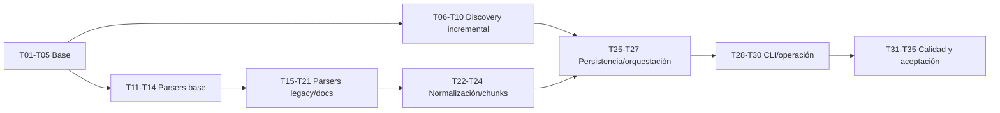

# H2 — Ingestion: Plan de tareas

## 1. Reglas

- Cada tarea produce un cambio pequeño y verificable.
- Ninguna debe superar 3 horas; si crece, se divide antes de implementarla.
- Las pruebas se desarrollan junto con cada capacidad.
- Los estados iniciales son `pendiente`.
- Una tarea termina solo con sus verificaciones pasando y sin ampliar exclusiones.
- Complejidad: **S** hasta 1.5 h; **M** entre 1.5 y 3 h.

## 2. Tareas

### H2-T01 — Extender el modelo de configuración

**Estado:** completado.
**Complejidad:** M.  
**Dependencias:** H1 completado.  
**Requisitos:** H2-REQ-001, H2-NFR-005.

- agregar settings `[ingestion]` tipados;
- definir defaults y validaciones cruzadas, incluyendo `max_file_size_mb = 50`;
- resolver paths respecto del TOML;
- rechazar claves desconocidas.

**Verificación:** tests de defaults, precedencia, paths, tipos, rangos y ausencia de efectos secundarios.

### H2-T02 — Actualizar configuración de ejemplo

**Estado:** completado.
**Complejidad:** S.  
**Dependencias:** H2-T01.  
**Requisitos:** H2-REQ-001.

- documentar todos los parámetros H2, extensiones Oracle ampliadas y default `max_file_size_mb = 50`;
- usar paths genéricos y seguros;
- actualizar `config show` para la sección.

**Verificación:** el ejemplo carga; `config show` no crea recursos.

### H2-T03 — Definir contratos del pipeline

**Estado:** completado.
**Complejidad:** M.  
**Dependencias:** ninguna.  
**Requisitos:** H2-REQ-009, H2-REQ-018, H2-NFR-008.

- crear value objects y estados mínimos en `domain/models.py`;
- agregar `LogicalUnit.confidence` con valores `high`, `medium` y `low`, dejando un comentario de código que indique que el enum es extensible para H4;
- definir outcomes y errores tipados;
- evitar dependencias de CLI, DB o parsers concretos; ubicar puertos mínimos en `domain/ports.py`.

**Verificación:** tests de construcción, invariantes e imports.

### H2-T04 — Crear migración SQLite v2

**Estado:** completado.
**Complejidad:** M.  
**Dependencias:** H2-T03.  
**Requisitos:** H2-REQ-019, H2-NFR-006.

- crear tablas, constraints e índices de H2 desde el adaptador `infrastructure/sqlite.py`;
- mantener la frontera: `database.py` queda para bootstrap, conexión y migraciones; `infrastructure/sqlite.py` queda para SQL de ingesta;
- conservar migración v1;
- soportar DB nueva y upgrade v1→v2;
- mantener error de versión futura.

**Verificación:** tests de migración, idempotencia, esquema e integridad.

### H2-T05 — Activar y verificar SQLite WAL

**Estado:** completado.
**Complejidad:** S.  
**Dependencias:** H2-T04.  
**Requisitos:** H2-REQ-020.

- habilitar foreign keys por conexión;
- ejecutar y comprobar journal WAL;
- traducir fallo a error accionable.

**Verificación:** pragmas activos en DB nueva/migrada y fallo simulado seguro.

### H2-T06 — Implementar discovery básico

**Estado:** completado.
**Complejidad:** M.  
**Dependencias:** H2-T01, H2-T03.  
**Requisitos:** H2-REQ-003.

- recorrer roots y archivos individuales desde `infrastructure/filesystem.py`;
- normalizar/deduplicar paths;
- ordenar resultados;
- no seguir symlinks.

**Verificación:** fixtures temporales prueban orden, roots, archivos y symlinks.

### H2-T07 — Implementar ignores y límites

**Estado:** completado.
**Complejidad:** M.  
**Dependencias:** H2-T06.  
**Requisitos:** H2-REQ-004.

- evaluar ignore patterns;
- filtrar extensiones case-insensitive;
- clasificar tamaño excedido;
- registrar errores de lectura/discovery.

**Verificación:** matriz de patterns, extensiones, tamaños y permisos.

### H2-T08 — Implementar SHA-256 streaming

**Estado:** completado.
**Complejidad:** S.  
**Dependencias:** H2-T03.  
**Requisitos:** H2-REQ-005.

- leer en bloques de 1 MiB;
- producir hash hexadecimal;
- detectar archivo desaparecido/cambiado durante lectura.

**Verificación:** vectores conocidos, archivo vacío y archivo grande temporal.

### H2-T09 — Implementar firma de procesamiento

**Estado:** completado.
**Complejidad:** S.  
**Dependencias:** H2-T01, H2-T03.  
**Requisitos:** H2-REQ-006, H2-NFR-002.

- serializar configuración relevante canónicamente;
- incluir versiones de parser/normalizador/chunker;
- excluir parámetros no transformativos.

**Verificación:** firma estable y cambios selectivos cubiertos.

### H2-T10 — Implementar decisión incremental

**Estado:** pendiente.  
**Complejidad:** M.  
**Dependencias:** H2-T04, H2-T08, H2-T09.  
**Requisitos:** H2-REQ-006, H2-REQ-007.

- resolver nuevo, unchanged, touch, changed, error previo y full;
- actualizar vistos sin tocar contenido;
- producir outcome verificable.

**Verificación:** tests de todas las transiciones y ausencia de parser en fast path.

### H2-T11 — Crear BaseParser y registro

**Estado:** pendiente.  
**Complejidad:** S.  
**Dependencias:** H2-T03.  
**Requisitos:** H2-REQ-009.

- definir contrato mínimo;
- mapear extensión a parser;
- rechazar duplicados y extensión desconocida.

**Verificación:** resolución, duplicados e imports sin efectos.

### H2-T12 — Implementar decodificación textual

**Estado:** pendiente.  
**Complejidad:** M.  
**Dependencias:** H2-T01, H2-T11.  
**Requisitos:** H2-REQ-010.

- detectar BOM;
- probar UTF-8 y fallback configurado;
- emitir warnings y errores tipados;
- rechazar reemplazo silencioso.

**Verificación:** fixtures UTF-8, UTF-16, cp1252, Latin-1 e inválido.

### H2-T13 — Implementar MarkdownParser

**Estado:** pendiente.  
**Complejidad:** M.  
**Dependencias:** H2-T11, H2-T12.  
**Requisitos:** H2-REQ-013.

- detectar headings ATX/Setext;
- conservar breadcrumbs, líneas y bloques de código;
- producir fallback de archivo.

**Verificación:** fixtures con jerarquía, código y documento sin headings.

### H2-T14 — Implementar TextParser

**Estado:** pendiente.  
**Complejidad:** S.  
**Dependencias:** H2-T11, H2-T12.  
**Requisitos:** H2-REQ-013.

- soportar txt, yaml/yml, json e ini;
- clasificar texto/configuración;
- conservar contenido y líneas sin reserializar.

**Verificación:** fixtures por extensión y evidencia byte/texto normalizado.

### H2-T15 — Implementar OracleParser base

**Estado:** pendiente.  
**Complejidad:** M.  
**Dependencias:** H2-T11, H2-T12.  
**Requisitos:** H2-REQ-011.

- detectar objetos principales, vistas, type specs y nombres;
- conservar texto completo y rangos;
- fallback seguro.

**Verificación:** fixtures package spec/body, procedure, function, trigger, view, type spec, `.pck`, `.vw`, `.vws`, `.pkg`, `.tps` y script genérico.

### H2-T16 — Delimitar subprogramas Oracle

**Estado:** pendiente.  
**Complejidad:** M.  
**Dependencias:** H2-T15.  
**Requisitos:** H2-REQ-011.

- detectar funciones/procedimientos internos;
- validar rangos y parent package;
- degradar a objeto completo ante ambigüedad.

**Verificación:** package con subprogramas, comentarios, strings y casos ambiguos.

### H2-T17 — Implementar PowerBuilderParser base

**Estado:** pendiente.  
**Complejidad:** M.  
**Dependencias:** H2-T11, H2-T12.  
**Requisitos:** H2-REQ-012.

- identificar tipo/nombre de objeto;
- conservar declaraciones y propiedades;
- fallback ante variantes.

**Verificación:** fixtures srw, sru, srf, srm y srj.

### H2-T18 — Extraer unidades PowerBuilder

**Estado:** pendiente.  
**Complejidad:** M.  
**Dependencias:** H2-T17.  
**Requisitos:** H2-REQ-012.

- delimitar eventos y funciones;
- detectar SQL de DataWindow en srd;
- marcar heurísticas y rangos;
- clasificar pbl binaria como skipped.

**Verificación:** fixtures de eventos, overloads, DataWindow y PBL sintética.

### H2-T19 — Incorporar dependencias documentales

**Estado:** pendiente.  
**Complejidad:** S.  
**Dependencias:** packaging H1.  
**Requisitos:** H2-REQ-014, H2-REQ-015.

- agregar `pypdf` y `python-docx` con versiones compatibles;
- verificar licencias y Python 3.12;
- mantener instalación reproducible.

**Verificación:** instalación limpia de runtime y dev extras.

### H2-T20 — Implementar PdfParser

**Estado:** pendiente.  
**Complejidad:** M.  
**Dependencias:** H2-T11, H2-T19.  
**Requisitos:** H2-REQ-014.

- extraer por página;
- aplicar límites;
- tipar cifrado, corrupción y falta de texto.

**Verificación:** PDF textual multipágina, cifrado, vacío y corrupto.

### H2-T21 — Implementar DocxParser

**Estado:** pendiente.  
**Complejidad:** M.  
**Dependencias:** H2-T11, H2-T19.  
**Requisitos:** H2-REQ-015.

- extraer headings, párrafos y tablas en orden;
- construir breadcrumbs;
- aplicar límites y errores seguros.

**Verificación:** DOCX con secciones/tablas y archivo corrupto.

### H2-T22 — Implementar normalización

**Estado:** pendiente.  
**Complejidad:** M.  
**Dependencias:** H2-T03.  
**Requisitos:** H2-REQ-016.

- normalizar BOM/saltos;
- preservar contenido técnico;
- ajustar offsets;
- calcular hash normalizado.

**Verificación:** CRLF/CR/LF, tabs, comentarios, Unicode y offsets.

### H2-T23 — Implementar chunking base

**Estado:** pendiente.  
**Complejidad:** M.  
**Dependencias:** H2-T22.  
**Requisitos:** H2-REQ-017.

- aceptar unidades lógicas;
- agrupar pequeñas compatibles;
- dividir grandes por párrafo/línea/caracteres;
- aplicar overlap.

**Verificación:** límites, overlap, contenido vacío y oversized controlado.

### H2-T24 — Implementar trazabilidad e IDs

**Estado:** pendiente.  
**Complejidad:** M.  
**Dependencias:** H2-T09, H2-T23.  
**Requisitos:** H2-REQ-018, H2-NFR-002.

- asignar ordinales, localizadores y `logical_unit_confidence` en metadata de chunk;
- generar metadata canónica;
- calcular content SHA y chunk ID.

**Verificación:** determinismo, líneas/páginas/objetos y cambio de firma/contenido.

### H2-T25 — Implementar persistencia por archivo

**Estado:** pendiente.  
**Complejidad:** M.  
**Dependencias:** H2-T04, H2-T24.  
**Requisitos:** H2-REQ-021, H2-NFR-006.

- upsert de files;
- reemplazo atómico de documento/chunks;
- rollback y error separado;
- queries de vigencia.

**Verificación:** éxito, reemplazo, fallo intermedio y documento previo no vigente.

### H2-T26 — Implementar IngestionService

**Estado:** pendiente.  
**Complejidad:** M.  
**Dependencias:** H2-T06–H2-T25.  
**Requisitos:** H2-REQ-002, H2-REQ-022.

- orquestar etapas secuencialmente;
- aislar errores recuperables;
- cerrar estados y métricas;
- manejar retries de DB.

**Verificación:** run mixto procesa válidos, registra inválidos y finaliza correctamente.

### H2-T27 — Implementar reconciliación

**Estado:** pendiente.  
**Complejidad:** M.  
**Dependencias:** H2-T25, H2-T26.  
**Requisitos:** H2-REQ-008.

- identificar no vistos por root completa;
- crear tombstones;
- eliminar hijos por cascada;
- evitar reconciliación insegura.

**Verificación:** eliminación, root fallida e interrupción sin huérfanos.

### H2-T28 — Integrar CLI ingest

**Estado:** pendiente.  
**Complejidad:** M.  
**Dependencias:** H2-T01, H2-T26, H2-T27.  
**Requisitos:** H2-REQ-023, H2-REQ-025.

- agregar árbol argparse y exclusiones, documentando que `--path` puede repetirse múltiples veces;
- usar doctor como bootstrap vigente;
- traducir errores/códigos;
- manejar KeyboardInterrupt.

**Verificación:** help, paths, incremental/full, errores y código 130.

### H2-T29 — Implementar métricas y stats

**Estado:** pendiente.  
**Complejidad:** M.  
**Dependencias:** H2-T25, H2-T28.  
**Requisitos:** H2-REQ-024, H2-REQ-027.

- persistir contadores/duración/bytes;
- mostrar resumen español;
- consultar última ejecución, corpus vigente e inventario exportable desde SQLite sin reescanear filesystem;
- mantener stats read-only.

**Verificación:** contadores cuadran; base ausente no se crea; stats e inventario no escanean filesystem.

### H2-T30 — Integrar logging contextual

**Estado:** pendiente.  
**Complejidad:** S.  
**Dependencias:** H2-T26, H2-T28.  
**Requisitos:** H2-NFR-004.

- incorporar run/stage/path/error code;
- evitar contenido sensible;
- registrar un resumen final.

**Verificación:** captura de logs por nivel, UTF-8, delay y ausencia de corpus.

### H2-T31 — Crear corpus sintético de pruebas

**Estado:** pendiente.  
**Complejidad:** M.  
**Dependencias:** H2-T13–H2-T21.  
**Requisitos:** todos los parsers.

- crear fixtures públicos/sintéticos de cada extensión;
- incluir encodings y errores;
- excluir nombres o datos internos.

**Verificación:** inventario de fixtures cubre matriz del test plan.

### H2-T32 — Completar integración incremental

**Estado:** pendiente.  
**Complejidad:** M.  
**Dependencias:** H2-T27, H2-T31.  
**Requisitos:** H2-REQ-005–H2-REQ-008, H2-NFR-002.

- probar primera corrida, unchanged, touch, modificación, eliminación y full;
- validar IDs, relaciones y contadores.

**Verificación:** suite usa directorios/SQLite temporales y pasa repetidamente.

### H2-T33 — Completar smoke tests

**Estado:** pendiente.  
**Complejidad:** M.  
**Dependencias:** H2-T28–H2-T32.  
**Requisitos:** H2-REQ-023, H2-REQ-026.

- probar ejecutable instalado fuera del source tree;
- ejecutar ingest, incremental y stats;
- capturar UTF-8 explícitamente en Windows;
- comprobar ausencia de red.

**Verificación:** smoke suite pasa en venv limpio.

### H2-T34 — Documentar operación H2

**Estado:** pendiente.  
**Complejidad:** S.  
**Dependencias:** H2-T28, H2-T29.  
**Requisitos:** H2-REQ-001, H2-REQ-023.

- actualizar README y guía operativa;
- documentar configuración, formatos, comandos y límites;
- explicar export textual de PBL y PDFs sin OCR.

**Verificación:** ejemplos públicos y coherentes con help real.

### H2-T35 — Ejecutar aceptación H2

**Estado:** pendiente.  
**Complejidad:** M.  
**Dependencias:** H2-T01–H2-T34.  
**Requisitos:** todos.

- ejecutar suite completa en instalación limpia;
- revisar chunks manualmente;
- medir full e incremental;
- documentar evidencia y exclusiones.

**Verificación:** todos los criterios Must y el test plan pasan; se crea evidencia de aceptación separada.

## 3. Orden de implementación

## 4. Trazabilidad de incrementos

| Incremento | Tareas | Resultado |
|---|---|---|
| REQ-01 Configuración | T01–T02 | Configuración H2 válida y visible |
| REQ-02 Persistencia base | T03–T05 | Schema v2, FK y WAL |
| REQ-03 Discovery/fingerprint | T06–T10 | Clasificación incremental |
| REQ-04 Parsers base | T11–T14 | Contrato, encoding y texto |
| REQ-05 Legacy/documentos | T15–T21 | Extracción de formatos objetivo |
| REQ-06 Normalización/chunking | T22–T24 | Chunks trazables y deterministas |
| REQ-07 Orquestación | T25–T27 | Pipeline atómico e incremental |
| REQ-08 CLI/observabilidad | T28–T30 | Comandos, stats, inventario consultable y logs |
| REQ-09 Cierre | T31–T35 | Fixtures, pruebas, docs, inventario exportable y aceptación |
