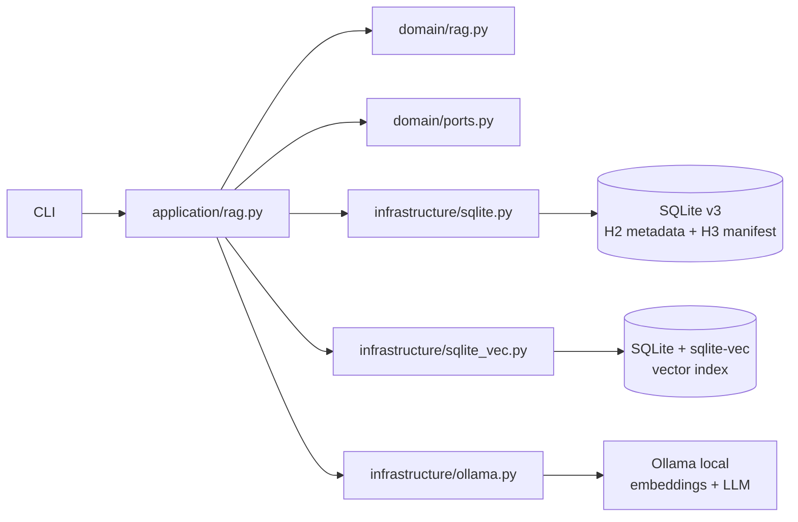
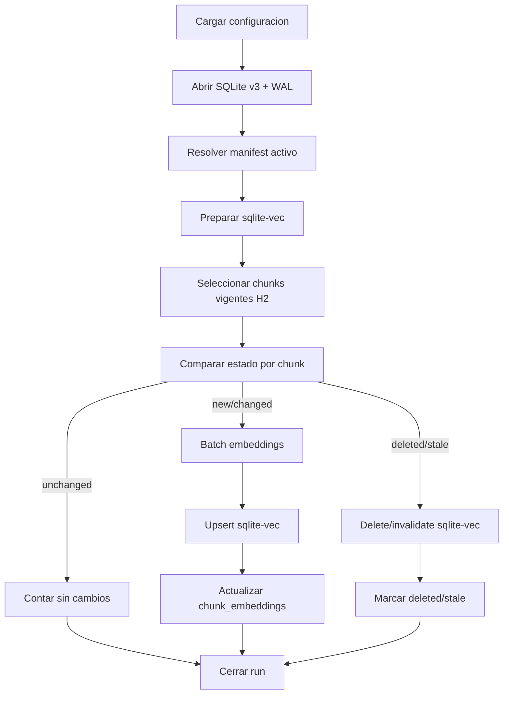

# H3 - RAG: Diseno

## 1. Objetivo

Definir la implementacion incremental de un RAG local sobre los chunks vigentes de H2. El diseno debe permitir buscar, construir contexto y responder preguntas con evidencia, sin introducir servicios remotos, frameworks RAG grandes ni acoplamiento a un dominio especifico.

## 2. Decisiones cerradas

| Tema | Decision H3 |
|---|---|
| Ejecucion | CLI, un proceso, operaciones locales |
| Embeddings | puerto `EmbeddingProvider`; adaptador inicial Ollama |
| Modelo default | `nomic-embed-text`, configurable |
| Vector store | SQLite + `sqlite-vec` |
| Metadata | SQLite v3 como fuente de verdad y manifest |
| Indexacion | incremental por chunk, con reindex parcial/full |
| Keyword | SQLite FTS5 si existe; fallback local simple |
| Ranking | combinacion ponderada vector + keyword |
| Contexto | ensamblador determinista con presupuesto de tokens |
| Generacion | Ollama local mediante puerto de LLM |
| Framework RAG | no adoptar en H3 |
| Telemetria | solo logs y metricas locales |

## 3. Arquitectura



`application/rag.py` orquesta casos de uso. `domain/rag.py` contiene reglas puras de versionamiento, ranking, filtros, deduplicacion y contexto. `domain/ports.py` define puertos pequenos. `infrastructure/` contiene adaptadores locales.

## 4. Estructura Python propuesta

```text
src/barbarion/
├── cli.py                         # agrega comandos RAG
├── config.py                      # agrega secciones H3
├── database.py                    # migracion v3 y bootstrap comun
├── application/
│   ├── ingest.py                  # existente H2
│   └── rag.py                     # index/search/ask/stats
├── domain/
│   ├── models.py                  # modelos compartidos existentes
│   ├── ingestion.py               # existente H2
│   ├── rag.py                     # reglas puras H3
│   └── ports.py                   # extiende puertos
└── infrastructure/
    ├── sqlite.py                  # SQL H2 + H3
    ├── sqlite_vec.py              # vector store local inicial
    └── ollama.py                  # embeddings y LLM local
```

No se crea un paquete paralelo `rag/` al nivel de las capas. Si el archivo `application/rag.py` crece, puede dividirse dentro de `application/` por caso de uso, pero solo despues de que haya una necesidad real.

## 5. Contratos internos

| Contrato | Campos minimos |
|---|---|
| `EmbeddingRequest` | texts, input_kind, embedding_version |
| `EmbeddingVector` | text_index, values, dimension, provider, model |
| `EmbeddingManifest` | provider, model, dimension, distance, normalize, version, collection |
| `IndexableChunk` | chunk_id, content, content_sha256, file/document metadata, locator |
| `IndexRunSummary` | run_id, status, counts, duration, errors |
| `RetrievalFilter` | domain, artifact_kind, language, document_id, folder, extension |
| `RetrievalCandidate` | chunk_id, scores, source metadata, snippet optional |
| `ContextSource` | source_id, candidate, content, token_estimate |
| `BuiltContext` | sources, rendered_context, token_count, omitted |
| `AnswerResult` | answer, sources, assumptions, insufficient_evidence, timings |

## 6. Configuracion

```toml
[embeddings]
provider = "ollama"
model = "nomic-embed-text"
batch_size = 16
timeout_seconds = 60
normalize = true

[vector_store]
provider = "sqlite_vec"
table_prefix = "rag"
distance = "cosine"

[retrieval]
mode = "hybrid"
top_k = 10
candidate_k = 40
similarity_threshold = 0.20
vector_weight = 0.70
keyword_weight = 0.30

[rag]
context_token_budget = 6000
max_chunk_tokens = 1200
dedupe_min_hash_prefix = 16
include_snippets = true

[llm]
provider = "ollama"
model = "llama3.1:8b"
timeout_seconds = 120
temperature = 0.1
```

Reglas:

- `batch_size` entre 1 y 128;
- `top_k` entre 1 y 100;
- `candidate_k >= top_k`;
- pesos hibridos entre 0 y 1 y suma mayor que 0;
- `context_token_budget` mayor a 500;
- `distance` inicial `cosine`;
- `provider` inicial obligatorio `sqlite_vec`; `qdrant_local` queda reservado para una decision futura;
- modelo LLM puede quedar sin validar hasta `ask`; `search` no lo requiere.

## 7. Modelo SQLite v3

### 7.1 Convenciones

- schema version H3: `3`;
- conserva v1/v2 y WAL;
- vector row id/logical id = `chunks.id`;
- timestamps ISO 8601 UTC;
- JSON canonico en TEXT;
- almacenar vectores del MVP en SQLite mediante `sqlite-vec`;
- Qdrant no es dependencia inicial de H3.

### 7.2 `embedding_manifests`

| Columna | Tipo | Regla |
|---|---|---|
| `id` | INTEGER | PK |
| `version` | TEXT | UNIQUE, SHA canonico |
| `provider`, `model` | TEXT | NOT NULL |
| `dimension` | INTEGER | NOT NULL |
| `distance`, `normalize` | TEXT/INTEGER | NOT NULL |
| `collection_name` | TEXT | NOT NULL |
| `status` | TEXT | active/obsolete/failed |
| `created_at`, `updated_at` | TEXT | UTC |

### 7.3 `embedding_runs`

| Columna | Tipo | Regla |
|---|---|---|
| `id` | INTEGER | PK |
| `manifest_id` | INTEGER | FK |
| `mode` | TEXT | incremental/full/partial |
| `status` | TEXT | running/completed/completed_with_errors/failed/interrupted |
| `scope_json` | TEXT | alcance canonico |
| `started_at`, `finished_at` | TEXT | UTC |
| `new_chunks`, `updated_chunks`, `unchanged_chunks` | INTEGER | default 0 |
| `deleted_chunks`, `failed_chunks` | INTEGER | default 0 |
| `duration_ms`, `embedding_ms`, `vector_ms` | INTEGER | nullable |

### 7.4 `chunk_embeddings`

| Columna | Tipo | Regla |
|---|---|---|
| `chunk_id` | TEXT | FK `chunks.id` |
| `manifest_id` | INTEGER | FK |
| `content_sha256` | TEXT | NOT NULL |
| `status` | TEXT | indexed/stale/deleted/error |
| `vector_ref` | TEXT | NOT NULL |
| `last_run_id` | INTEGER | FK |
| `error_code`, `error_message` | TEXT | nullable |
| `created_at`, `updated_at` | TEXT | UTC |

Primary key `(chunk_id, manifest_id)`.

### 7.5 `rag_queries`

| Columna | Tipo | Regla |
|---|---|---|
| `id` | INTEGER | PK |
| `query_text_sha256` | TEXT | no guarda pregunta completa por defecto |
| `mode`, `top_k`, `filters_json` | TEXT/INTEGER | NOT NULL |
| `candidate_count`, `context_sources` | INTEGER | default 0 |
| `vector_ms`, `keyword_ms`, `ranking_ms`, `context_ms`, `llm_ms` | INTEGER | nullable |
| `status` | TEXT | completed/insufficient_evidence/error |
| `created_at` | TEXT | UTC |

### 7.6 `symbol_occurrences`

Tabla reservada para compatibilidad futura con H4. H3 no implementa extraccion avanzada; solo puede poblarla si H2 ya provee metadata simple equivalente.

| Columna | Tipo | Regla |
|---|---|---|
| `id` | INTEGER | PK |
| `chunk_id` | TEXT | FK `chunks.id` |
| `symbol_name` | TEXT | nullable |
| `symbol_kind` | TEXT | nullable |
| `line_start` | INTEGER | nullable |
| `line_end` | INTEGER | nullable |

Indices: `chunk_id`, `symbol_name` y `symbol_kind`.

### 7.7 Tablas vectoriales `sqlite-vec`

El diseno concreto depende de la API disponible de `sqlite-vec`, pero debe mantener una frontera clara:

- tabla virtual o estructura vectorial para embeddings por `chunk_id`;
- tabla relacional de metadata/filtros en SQLite;
- `chunk_embeddings.vector_ref` referencia el registro vectorial;
- no se duplican textos completos fuera de `chunks.content`;
- borrar/reconstruir tablas vectoriales no afecta H2.

## 8. Metadata vectorial y de resultados

Cada punto vectorial guarda:

| Campo | Uso |
|---|---|
| `chunk_id` | identidad y delete logico |
| `domain` | filtro |
| `artifact_kind` | filtro por tipo |
| `language` | filtro |
| `document_id`, `file_id` | trazabilidad |
| `relative_path`, `folder`, `extension` | filtros y salida |
| `object_type`, `object_name` | H4/H5 |
| `symbol_name`, `symbol_kind` | H4 |
| `parent_symbol` | H4 |
| `package_name`, `procedure_name` | H4 Oracle |
| `class_name`, `event_name` | H4 PowerBuilder |
| `start_line`, `end_line`, `page_start`, `page_end` | citas |
| `content_sha256`, `embedding_version` | validacion |

Estos campos se almacenan en SQLite junto al estado de embedding o se derivan por join desde metadata H2. Pueden quedar NULL inicialmente. Su presencia prepara H4 sin convertir H3 en analisis profundo.

## 9. Pipeline de indexacion



Reglas:

- los batches se ordenan por `chunk_id`;
- el contenido enviado al embedding provider es el `chunks.content` vigente;
- un fallo de embedding en batch se registra por chunk si es recuperable;
- si `sqlite-vec` falla durante upsert, no se marca el chunk como indexado;
- Ctrl+C marca run `interrupted` y no borra indices adicionales;
- `--dry-run` calcula alcance sin llamar modelos ni escribir tablas vectoriales.

## 10. Recuperacion

### 10.1 Semantica

1. generar embedding de la query;
2. buscar en `sqlite-vec` y aplicar filtros con metadata SQLite;
3. traer metadata completa desde SQLite;
4. aplicar umbral y orden estable.

### 10.2 Keyword

1. normalizar consulta conservando identificadores;
2. consultar FTS5 si existe;
3. si FTS5 no existe, usar busqueda local simple sobre chunks vigentes;
4. devolver score lexicografico normalizado.

### 10.3 Hibrida

```text
combined_score = normalized_vector_score * vector_weight
               + normalized_keyword_score * keyword_weight
```

El ranking conserva `vector_score`, `keyword_score`, `combined_score` y `retrieval_mode`. Los candidatos duplicados por `chunk_id` se fusionan.

## 11. Context builder

Pasos:

1. filtrar candidatos bajo umbral;
2. deduplicar por `chunk_id` y `content_sha256`;
3. limitar por `max_chunk_tokens`;
4. agrupar candidatos del mismo documento si son contiguos o cercanos;
5. asignar `source_id` estable `F1`, `F2`, ...;
6. renderizar contexto con encabezados de fuente;
7. detener al alcanzar `context_token_budget`;
8. registrar omitidos por score, duplicado o presupuesto.

El estimador de tokens puede ser aproximado por caracteres para H3, pero debe estar encapsulado para cambiarlo despues.

## 12. Preguntas y respuestas

Flujo:

1. `ask` llama recuperacion hibrida;
2. si no hay evidencia suficiente, responde sin LLM salvo `--force`;
3. context builder produce fuentes numeradas;
4. prompt exige responder solo con evidencia;
5. adaptador Ollama LLM genera respuesta;
6. validador comprueba citas;
7. salida muestra conclusion, evidencia, supuestos y limites.

Formato base:

```markdown
## Conclusion
...

## Evidencia
- [F1] `ruta/archivo.sql`, chunk `...`, score 0.82, lineas 10-42

## Supuestos y limites
- ...
```

Si una cita no existe en el contexto, la respuesta se marca invalida y se reemplaza por un error accionable o por evidencia insuficiente, segun configuracion.

## 13. CLI

| Comando | Comportamiento |
|---|---|
| `barbarion index` | indexacion incremental de chunks vigentes |
| `barbarion index --dry-run` | muestra alcance sin escribir |
| `barbarion reindex --full` | reconstruye indice de la version activa |
| `barbarion reindex --path PATH` | reindexa documentos bajo carpeta |
| `barbarion reindex --document ID` | reindexa un documento |
| `barbarion search "consulta"` | recupera candidatos |
| `barbarion ask "pregunta"` | recupera contexto y responde |
| `barbarion ask --no-llm` | muestra contexto ensamblado |
| `barbarion embeddings` | estado de manifests, modelos e indices |
| `barbarion stats` | incluye metricas H2 + H3 |

Opciones comunes de consulta:

- `--mode semantic|keyword|hybrid`;
- `--top-k N`;
- `--threshold FLOAT`;
- `--project DOMAIN`;
- `--type KIND`;
- `--language LANG`;
- `--document ID`;
- `--folder PATH`;
- `--extension EXT`;
- `--format text|json|markdown`;
- `--debug`.

## 14. Observabilidad

Logs:

- `INFO`: inicio/fin de runs, resumen, query id;
- `WARNING`: modelo no disponible, FTS5 ausente, evidencia insuficiente;
- `ERROR`: fallos operativos sin contenido fuente;
- `DEBUG`: timings, scores, filtros y decisiones, con snippets solo si el usuario lo pide.

Metricas:

- indexacion: chunks/s, batch size efectivo, latencia de embeddings, upsert/delete, errores;
- recuperacion: vector_ms, keyword_ms, ranking_ms, context_ms;
- ask: llm_ms, fuentes usadas, tokens estimados, citas rechazadas.
- calidad de contexto: `context_precision`, `context_recall`, `duplicate_ratio` y `token_waste`.

## 15. Reportes H3

El cierre tecnico debe poder generar evidencia automatica con un comando o tarea equivalente a `generate-report`. La salida local esperada es:

```text
reports/
└── h3/
    ├── metrics.json
    ├── topk-report.md
    ├── smoke-report.md
    └── benchmark.md
```

`metrics.json` contiene metricas estructuradas de indexacion, recuperacion, benchmark y contexto. `topk-report.md` resume recall@5, recall@10, MRR y latencia por categoria. `smoke-report.md` documenta comandos ejecutados. `benchmark.md` conserva preguntas, fuentes esperadas, observaciones y una seccion `Baseline` con `recall@5`, `recall@10`, `mrr` y latencia.

Cada ejecucion de benchmark debe conservar historico local. El formato puede ser JSONL, una lista dentro de `metrics.json` o una seccion acumulativa en `benchmark.md`, siempre que permita comparar ejecuciones por fecha, commit/configuracion, modelo, chunk size, overlap y pesos de ranking.

## 16. Preparacion para H4 y H5

H4 podra usar `RetrievalFilter`, `RetrievalCandidate` y `ContextBuilder` para sembrar analisis con objetos, archivos o relaciones. H5 podra serializar `ContextSource` y `AnswerResult` como evidencia en Markdown. H3 no implementa dependencias ni specs, pero conserva campos de objeto, rangos, scores y procedencia.

## 17. Salvaguardas contra over engineering

No se agregan LangChain, LlamaIndex, agentes autonomos, bases de grafos, servidores HTTP, workers, colas, cache distribuida, modelos descargados automaticamente, telemetria remota ni multiples proveedores activos simultaneos. Toda abstraccion debe respaldar un requisito Must verificable.

Qdrant queda como alternativa futura y no se implementa como dependencia inicial de H3.
