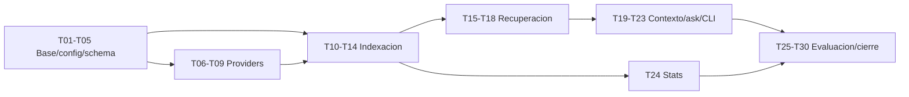

# H3 - RAG: Plan de tareas

## 1. Reglas

- Cada tarea produce un cambio pequeno y verificable.
- Ninguna debe superar 3 horas; si crece, se divide antes de implementarla.
- Las pruebas se desarrollan junto con cada capacidad.
- Los estados iniciales son `pendiente`.
- Una tarea termina solo con sus verificaciones pasando y sin ampliar alcance.
- Complejidad: **S** hasta 1.5 h; **M** entre 1.5 y 3 h.

## 2. Tareas

### H3-T01 - Extender configuracion RAG

**Estado:** completado.  
**Complejidad:** M.  
**Dependencias:** H2 aceptado.  
**Requisitos:** H3-REQ-001, H3-NFR-005.

- agregar secciones `[embeddings]`, `[vector_store]`, `[retrieval]`, `[rag]` y `[llm]`;
- definir defaults y validaciones cruzadas;
- resolver paths relativos al TOML;
- rechazar claves desconocidas.

**Verificacion:** tests de defaults, rangos, paths, errores y `config show` sin efectos.

### H3-T02 - Actualizar configuracion de ejemplo y docs operativas

**Estado:** completado.  
**Complejidad:** S.  
**Dependencias:** H3-T01.  
**Requisitos:** H3-REQ-001, H3-REQ-019.

- documentar claves H3 en `barbarion.example.toml`;
- actualizar README con comandos RAG;
- explicar modelos locales requeridos sin descarga automatica.

**Verificacion:** ejemplo carga y ayuda/documentacion coinciden.

### H3-T03 - Definir modelos y puertos RAG

**Estado:** completado.  
**Complejidad:** M.  
**Dependencias:** H3-T01.  
**Requisitos:** H3-REQ-002, H3-REQ-015, H3-REQ-016, H3-NFR-006.

- crear contratos de embeddings, vector store, LLM y retrieval;
- definir errores tipados;
- ubicar reglas puras en `domain/rag.py`;
- extender `domain/ports.py` sin acoplar infraestructura.

**Verificacion:** tests de invariantes, imports sin efectos y fakes deterministas.

### H3-T04 - Crear migracion SQLite v3

**Estado:** completado.  
**Complejidad:** M.  
**Dependencias:** H3-T03.  
**Requisitos:** H3-REQ-006, H3-NFR-008.

- crear `embedding_manifests`, `embedding_runs`, `chunk_embeddings` y `rag_queries`;
- crear `symbol_occurrences` como tabla reservada para H4;
- conservar migraciones previas y WAL;
- agregar indices necesarios;
- mantener H2 read-only para H3.

**Verificacion:** DB nueva, upgrade v2-v3, idempotencia, FK y version futura.

### H3-T05 - Implementar manifest de embeddings

**Estado:** completado.  
**Complejidad:** M.  
**Dependencias:** H3-T04.  
**Requisitos:** H3-REQ-004.

- calcular version canonica;
- crear/obtener manifest activo;
- detectar cambios de proveedor/modelo/dimension;
- marcar obsoletos.

**Verificacion:** versiones estables, cambios selectivos y no mezcla de dimensiones.

### H3-T06 - Implementar provider fake de embeddings

**Estado:** completado.  
**Complejidad:** S.  
**Dependencias:** H3-T03.  
**Requisitos:** H3-REQ-002, H3-NFR-008.

- generar vectores deterministas para tests;
- simular dimensiones, timeouts y errores;
- no depender de red ni modelos.

**Verificacion:** vectores reproducibles y errores tipados.

### H3-T07 - Implementar adaptador Ollama embeddings

**Estado:** completado.  
**Complejidad:** M.  
**Dependencias:** H3-T03, H3-T05.  
**Requisitos:** H3-REQ-003, H3-NFR-001.

- llamar endpoint local de embeddings;
- validar dimension estable;
- manejar timeout/modelo ausente/respuesta invalida;
- no descargar modelos.

**Verificacion:** tests con servidor fake HTTP y smoke opcional con Ollama real.

### H3-T08 - Incorporar dependencia sqlite-vec

**Estado:** completado.  
**Complejidad:** S.  
**Dependencias:** packaging vigente.  
**Requisitos:** H3-REQ-005, H3-NFR-005.

- agregar dependencia `sqlite-vec` compatible con Python 3.12;
- verificar soporte local en Windows/Linux y carga de extension si aplica;
- documentar version y motivo.

**Verificacion:** instalacion limpia y prueba de import sin efectos.

### H3-T09 - Implementar adaptador sqlite-vec

**Estado:** completado.  
**Complejidad:** M.  
**Dependencias:** H3-T08, H3-T05.  
**Requisitos:** H3-REQ-005.

- crear/abrir tablas vectoriales SQLite;
- crear/validar dimension y distancia;
- implementar upsert, delete y search;
- mapear errores operativos.

**Verificacion:** tests con directorio temporal, upsert idempotente, filtros y dimension incompatible.

### H3-T10 - Implementar seleccion de chunks indexables

**Estado:** pendiente.  
**Complejidad:** M.  
**Dependencias:** H3-T04.  
**Requisitos:** H3-REQ-007, H3-REQ-022.

- consultar chunks vigentes H2;
- mapear metadata para filtros y citas;
- mapear campos preparados para H4 (`symbol_name`, `symbol_kind`, `parent_symbol`, `package_name`, `procedure_name`, `class_name`, `event_name`) como NULL si no existen;
- excluir no vigentes;
- no acceder al filesystem.

**Verificacion:** fixtures SQLite con processed, error, deleted y hashes.

### H3-T11 - Implementar decision incremental de indexacion

**Estado:** pendiente.  
**Complejidad:** M.  
**Dependencias:** H3-T05, H3-T10.  
**Requisitos:** H3-REQ-008, H3-NFR-002.

- clasificar new, changed, unchanged, deleted y stale;
- evitar llamadas de embeddings para unchanged;
- producir plan ordenado y dry-run.

**Verificacion:** matriz de estados y orden canonico.

### H3-T12 - Implementar IndexService

**Estado:** pendiente.  
**Complejidad:** M.  
**Dependencias:** H3-T07, H3-T09, H3-T11.  
**Requisitos:** H3-REQ-008, H3-REQ-020.

- orquestar batches;
- persistir runs y estados por chunk;
- registrar errores recuperables;
- medir tiempos de embeddings y vector store.

**Verificacion:** integracion con fakes procesa mixto y deja manifest consistente.

### H3-T13 - Implementar reindex full/parcial y obsoletos

**Estado:** pendiente.  
**Complejidad:** M.  
**Dependencias:** H3-T12.  
**Requisitos:** H3-REQ-009.

- soportar full, path, document y chunk-id;
- reconstruir coleccion de version activa;
- borrar indices obsoletos solo con opcion explicita;
- manejar interrupcion.

**Verificacion:** reindex scope, delete obsolete, Ctrl+C y no tocar H2.

### H3-T14 - Integrar CLI index/reindex

**Estado:** pendiente.  
**Complejidad:** M.  
**Dependencias:** H3-T12, H3-T13.  
**Requisitos:** H3-REQ-018.

- agregar comandos y opciones;
- traducir errores a codigos de salida;
- mostrar resumen en espanol;
- soportar `--dry-run`.

**Verificacion:** help, argumentos invalidos, dry-run, incremental y reindex.

### H3-T15 - Implementar busqueda semantica

**Estado:** pendiente.  
**Complejidad:** M.  
**Dependencias:** H3-T09.  
**Requisitos:** H3-REQ-010, H3-REQ-015.

- generar embedding de query;
- consultar `sqlite-vec` con filtros SQLite;
- enriquecer resultados desde SQLite;
- aplicar threshold y orden estable.

**Verificacion:** tests con provider/vector fake, filtros y coleccion vacia.

### H3-T16 - Implementar busqueda keyword

**Estado:** pendiente.  
**Complejidad:** M.  
**Dependencias:** H3-T04, H3-T10.  
**Requisitos:** H3-REQ-011.

- crear soporte FTS5 cuando este disponible;
- implementar fallback local simple;
- devolver score keyword y metadata;
- mantener sincronizacion con chunks vigentes.

**Verificacion:** identifiers, literales, FTS ausente simulado y ranking estable.

### H3-T17 - Implementar ranking hibrido

**Estado:** pendiente.  
**Complejidad:** M.  
**Dependencias:** H3-T15, H3-T16.  
**Requisitos:** H3-REQ-012.

- normalizar scores;
- combinar pesos configurables;
- deduplicar por chunk;
- conservar scores individuales.

**Verificacion:** casos vector-only, keyword-only, empates y pesos invalidos.

### H3-T18 - Implementar SearchService

**Estado:** pendiente.  
**Complejidad:** M.  
**Dependencias:** H3-T17.  
**Requisitos:** H3-REQ-015, H3-REQ-020.

- exponer busqueda semantic/keyword/hybrid;
- registrar `rag_queries`;
- devolver resultados estructurados;
- soportar debug.

**Verificacion:** unit e integracion con fakes, metricas y filtros.

### H3-T19 - Implementar ContextBuilder

**Estado:** pendiente.  
**Complejidad:** M.  
**Dependencias:** H3-T18.  
**Requisitos:** H3-REQ-013, H3-REQ-022.

- estimar tokens;
- deduplicar y agrupar fuentes;
- asignar `source_id`;
- renderizar contexto debug.
- calcular o preparar `context_precision`, `context_recall`, `duplicate_ratio` y `token_waste`.

**Verificacion:** presupuesto, duplicados, agrupacion, omitidos y metadata de citas.

### H3-T20 - Implementar adaptador Ollama LLM

**Estado:** pendiente.  
**Complejidad:** M.  
**Dependencias:** H3-T03.  
**Requisitos:** H3-REQ-016, H3-NFR-001.

- llamar generacion local;
- controlar timeout y temperatura;
- manejar modelo ausente;
- no almacenar prompts completos por defecto.

**Verificacion:** servidor fake, timeout, respuesta invalida y smoke opcional real.

### H3-T21 - Implementar prompts y validador de citas

**Estado:** pendiente.  
**Complejidad:** M.  
**Dependencias:** H3-T19, H3-T20.  
**Requisitos:** H3-REQ-014, H3-REQ-016.

- definir plantilla de respuesta en espanol;
- validar que citas existan;
- separar evidencia, supuestos y limites;
- manejar evidencia insuficiente.

**Verificacion:** respuestas con citas validas, cita inexistente y sin resultados.

### H3-T22 - Implementar AskService

**Estado:** pendiente.  
**Complejidad:** M.  
**Dependencias:** H3-T18, H3-T21.  
**Requisitos:** H3-REQ-016, H3-REQ-017, H3-REQ-020.

- orquestar search, context, LLM y validacion;
- soportar `--no-llm`;
- registrar metricas por etapa;
- devolver resultado estructurado.

**Verificacion:** ask con evidencia, insuficiente, debug y timeout LLM.

### H3-T23 - Integrar CLI search/ask

**Estado:** pendiente.  
**Complejidad:** M.  
**Dependencias:** H3-T18, H3-T22.  
**Requisitos:** H3-REQ-019.

- agregar filtros, top-k, threshold, mode y format;
- formatear text/json/markdown;
- mostrar fuentes, scores y lineas;
- traducir errores.

**Verificacion:** smoke CLI de busqueda, ask, filtros, JSON valido y no-llm.

### H3-T24 - Implementar CLI embeddings/stats

**Estado:** pendiente.  
**Complejidad:** M.  
**Dependencias:** H3-T04, H3-T12.  
**Requisitos:** H3-REQ-004, H3-REQ-019, H3-REQ-020.

- mostrar manifest activo y obsoletos;
- contar indexed/stale/deleted/error;
- extender stats con metricas RAG;
- mantener read-only.

**Verificacion:** DB ausente/existente, salida espanol y no mutacion.

### H3-T25 - Crear corpus y preguntas de evaluacion RAG

**Estado:** pendiente.  
**Complejidad:** M.  
**Dependencias:** H2 fixtures.  
**Requisitos:** H3-REQ-021, H3-REQ-023.

- preparar al menos 10 preguntas;
- clasificar cada pregunta en navegacion, dependencias, ubicacion de objetos, explicaciones, impacto o documentacion;
- incluir ejemplos como `Donde se calcula COSTO_AMORT_DIA?`, `Que objetos llaman p_insertarCompraVenta?`, `Donde se usa NOM_OPERACION_DIA?` y `Que documentos hablan de CDVAL?`;
- mapear fuentes esperadas por chunk/documento;
- cubrir Oracle, PowerBuilder y documentacion;
- evitar informacion privada.

**Verificacion:** fixtures versionados y validacion de referencias existentes.

### H3-T26 - Implementar Retrieval Benchmark Dataset

**Estado:** pendiente.  
**Complejidad:** M.  
**Dependencias:** H3-T18, H3-T25.  
**Requisitos:** H3-REQ-021, H3-REQ-023.

- ejecutar preguntas contra search;
- medir recall@5, recall@10, mrr y latencia;
- medir `context_precision`, `context_recall`, `duplicate_ratio` y `token_waste` cuando exista contexto esperado;
- crear o actualizar baseline con recall@5, recall@10, mrr y latencia;
- conservar historico local de ejecuciones de benchmark;
- generar reporte local;
- fallar si no cumple umbral configurado.

**Verificacion:** suite reproducible con fakes y modo real opcional.

### H3-T27 - Completar pruebas de integracion

**Estado:** pendiente.  
**Complejidad:** M.  
**Dependencias:** H3-T14, H3-T23, H3-T24.  
**Requisitos:** todos los Must.

- probar index inicial, incremental, reindex, search, ask y stats;
- usar SQLite y tablas `sqlite-vec` temporales;
- usar fakes para modelos por defecto.

**Verificacion:** integration suite pasa sin red ni modelos reales.

### H3-T28 - Completar smoke tests instalados

**Estado:** pendiente.  
**Complejidad:** M.  
**Dependencias:** H3-T27.  
**Requisitos:** H3-REQ-018, H3-REQ-019, H3-NFR-001.

- ejecutar entry point instalado fuera del repo;
- validar ayuda, index dry-run, search, ask no-llm y stats;
- capturar UTF-8 en Windows.

**Verificacion:** smoke suite pasa en venv limpio.

### H3-T29 - Documentar operacion H3

**Estado:** pendiente.  
**Complejidad:** S.  
**Dependencias:** H3-T23, H3-T24.  
**Requisitos:** H3-REQ-019, H3-NFR-007.

- actualizar README y docs operativas;
- explicar indexacion, filtros, modelos, errores y limites;
- documentar privacidad de logs y debug.

**Verificacion:** comandos documentados coinciden con help real.

### H3-T30 - Ejecutar cierre tecnico de H3 y generate-report

**Estado:** pendiente.  
**Complejidad:** M.  
**Dependencias:** H3-T01-H3-T29.  
**Requisitos:** todos, H3-REQ-023.

- ejecutar suite completa;
- ejecutar evaluacion de 10 preguntas;
- ejecutar comando o tarea equivalente a `generate-report`;
- producir `reports/h3/metrics.json`;
- producir `reports/h3/topk-report.md`;
- producir `reports/h3/smoke-report.md`;
- producir `reports/h3/benchmark.md`;
- asegurar que `benchmark.md` incluya seccion `Baseline`;
- asegurar que la ejecucion conserve historico comparable;
- registrar metricas y limitaciones;
- preparar insumos para el ultimo task de aceptacion.

**Verificacion:** todos los Must pasan, top-5 cumple al menos 8/10, los cuatro reportes existen con contenido reproducible y el historico permite comparar contra una ejecucion previa.

## 3. Orden de implementacion

## 4. Trazabilidad de incrementos

| Incremento | Tareas | Resultado |
|---|---|---|
| RAG-01 Configuracion y schema | T01-T05 | H3 configurado y SQLite v3 |
| RAG-02 Proveedores locales | T06-T09 | Embeddings y sqlite-vec desacoplados |
| RAG-03 Indexacion | T10-T14 | Indice incremental y reindex |
| RAG-04 Recuperacion | T15-T18 | Search semantico, keyword e hibrido |
| RAG-05 Contexto y Q&A | T19-T23 | Ask con contexto y citas |
| RAG-06 Operacion | T24-T29 | Stats, evaluacion, smoke y docs |
| RAG-07 Cierre | T30 | Evidencia tecnica para aceptacion posterior |
