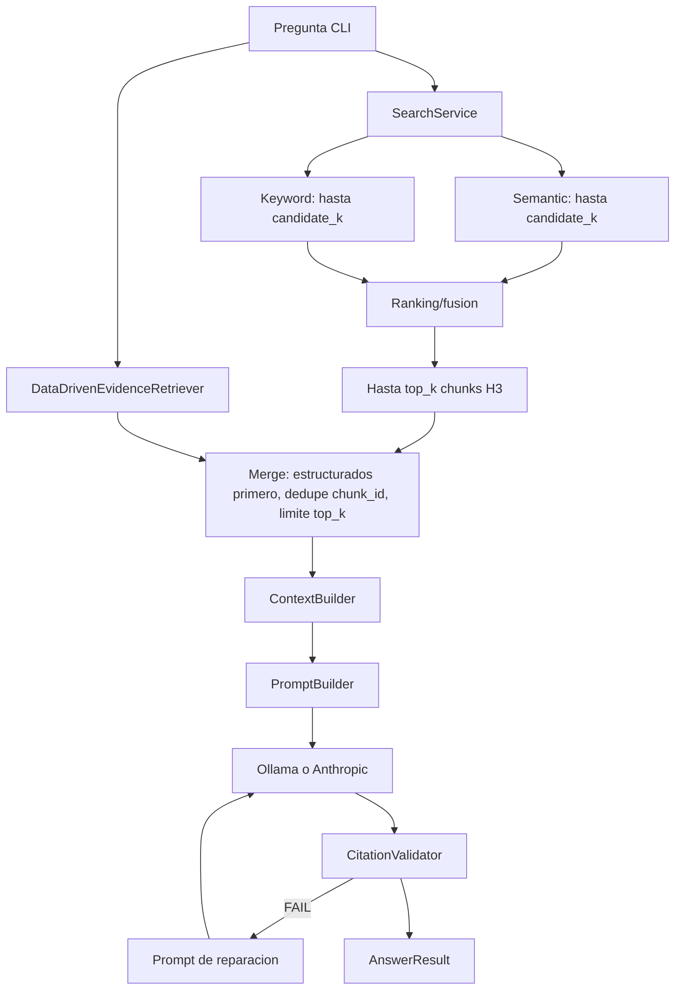

# H3.1 - Optimizacion de contexto RAG: Diseno

## 1. Comportamiento actual verificado

### 1.1 Flujo de una consulta



Evidencia en codigo:

- `src/barbarion/application/rag.py`: `SearchService`,
  `DataDrivenEvidenceRetriever`, `ContextBuilder`, `PromptBuilder`,
  `CitationValidator`, `AskService` y helpers de composicion.
- `src/barbarion/domain/rag.py`: contratos de candidatos, busqueda, contexto,
  respuesta y fusion hibrida.
- `src/barbarion/cli.py`: construccion de servicios desde configuracion.
- `src/barbarion/config.py` y `barbarion.example.toml`: defaults vigentes.

### 1.2 Retrieval y ranking

Defaults: `mode=hybrid`, `top_k=10`, `candidate_k=40`, threshold `0.20`, pesos
vector/keyword `0.70/0.30`.

- semantic genera un embedding Ollama y consulta sqlite-vec;
- keyword consulta SQLite FTS/fallback;
- cada canal puede producir hasta `candidate_k`;
- hybrid une por `chunk_id`, normaliza scores por canal, aplica pesos, ordena
  por score combinado y corta en `top_k`;
- semantic y keyword tambien cortan en `top_k`;
- no existe cross-encoder ni reranker separado. `reranked_chunks` en debug nombra
  el resultado del ranking/fusion, no una segunda etapa de reranking.

### 1.3 Evidencia estructurada y seleccion previa

`AskService` consulta ademas `DataDrivenEvidenceRetriever` con limite
`candidate_k`. `_merge_ask_candidates` coloca primero los candidatos
estructurados, despues los chunks H3, deduplica solo `chunk_id` y corta en
`top_k`. Si existe configuracion estructurada, omite el chunk de configuracion
no estructurado equivalente. Este orden puede consumir los cupos antes de
comparar globalmente relevancia entre ambas procedencias.

### 1.4 ContextBuilder

Orden actual:

1. threshold por `combined_score`;
2. dedupe por `chunk_id` y prefijo de `content_sha256`;
3. reorden estable: estructurado, `document_id`, `ordinal`, score y `chunk_id`;
4. contenido desde `content` o `snippet`;
5. truncado aproximado a `max_chunk_tokens`;
6. render de header y contenido;
7. ajuste al remanente de `context_token_budget`.

El estimador es `ceil(len(text)/4)`. El presupuesto incluye el bloque renderizado
de cada fuente, pero no instrucciones, pregunta ni formato de respuesta. La
deduplicacion exacta no detecta overlap de ventanas ni parafrasis. Al reordenar
por documento antes de gastar presupuesto, una fuente menos relevante puede
desplazar otra con score mayor.

### 1.5 Prompt y reparacion

`PromptBuilder.build` concatena:

- instrucciones de grounding y citas;
- IDs permitidos;
- pregunta;
- contexto renderizado;
- formato requerido con tres secciones.

Si `CitationValidator` rechaza la salida, `PromptBuilder.repair` vuelve a incluir
instrucciones, IDs, pregunta y contexto, y agrega la respuesta original. Por
tanto, un run puede efectuar dos solicitudes; H1.2 acumula uso real entre ellas.

### 1.6 Observabilidad actual

`ask --debug` expone fuentes, candidatos por canal, candidatos finales,
caracteres de contexto/prompt, estimacion local, truncamientos y contenido
efimero de prompt/respuesta. SQLite guarda hash de pregunta, conteos, tiempos y
metricas de contexto, no el contenido. Anthropic entrega uso real posterior;
Ollama puede entregar contadores propios. No existe desglose por componente ni
reconciliacion de caracteres/bytes.

## 2. Diagnostico de los 10,198 tokens

La ejecucion real registro:

| Medida | Valor | Naturaleza |
|---|---:|---|
| `prompt_tokens_est_local` | 6,190 | `ceil(caracteres/4)`, estimacion previa |
| `usage.input_tokens` | 10,198 | contador real Anthropic |
| `usage.output_tokens` | 529 | contador real Anthropic |

La diferencia de entrada es `4,008` tokens y la razon real/estimada es
aproximadamente `1.647`. Esto demuestra que el estimador local subestimo esa
entrada frente a la tokenizacion efectiva del proveedor y cualquier overhead de
entrada contabilizado por este. No demuestra que el contexto fuera incorrecto
ni permite repartir el total historico entre instrucciones, pregunta, metadata
y evidencia, porque esa descomposicion no fue conservada.

Factores sustentados por la implementacion que pueden explicar el tamano:

- hasta `6,000` tokens locales estimados de contexto renderizado;
- headers repetidos por fuente: ruta, chunk, score, rangos, simbolos,
  relaciones, tipo de evidencia y flag de truncado;
- instrucciones, pregunta, IDs y formato fuera de ese presupuesto;
- texto tecnico/codigo cuya tokenizacion no sigue necesariamente 4 caracteres;
- overlap parcial no reconocido por hash exacto;
- hasta diez fuentes y posible prioridad estructurada antes del ranking global;
- una reparacion, si ocurre, constituye una segunda solicitud aun mayor.

Conclusion: el sistema limita una aproximacion del contexto, no el input total
real. H3.1 debe medir primero una ejecucion reproducible; no puede reconstruir
exactamente una solicitud historica no persistida.

## 3. Decisiones de diseno

| ID | Decision | Motivo | Requisitos |
|---|---|---|---|
| H3.1-DD-001 | Congelar una politica `baseline_v1` equivalente al comportamiento actual | Permite comparar sin reescribir la historia | REQ-001, REQ-013 |
| H3.1-DD-002 | Introducir un `PromptComposition` estructurado antes de renderizar texto | Hace reconciliables componentes sin acoplar proveedores | REQ-002, REQ-003 |
| H3.1-DD-003 | Mantener una funcion local simple `estimate_tokens(text)` con `estimator_id` versionado; extraer un contrato solo si aparecen estrategias reales multiples | Separa estimacion de uso real sin inflar arquitectura | REQ-003, REQ-007 |
| H3.1-DD-004 | Mantener contadores reales fuera del estimador y adjuntarlos solo despues de generar | Evita presentar estimaciones como consumo | REQ-003, REQ-014 |
| H3.1-DD-005 | Aplicar un `input_token_budget_est` al prompt completo controlado | Corrige la frontera conceptual actual | REQ-007 |
| H3.1-DD-006 | Reservar overhead fijo medido antes de asignar evidencia | Pregunta e instrucciones no pueden competir despues del armado | REQ-007, REQ-010 |
| H3.1-DD-007 | Seleccionar evidencia por relevancia y penalizar solo redundancia demostrable; ordenar para presentacion despues | Evita que orden documental decida omisiones sin exigir inferencia de hechos | REQ-008, REQ-009 |
| H3.1-DD-008 | Detectar overlap local sobre candidatos acotados y conservar trazabilidad de segmentos | Reduce repeticion sin recorrer el corpus | REQ-005, NFR-003 |
| H3.1-DD-009 | Mantener IDs F1..Fn asignados despues de la seleccion definitiva | Evita citas huerfanas | REQ-006, REQ-010 |
| H3.1-DD-010 | No persistir `PromptComposition` con contenido; persistir solo resumen seguro | Respeta privacidad vigente | REQ-004, NFR-001 |
| H3.1-DD-011 | Extender el benchmark H3 y reutilizar el scoring H1.1 donde aplique | Reduce abstracciones nuevas | REQ-011, REQ-012 |
| H3.1-DD-012 | Mantener optimizacion desactivada hasta disponer de baseline aprobada | Cumple el orden medir-optimizar | REQ-001 |

## 4. Contratos propuestos

Los nombres son orientativos para implementacion; no exigen nuevos modulos si
los contratos existentes pueden extenderse limpiamente.

```text
PromptComponent
  kind: instructions | question | source_metadata | source_content | output_format
  source_id: str | null
  text: str
  chars: int
  utf8_bytes: int
  tokens_est_local: int

PromptComposition
  components: tuple[PromptComponent, ...]
  rendered_prompt: str
  estimator_id: str
  totals: PromptSizeMetrics

EvidenceDecision
  chunk_id: str
  action: selected | truncated | omitted
  reasons: tuple[str, ...]
  overlap_chars: int | null
  contribution_est_local: int

ContextOptimizationSummary
  policy_id: str
  candidates: int
  selected: int
  decisions_by_reason: mapping
  structural_metrics: mapping
```

`PromptBuilder` debe seguir siendo la unica fuente del texto final. Puede
construir primero componentes y renderizarlos; `LlmProviderPort` continua
recibiendo un `str` identico para todos los proveedores.

## 5. Presupuesto propuesto

Nueva opcion sugerida:

```toml
[rag]
# input_token_budget_est = <por definir despues de la baseline>
max_chunk_tokens = 1200
dedupe_min_hash_prefix = 16
context_selection_policy = "baseline_v1"
overlap_detection = "report_only"
```

El spec no propone un valor numerico. T01 debe medir la baseline y T05 fijara
nombre, default y migracion. Reglas:

1. construir instrucciones, pregunta, IDs potenciales y formato;
2. medir el overhead local;
3. reservar margen determinista documentado para headers y variacion del
   ensamblado, no para tokens del proveedor;
4. asignar remanente a fuentes;
5. renderizar composicion final y comprobar que su estimacion total cabe;
6. si no cabe ni una evidencia util, retornar evidencia insuficiente;
7. reportar uso real posterior sin usarlo para cambiar retrospectivamente la
   seleccion.

Compatibilidad propuesta: durante una ventana de migracion,
`context_token_budget` conserva `baseline_v1`. La nueva politica requiere
`input_token_budget_est`; declarar ambos con semantica incompatible debe fallar
con mensaje accionable. La decision exacta se congela despues de T01/T02.

## 6. Redundancia y overlap

Fases conservadoras:

- `exact`: reglas actuales por ID/hash;
- `report_only`: medir interseccion de rangos para mismo documento y similitud
  lexical acotada entre candidatos, sin eliminar;
- `trim_overlap_v1`: remover solo el prefijo/sufijo cuya igualdad normalizada y
  continuidad de rangos sean demostrables; conservar rango original y rango
  enviado;
- la similitud lexical aproximada entre documentos distintos queda diferida o,
  si T03 demuestra utilidad, limitada a una metrica `report-only` Should.

No se usaran embeddings adicionales ni LLM para deduplicar. Fuentes diferentes
que sostienen el mismo hecho pueden ser corroboracion y no deben eliminarse sin
que el benchmark mida cobertura.

## 7. Metricas

### Estructurales, siempre disponibles

- caracteres y bytes por componente;
- fuentes/candidatos por etapa;
- contenido y header estimados por fuente;
- duplicados exactos, pares con overlap y caracteres solapados;
- decisiones por razon, truncamientos y presupuesto sin usar;
- evidencia seleccionada no citada cuando existe generacion.

### Estimadas localmente

- tokens por componente y total con `estimator_id`;
- error relativo solo cuando existe contador real equivalente.

### Reales, opcionales

- input/output/total por solicitud y por run;
- cobertura: porcentaje de solicitudes con contadores completos;
- generacion y reparacion separadas.

### Calidad

- retrieval: recall@5, recall@10, MRR;
- seleccion: expected-source recall y fact coverage;
- citas: precision, recall, IDs invalidos, repair rate;
- resultado: accepted/insufficient/error y rubrica determinista versionada.

## 8. Benchmark H3.1

Se creara un dataset nuevo versionado, separado del corpus privado y del valor
historico. Puede reutilizar patrones de `tests/fixtures/rag_evaluation.json` y
`src/barbarion/resources/model_benchmark_v1.json`, pero debe probar el pipeline
completo de retrieval a citas.

Matriz minima:

| Familia | Propiedad |
|---|---|
| literal | identificadores tecnicos exactos |
| semantica | pregunta sin tokens literales suficientes |
| multi-fuente | dos hechos necesarios en fuentes distintas |
| overlap | ventanas contiguas con texto repetido conocido |
| duplicado | copias exactas y casi duplicadas controladas |
| distractores | fuentes relevantes lexicalmente pero sin el hecho |
| ambiguedad | evidencia contradictoria que debe conservarse |
| insuficiente | corpus sin respuesta |
| estructurada | evidencia H4.1 sintetica junto con codigo relacionado |

Cada caso declara fuentes y hechos esperados, citas permitidas, claims
prohibidos y si requiere respuesta insuficiente. El benchmark normal usa fakes
deterministas y bloquea red.

## 9. Persistencia y privacidad

Se prefiere extender `rag_queries` solo si la baseline demuestra necesidad de
historico local. Campos persistibles: version de politica/estimador/dataset,
conteos, totales, ratios, tiempos y hashes. Componentes con texto viven solo en
memoria y en salida debug explicita. Los reportes versionables contienen datos
del corpus sintetico, nunca ejecuciones sobre sistemas privados.

## 10. Compatibilidad

- `LlmProviderPort` no cambia por H3.1.
- Anthropic y Ollama reciben `PromptComposition.rendered_prompt`.
- `--no-llm` ejecuta retrieval, seleccion, composicion y metricas estructurales,
  pero no resuelve credenciales ni reporta uso real.
- H4/H5 pueden seguir usando `ContextBuilder`; nuevas opciones tienen defaults
  compatibles hasta migracion explicita.
- `CitationValidator` valida solo fuentes finalmente enviadas.

## 11. Riesgos y mitigaciones

| Riesgo | Mitigacion |
|---|---|
| Optimizar para un tokenizer | presupuesto y decisiones usan estimador local versionado |
| Reducir corroboracion util | medir cobertura en benchmark y limitar recortes a redundancia demostrable |
| Confundir fusion con reranking | terminologia corregida en docs y metricas |
| Benchmark demasiado simple | casos multi-fuente, overlap, distractores y estructurados |
| Filtrar datos privados | corpus sintetico, scanner de canarios y revision manual |
| Inflar arquitectura | extender contratos actuales y limitar calculo a candidatos |
| Romper H4/H5 | pruebas de consumidores de ContextBuilder |
| Perseguir 10,198 como target | puertas basadas en baseline y calidad, no numero fijo |

## 12. Decisiones pendientes para la implementacion

No bloquean el spec, pero T01/T02 deben resolverlas con datos:

- nombre/default final del presupuesto de input y politica de migracion;
- estimador local inicial: conservar `chars/4` como baseline o adoptar uno
  mejor calibrado sin dependencia pesada;
- umbral de overlap lexical y si `trim_overlap_v1` entra al primer release;
- persistir resumen extendido en SQLite o mantenerlo solo en reportes;
- conjunto exacto de puertas numericas derivado de la baseline.
