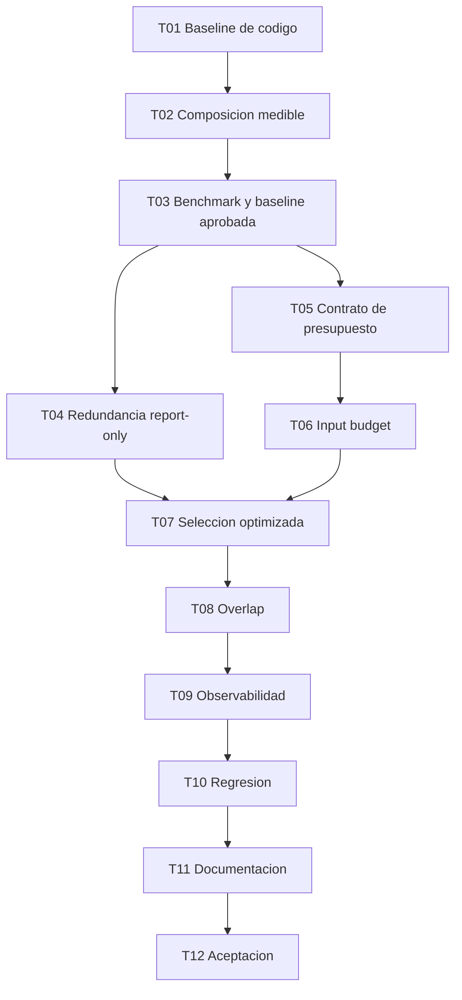

# H3.1 - Optimizacion de contexto RAG: Plan de tareas

## 1. Reglas

- Implementar en orden; T01-T03 son instrumentacion y baseline.
- No activar optimizaciones antes de aprobar T03.
- Cada tarea incluye pruebas y documentacion aplicable.
- No modificar H1.2 ni agregar proveedores LLM.
- No cambiar embeddings, sqlite-vec ni chunking H2 en esta evolucion.
- No persistir prompts, respuestas, preguntas o contenido de fuentes.
- Fixtures, benchmarks y reportes versionados son publicos o sinteticos.
- No crear `acceptance.md` hasta H3.1-T12.
- Estados iniciales: `pendiente`.

Estado actual del hito: implementacion iniciada. H3.1-T01 a H3.1-T11
completadas; H3.1-T12 pendiente. T08 fue completada mediante una
decision explicita de diferimiento basada en la baseline.

## 2. Tareas

### H3.1-T01 - Caracterizar y congelar la baseline vigente

**Estado:** completada.
**Objetivo:** demostrar el comportamiento anterior a cualquier optimizacion.  
**Descripcion:** crear pruebas de caracterizacion para retrieval por modo,
fusion, merge estructurado, orden, dedupe, truncado, presupuesto de contexto,
prompt inicial, reparacion, citas y debug. Registrar defaults y algoritmos como
`baseline_v1`. Documentar que los `10,198` historicos no admiten desglose exacto.  
**Dependencias:** H3 y H1.2 aceptados.  
**Resultado esperado:** reporte baseline reproducible sin cambiar resultados.  
**Requisitos:** REQ-001, REQ-009, REQ-014; NFR-002.  
**Checkpoint:** tests de caracterizacion H3/H4.1 y `git diff` sin cambios de
algoritmo productivo.

**Evidencia:** `reports/h31/baseline-v1.json` y
`reports/h31/baseline-v1.md`; 9 pruebas baseline y 72 pruebas de regresion
focalizada aprobadas. No se modifico ningun archivo bajo `src/`.

### H3.1-T02 - Modelar composicion y tamanos del prompt

**Estado:** completada.
**Objetivo:** medir componentes reconciliables del input controlado.  
**Descripcion:** introducir composicion estructurada dentro de `PromptBuilder`,
metricas de caracteres, bytes UTF-8 y estimacion local versionada por componente.
El texto renderizado debe permanecer byte a byte compatible con baseline.  
**Dependencias:** T01.  
**Resultado esperado:** suma de componentes igual al prompt real; proveedor sigue
recibiendo `str` sin cambio de puerto.  
**Requisitos:** REQ-002, REQ-003, REQ-004; NFR-004, NFR-006.  
**Checkpoint:** unit tests golden del prompt y reconciliacion ASCII/Unicode/codigo.

**Evidencia:** `reports/h31/t02-prompt-composition.md`; hashes T01 de generacion
y reparacion sin cambios, reconciliacion exacta de caracteres/bytes UTF-8 y
regresion por grupos con 861 pruebas aprobadas. No se modificaron retrieval,
contexto, ranking, seleccion ni presupuesto.

### H3.1-T03 - Construir benchmark H3.1 y aprobar baseline

**Estado:** completada.
**Objetivo:** establecer puertas empiricas antes de optimizar.  
**Descripcion:** crear corpus y dataset sinteticos con literal, semantic,
multi-fuente, overlap, duplicados, distractores, ambiguedad, insuficiencia y
evidencia estructurada. Ejecutar pipeline con fakes, producir JSON/Markdown y
registrar configuracion/version. Escanear privacidad.  
**Dependencias:** T01, T02.  
**Resultado esperado:** baseline publicable con retrieval, seleccion, contexto,
citas, calidad y tamanos; puertas propuestas a partir de resultados.  
**Requisitos:** REQ-001, REQ-011, REQ-012, REQ-013; NFR-001, NFR-005.  
**Checkpoint:** comando offline documentado genera reportes deterministas.

**Evidencia:** `tests/fixtures/h31_baseline_benchmark.json`, runner offline
`tests/support/h31_baseline_benchmark.py` y reportes reproducibles
`reports/h31/t03-baseline.json`/`.md`. Diez casos sinteticos miden composicion,
metadata/evidencia, retrieval, fuentes necesarias, cobertura de hechos, citas,
insuficiencia, duplicado exacto, overlap y reparacion por separado. T03 no
modifica `src/`, no habilita optimizaciones y deja T04-T08 en revision humana
sin objetivo de reduccion prefijado.

### H3.1-T04 - Instrumentar decisiones y redundancia en report-only

**Estado:** completada.
**Objetivo:** explicar seleccion, omision, duplicacion y overlap sin reducir aun.  
**Descripcion:** registrar `EvidenceDecision`, duplicados exactos y overlap por
rango/contenido sobre candidatos acotados. La redundancia lexical entre
documentos es opcional, solo `report-only` y no bloquea aceptacion. Exponer
razones seguras en debug/benchmark; mantener `baseline_v1` como seleccion
efectiva.  
**Dependencias:** T03 aprobado.  
**Resultado esperado:** diagnostico por candidato sin cambio funcional.  
**Requisitos:** REQ-005, REQ-006; NFR-003.  
**Checkpoint:** tests exactos, overlap, documentos distintos, contradicciones y
complejidad acotada.

**Evidencia:** diagnostico efimero `report_only` por candidato y reporte
`reports/h31/t04-redundancy-report.json`/`.md`. El duplicado exacto detectado ya
es omitido por `baseline_v1` y aporta `0` tokens al prompt; el unico overlap
demostrado aporta `7` tokens estimados, `0.277%` del prompt de generacion del
benchmark. El resultado respalda priorizar T07 y deja T08 como candidato a
diferimiento, sin cambiar aun seleccion, orden, contexto ni presupuesto.

### H3.1-T05 - Definir configuracion y migracion del presupuesto de input

**Estado:** completada.
**Objetivo:** congelar el contrato provider-agnostic a partir de baseline.  
**Descripcion:** decidir nombre/default, rango, precedencia y compatibilidad con
`context_token_budget`; actualizar config show y ejemplo. Rechazar combinaciones
ambiguas. No activar aun la seleccion optimizada.  
**Dependencias:** T02, T03.  
**Resultado esperado:** configuraciones existentes y nuevas tienen semantica
explicita y validada.  
**Requisitos:** REQ-007, REQ-014.  
**Checkpoint:** unit tests de defaults, limites, claves desconocidas y migracion.

**Evidencia:** contrato documentado en
`reports/h31/t05-input-budget-contract.md`. `rag.input_token_budget_est` es
opcional, sin default numerico, con rango `501..200000`; `config show` distingue
el valor no configurado. Las configuraciones legadas conservan
`context_token_budget=6000` y `baseline_v1`; declarar ambas claves explicitamente
falla por ambiguedad. T05 no aplica el nuevo presupuesto ni cambia el pipeline.

### H3.1-T06 - Aplicar presupuesto al input completo

**Estado:** completada.
**Objetivo:** limitar localmente la composicion completa antes de generar.  
**Descripcion:** medir overhead fijo, asignar remanente a evidencia, renderizar y
revalidar el total estimado. Mantener estimador intercambiable y distinguir
generacion/reparacion. Si no cabe evidencia suficiente, no llamar al LLM.  
**Dependencias:** T05.  
**Resultado esperado:** todo prompt cumple el presupuesto estimado configurado o
falla de forma segura y trazable.  
**Requisitos:** REQ-003, REQ-007, REQ-010.  
**Checkpoint:** tests de bordes, pregunta larga, metadata, Unicode, cero remanente
y reparacion.

**Evidencia:** `reports/h31/t06-full-input-budget.md`. Con
`input_token_budget_est`, generation reserva overhead fijo, asigna el remanente
a evidencia con `baseline_v1` y revalida el prompt completo usando `chars4_v1`.
Sin evidencia relevante que quepa, no llama al LLM. Repair se valida por
separado y se omite de forma segura si excede el limite. Sin la clave nueva se
mantienen byte a byte los prompts y la politica legada; T06 no implementa
relevance-first.

### H3.1-T07 - Implementar seleccion relevance-first

**Estado:** completada.
**Objetivo:** evitar que orden documental o procedencia consuman presupuesto sin
comparacion global.  
**Descripcion:** ordenar por relevancia dentro de cada familia, fusionar por
rango relativo, penalizar duplicados exactos y aplicar desempates deterministas; ordenar para
presentacion despues. Integrar candidatos H3 y H4.1 sin perder trazabilidad ni
citas. Cobertura y diversidad se miden en el benchmark, pero no gobiernan esta
politica inicial. Mantener politica baseline elegible para comparacion.  
**Dependencias:** T04, T06.  
**Resultado esperado:** politica `optimized_v1` explicable con decisiones por
candidato.  
**Requisitos:** REQ-006, REQ-008, REQ-009, REQ-010.  
**Checkpoint:** tests con top-k, structured/chunks, scores, empates y fuente unica.

**Evidencia:** `reports/h31/t07-relevance-first.json`/`.md`. La politica opt-in
`optimized_v1` conserva el `combined_score` original, pero no lo compara como
absoluto entre H3/H4.1: transforma la posicion dentro de cada familia a rango
relativo y fusiona despues. Aplica dedupe exacto antes de `top_k`, desempates
deterministas y orden de presentacion posterior. `relevant-at-six` y el nuevo
caso sintetico `mixed-family-competition` pasan de cobertura `0` a `1`, sin
regresion de retrieval o citas. No incorpora diversidad semantica ni reranker.

### H3.1-T08 - Reducir overlap demostrable

**Estado:** reabierta y completada — `trim_overlap_v1` implementado.
**Objetivo:** evitar repetir contenido sin eliminar hechos.  
**Descripcion:** decidir con evidencia de T03/T04 si se activa `trim_overlap_v1`.
Si se activa, recortar solo segmentos contiguos demostrables, conservar rangos
original/enviado y reasignar presupuesto; si no supera puertas, dejar report-only
y documentar la decision.  
**Dependencias:** T04, T07.  
**Resultado esperado:** reduccion conservadora o diferimiento basado en metricas.  
**Requisitos:** REQ-005, REQ-006, REQ-008, REQ-010.  
**Checkpoint:** tests de overlap real, similitud accidental, codigo repetitivo,
documentos distintos y citas por rango.

**Decision revisada:** T04 justifico inicialmente diferir el trim con solo `27`
caracteres/`7` tokens estimados. Una validacion autorizada posterior midio
`2,446` caracteres/`612` tokens estimados repetidos y reabrio T08. La politica
`trim_overlap_v1` recorta solo igualdad exacta sufijo/prefijo, mismo documento y
continuidad de rangos; conserva trazabilidad, reasigna el presupuesto liberado y
no usa similitud aproximada. Evidencia: `reports/h31/t08-overlap-decision.md`.

### H3.1-T09 - Extender observabilidad, CLI y reportes

**Estado:** completada.
**Objetivo:** hacer comparables runs sin exponer contenido.  
**Descripcion:** mostrar resumen estructural y estimado; integrar uso real opcional
por solicitud/run; decidir persistencia segura de agregados; extender JSON/text
y benchmark. Mantener contenido solo en debug explicito y no persistido.  
**Dependencias:** T02, T04, T06-T08.  
**Resultado esperado:** baseline/optimized comparables con cobertura de metricas.  
**Requisitos:** REQ-003, REQ-004, REQ-006, REQ-012, REQ-014.  
**Checkpoint:** tests SQLite/logs/canarios, nulls, generacion y reparacion.

**Evidencia:** schema seguro `h31_observability_v1` en memoria/debug y reportes
`reports/h31/t09-observability.json`/`.md`. Expone politica, estimador,
composicion separada de generation/repair, presupuesto, decisiones, redundancia
y citas sin copiar pregunta, prompt, respuesta o contenido. La CLI mantiene JSON
limpio, renderiza el detalle por stderr con `--debug` y etiqueta uso Anthropic
real como `provider_input_tokens`, `provider_output_tokens` y
`provider_total_tokens`; valores ausentes permanecen `null`/no se muestran. No
se amplía persistencia SQLite: solo se versionan agregados sinteticos.

### H3.1-T10 - Validar regresion funcional y consumidores

**Estado:** completada.
**Objetivo:** demostrar que reducir contexto no degrada Barbarion.  
**Descripcion:** ejecutar benchmark baseline/optimized y regresion H1-H5, H4.1,
H1.1 y H1.2. Verificar Ollama fake, Anthropic fake, `--no-llm`, evidencia
insuficiente, H4 y H5 consumidores de contexto, formatos y Unicode.  
**Dependencias:** T09.  
**Resultado esperado:** puertas de retrieval, seleccion, citas y calidad pasan;
si no, optimizacion se desactiva y el hallazgo se documenta.  
**Requisitos:** REQ-009, REQ-010, REQ-013, REQ-014; NFR-002.  
**Checkpoint:** suite completa y comparador sin regresiones Must.

**Evidencia:** `reports/h31/t10-regression.json`/`.md`; matriz opt-in con `76`
pruebas, suite completa `907 passed, 3 skipped` y smoke instalado `11 passed`.
`relevant-at-six` conserva la mejora de cobertura `0 -> 1`, sin regresion en
retrieval o citas. H4.1, H4, H5, `--no-llm`, Ollama/Anthropic fake, formatos y
Unicode pasan. `optimized_v1` queda `qualified_candidate` para default, pero T10
no lo promueve: `baseline_v1` sigue siendo el default efectivo.

### H3.1-T11 - Documentar operacion y decisiones

**Estado:** completada.
**Objetivo:** dejar configuracion, metricas y limites comprensibles.  
**Descripcion:** actualizar README, CLI, ARCHITECTURE, DECISIONS, EVOLUTION,
ROADMAP, ejemplo TOML y spec. Explicar estimado/real, presupuesto, politicas,
benchmark y privacidad. No editar acta H1.2.  
**Dependencias:** T10.  
**Resultado esperado:** documentacion coherente con codigo y defaults efectivos.  
**Requisitos:** REQ-015; NFR-006.  
**Checkpoint:** busquedas de estados/terminologia, enlaces y `git diff --check`.

**Evidencia:** `docs/H31-RAG-CONTEXT.md` consolida el problema resuelto, la
comparacion de politicas, el contrato opt-in, la decision de diferir overlap,
la reproduccion/lectura del benchmark y su privacidad. README, CLI,
ARCHITECTURE, DECISIONS, EVOLUTION, ROADMAP, ejemplo TOML y spec fueron
revisados contra el default efectivo; H1.2 permanece sin cambios.
El comando documentado reprodujo el benchmark. Pruebas focalizadas de README y
configuracion: `97 passed`; regresion completa en la runtime disponible:
`896 passed, 14 skipped`. Los skips adicionales corresponden a capacidades
opcionales ausentes en esa runtime y no reemplazan la evidencia T10
(`907 passed, 3 skipped`). `git diff --check` sin errores.

### H3.1-T12 - Aceptacion tecnica y funcional

**Estado:** completada.
**Objetivo:** cerrar H3.1 solo con evidencia reproducible.  
**Descripcion:** ejecutar suite, smoke instalado, benchmark baseline/optimized,
scanner de privacidad y validaciones opt-in autorizadas. Crear por primera vez
`acceptance.md` con versiones, comandos, metricas, limitaciones y decision final.
No inventar uso real si un proveedor no fue ejecutado.  
**Dependencias:** T01-T11 completadas y autorizacion de aceptacion.  
**Resultado esperado:** ACCEPTED, REJECTED o aceptacion condicionada explicita.  
**Requisitos:** todos.  
**Checkpoint:** `acceptance.md` respaldado por artefactos reproducibles.

**Resultado T12:** `ACCEPTED` el 2026-08-07. Suite instalada
`924 passed, 3 skipped`, smoke `11 passed`, benchmark reproducible `7 passed` y
scanner de privacidad sin coincidencias. `baseline_v1` permanece como default;
`optimized_v1` sigue opt-in y su promocion queda diferida hasta validar mas
corpus. Evidencia completa en [`acceptance.md`](acceptance.md).

**Puerta correctiva previa:** una ejecucion real posterior a T11 detecto
candidatos vectoriales sin chunk vigente. Antes de T12 se corrigio el consumo
prematuro de `top_k` en `optimized_v1` y la limpieza de vectores huerfanos en
reindexado global. La cobertura sintetica demuestra backfill, trazabilidad
`missing_content`, dedupe, presupuesto, desempates, reingesta/reindexado,
recuperacion de contenido e idempotencia. Esta correccion no completa T12, no
promueve `optimized_v1` y no crea `acceptance.md`.

Una segunda validacion mostro dos escalas no calibradas H3/H4.1 y `612` tokens
locales estimados de overlap exacto. La correccion conserva scores originales,
fusiona por rango relativo de familia y reabre T08 para activar trim exacto con
continuidad demostrable. El fixture publico
`tests/fixtures/h31_mixed_family_benchmark.json` y el benchmark H3.1 cubren la
puerta; matriz de consumidores `316 passed, 11 skipped` y suite completa
`906 passed, 14 skipped`. T12 permanece pendiente.

Una tercera consulta real encontro una perdida de precision dentro de H4.1:
varios candidatos con el mismo score recibian rangos ordinales distintos y la
formula cuya identidad coincidia literalmente con el identificador consultado
quedaba fuera del presupuesto. La correccion previa a T12 usa rangos densos
para que los empates compartan `relative_score` y conserva la coincidencia
exacta de identificador como senal trazable de precision. No cambia `top_k`, el
presupuesto de `4500`, `baseline_v1` ni el estado pendiente de T12.

La misma consulta expuso despues un falso negativo del validador de citas:
`ROUND(...,2)` no respaldaba lexicalmente la frase "redondea a 2 decimales".
La puerta previa a T12 incorpora solo inferencias sintacticas directas,
enumeracion completa de identificadores y limites literales verificables de la
fuente. Las afirmaciones inventadas, ausencias contradichas y contradicciones
generales permanecen rechazadas. No cambia retrieval, presupuesto ni politicas.

## 3. Orden de implementacion

## 4. Trazabilidad

| Requisito | Tareas principales |
|---|---|
| REQ-001 | T01, T03 |
| REQ-002 | T02 |
| REQ-003 | T02, T06, T09 |
| REQ-004 | T02, T09 |
| REQ-005 | T04, T08 |
| REQ-006 | T04, T07-T09 |
| REQ-007 | T05, T06 |
| REQ-008 | T07, T08 |
| REQ-009 | T01, T07, T10 |
| REQ-010 | T06-T08, T10 |
| REQ-011 | T03 |
| REQ-012 | T03, T09 |
| REQ-013 | T03, T10 |
| REQ-014 | T01, T05, T09, T10 |
| REQ-015 | T11, T12 |
