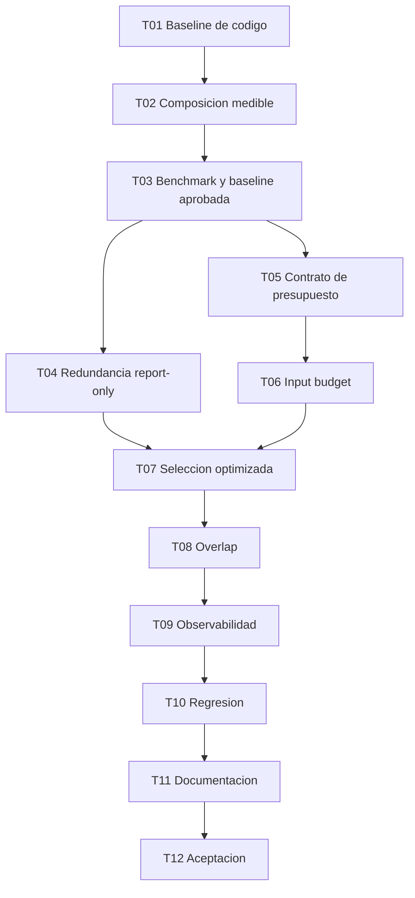

# H3.1 - Optimizacion de contexto RAG: Plan de tareas

## 1. Reglas

- Implementar en orden; T01-T03 son instrumentacion y baseline.
- No activar optimizaciones antes de aprobar T03.
- Cada tarea incluye pruebas y documentacion aplicable.
- No modificar H1.2 ni agregar proveedores LLM.
- No cambiar embeddings, sqlite-vec ni chunking H2 en esta evolucion.
- No persistir prompts, respuestas, preguntas o contenido de fuentes.
- Fixtures, benchmarks y reportes versionados son publicos o sinteticos.
- No crear `acceptance.md` hasta H3.1-T12.
- Estados iniciales: `pendiente`.

Estado actual del hito: implementacion iniciada. H3.1-T01 completada;
H3.1-T02 a H3.1-T12 pendientes.

## 2. Tareas

### H3.1-T01 - Caracterizar y congelar la baseline vigente

**Estado:** completada.
**Objetivo:** demostrar el comportamiento anterior a cualquier optimizacion.  
**Descripcion:** crear pruebas de caracterizacion para retrieval por modo,
fusion, merge estructurado, orden, dedupe, truncado, presupuesto de contexto,
prompt inicial, reparacion, citas y debug. Registrar defaults y algoritmos como
`baseline_v1`. Documentar que los `10,198` historicos no admiten desglose exacto.  
**Dependencias:** H3 y H1.2 aceptados.  
**Resultado esperado:** reporte baseline reproducible sin cambiar resultados.  
**Requisitos:** REQ-001, REQ-009, REQ-014; NFR-002.  
**Checkpoint:** tests de caracterizacion H3/H4.1 y `git diff` sin cambios de
algoritmo productivo.

**Evidencia:** `reports/h31/baseline-v1.json` y
`reports/h31/baseline-v1.md`; 9 pruebas baseline y 72 pruebas de regresion
focalizada aprobadas. No se modifico ningun archivo bajo `src/`.

### H3.1-T02 - Modelar composicion y tamanos del prompt

**Estado:** pendiente.  
**Objetivo:** medir componentes reconciliables del input controlado.  
**Descripcion:** introducir composicion estructurada dentro de `PromptBuilder`,
metricas de caracteres, bytes UTF-8 y estimacion local versionada por componente.
El texto renderizado debe permanecer byte a byte compatible con baseline.  
**Dependencias:** T01.  
**Resultado esperado:** suma de componentes igual al prompt real; proveedor sigue
recibiendo `str` sin cambio de puerto.  
**Requisitos:** REQ-002, REQ-003, REQ-004; NFR-004, NFR-006.  
**Checkpoint:** unit tests golden del prompt y reconciliacion ASCII/Unicode/codigo.

### H3.1-T03 - Construir benchmark H3.1 y aprobar baseline

**Estado:** pendiente.  
**Objetivo:** establecer puertas empiricas antes de optimizar.  
**Descripcion:** crear corpus y dataset sinteticos con literal, semantic,
multi-fuente, overlap, duplicados, distractores, ambiguedad, insuficiencia y
evidencia estructurada. Ejecutar pipeline con fakes, producir JSON/Markdown y
registrar configuracion/version. Escanear privacidad.  
**Dependencias:** T01, T02.  
**Resultado esperado:** baseline publicable con retrieval, seleccion, contexto,
citas, calidad y tamanos; puertas propuestas a partir de resultados.  
**Requisitos:** REQ-001, REQ-011, REQ-012, REQ-013; NFR-001, NFR-005.  
**Checkpoint:** comando offline documentado genera reportes deterministas.

### H3.1-T04 - Instrumentar decisiones y redundancia en report-only

**Estado:** pendiente.  
**Objetivo:** explicar seleccion, omision, duplicacion y overlap sin reducir aun.  
**Descripcion:** registrar `EvidenceDecision`, duplicados exactos y overlap por
rango/contenido sobre candidatos acotados. La redundancia lexical entre
documentos es opcional, solo `report-only` y no bloquea aceptacion. Exponer
razones seguras en debug/benchmark; mantener `baseline_v1` como seleccion
efectiva.  
**Dependencias:** T03 aprobado.  
**Resultado esperado:** diagnostico por candidato sin cambio funcional.  
**Requisitos:** REQ-005, REQ-006; NFR-003.  
**Checkpoint:** tests exactos, overlap, documentos distintos, contradicciones y
complejidad acotada.

### H3.1-T05 - Definir configuracion y migracion del presupuesto de input

**Estado:** pendiente.  
**Objetivo:** congelar el contrato provider-agnostic a partir de baseline.  
**Descripcion:** decidir nombre/default, rango, precedencia y compatibilidad con
`context_token_budget`; actualizar config show y ejemplo. Rechazar combinaciones
ambiguas. No activar aun la seleccion optimizada.  
**Dependencias:** T02, T03.  
**Resultado esperado:** configuraciones existentes y nuevas tienen semantica
explicita y validada.  
**Requisitos:** REQ-007, REQ-014.  
**Checkpoint:** unit tests de defaults, limites, claves desconocidas y migracion.

### H3.1-T06 - Aplicar presupuesto al input completo

**Estado:** pendiente.  
**Objetivo:** limitar localmente la composicion completa antes de generar.  
**Descripcion:** medir overhead fijo, asignar remanente a evidencia, renderizar y
revalidar el total estimado. Mantener estimador intercambiable y distinguir
generacion/reparacion. Si no cabe evidencia suficiente, no llamar al LLM.  
**Dependencias:** T05.  
**Resultado esperado:** todo prompt cumple el presupuesto estimado configurado o
falla de forma segura y trazable.  
**Requisitos:** REQ-003, REQ-007, REQ-010.  
**Checkpoint:** tests de bordes, pregunta larga, metadata, Unicode, cero remanente
y reparacion.

### H3.1-T07 - Implementar seleccion relevance-first

**Estado:** pendiente.  
**Objetivo:** evitar que orden documental o procedencia consuman presupuesto sin
comparacion global.  
**Descripcion:** seleccionar por score/relevancia, penalizar duplicados exactos
y overlap demostrado, y aplicar desempates deterministas; ordenar para
presentacion despues. Integrar candidatos H3 y H4.1 sin perder trazabilidad ni
citas. Cobertura y diversidad se miden en el benchmark, pero no gobiernan esta
politica inicial. Mantener politica baseline elegible para comparacion.  
**Dependencias:** T04, T06.  
**Resultado esperado:** politica `optimized_v1` explicable con decisiones por
candidato.  
**Requisitos:** REQ-006, REQ-008, REQ-009, REQ-010.  
**Checkpoint:** tests con top-k, structured/chunks, scores, empates y fuente unica.

### H3.1-T08 - Reducir overlap demostrable

**Estado:** pendiente.  
**Objetivo:** evitar repetir contenido sin eliminar hechos.  
**Descripcion:** decidir con evidencia de T03/T04 si se activa `trim_overlap_v1`.
Si se activa, recortar solo segmentos contiguos demostrables, conservar rangos
original/enviado y reasignar presupuesto; si no supera puertas, dejar report-only
y documentar la decision.  
**Dependencias:** T04, T07.  
**Resultado esperado:** reduccion conservadora o diferimiento basado en metricas.  
**Requisitos:** REQ-005, REQ-006, REQ-008, REQ-010.  
**Checkpoint:** tests de overlap real, similitud accidental, codigo repetitivo,
documentos distintos y citas por rango.

### H3.1-T09 - Extender observabilidad, CLI y reportes

**Estado:** pendiente.  
**Objetivo:** hacer comparables runs sin exponer contenido.  
**Descripcion:** mostrar resumen estructural y estimado; integrar uso real opcional
por solicitud/run; decidir persistencia segura de agregados; extender JSON/text
y benchmark. Mantener contenido solo en debug explicito y no persistido.  
**Dependencias:** T02, T04, T06-T08.  
**Resultado esperado:** baseline/optimized comparables con cobertura de metricas.  
**Requisitos:** REQ-003, REQ-004, REQ-006, REQ-012, REQ-014.  
**Checkpoint:** tests SQLite/logs/canarios, nulls, generacion y reparacion.

### H3.1-T10 - Validar regresion funcional y consumidores

**Estado:** pendiente.  
**Objetivo:** demostrar que reducir contexto no degrada Barbarion.  
**Descripcion:** ejecutar benchmark baseline/optimized y regresion H1-H5, H4.1,
H1.1 y H1.2. Verificar Ollama fake, Anthropic fake, `--no-llm`, evidencia
insuficiente, H4 y H5 consumidores de contexto, formatos y Unicode.  
**Dependencias:** T09.  
**Resultado esperado:** puertas de retrieval, seleccion, citas y calidad pasan;
si no, optimizacion se desactiva y el hallazgo se documenta.  
**Requisitos:** REQ-009, REQ-010, REQ-013, REQ-014; NFR-002.  
**Checkpoint:** suite completa y comparador sin regresiones Must.

### H3.1-T11 - Documentar operacion y decisiones

**Estado:** pendiente.  
**Objetivo:** dejar configuracion, metricas y limites comprensibles.  
**Descripcion:** actualizar README, CLI, ARCHITECTURE, DECISIONS, EVOLUTION,
ROADMAP, ejemplo TOML y spec. Explicar estimado/real, presupuesto, politicas,
benchmark y privacidad. No editar acta H1.2.  
**Dependencias:** T10.  
**Resultado esperado:** documentacion coherente con codigo y defaults efectivos.  
**Requisitos:** REQ-015; NFR-006.  
**Checkpoint:** busquedas de estados/terminologia, enlaces y `git diff --check`.

### H3.1-T12 - Aceptacion tecnica y funcional

**Estado:** pendiente.  
**Objetivo:** cerrar H3.1 solo con evidencia reproducible.  
**Descripcion:** ejecutar suite, smoke instalado, benchmark baseline/optimized,
scanner de privacidad y validaciones opt-in autorizadas. Crear por primera vez
`acceptance.md` con versiones, comandos, metricas, limitaciones y decision final.
No inventar uso real si un proveedor no fue ejecutado.  
**Dependencias:** T01-T11 completadas y autorizacion de aceptacion.  
**Resultado esperado:** ACCEPTED, REJECTED o aceptacion condicionada explicita.  
**Requisitos:** todos.  
**Checkpoint:** `acceptance.md` respaldado por artefactos reproducibles.

## 3. Orden de implementacion

## 4. Trazabilidad

| Requisito | Tareas principales |
|---|---|
| REQ-001 | T01, T03 |
| REQ-002 | T02 |
| REQ-003 | T02, T06, T09 |
| REQ-004 | T02, T09 |
| REQ-005 | T04, T08 |
| REQ-006 | T04, T07-T09 |
| REQ-007 | T05, T06 |
| REQ-008 | T07, T08 |
| REQ-009 | T01, T07, T10 |
| REQ-010 | T06-T08, T10 |
| REQ-011 | T03 |
| REQ-012 | T03, T09 |
| REQ-013 | T03, T10 |
| REQ-014 | T01, T05, T09, T10 |
| REQ-015 | T11, T12 |
