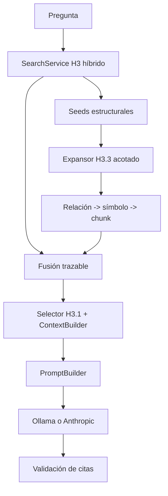

# H3.3 — Graph-Aware Retrieval: Diseño

## 1. Arquitectura vigente verificada

`AskService` en `src/barbarion/application/rag.py` ejecuta `SearchService`, llama a `DataDrivenEvidenceRetriever` cuando está disponible, fusiona candidatos, y entrega una sola vez al `ContextBuilder`/selector H3.1. La persistencia real usa `SQLiteReverseEngineeringRepository.active_relations_for_symbol`; `TechnicalRelation` contiene `relation_type`, estado, origen/destino y `evidence_chunk_id`. H3.3 entra entre retrieval y selección final.

### Resultado T01 — inventario real

La inspección del repositorio confirma que `OracleParser` produce `package_spec`, `package_body`, `procedure` y `function`, conservando `parent_name` y `breadcrumb` para subprogramas. Sin embargo, `symbol_from_source()` no rellena `parent_symbol_id`; usa `container_name`/metadata. Por tanto, no existe actualmente una relación package→miembro persistida y navegable demostrada por el código.

El resolvedor canoniza las relaciones como `calls`, `uses`, `opens`, `references`, `parent_of` y `precedes`. `active_relations_for_symbol()` permite `OUTGOING`, `INCOMING` y `BOTH`, y la dirección se calcula al consultar. `evidence_chunk_id` procede del `source_chunk_id` de la referencia; el fallback a ese chunk queda sujeto a la validación de vigencia y contenido definida en requirements.

**Conclusión T01:** H3.3 puede comprobar inicialmente expansión de llamadas/uso de tablas y cruces H4.1 ya resueltos. El caso de package completo queda condicionado a una fixture/corpus que demuestre una relación package→miembro navegable o pasa a capacidad diferida.



## 2. Seeds

Se obtienen de los candidatos H3 y del recuperador estructurado existente, en ese orden de disponibilidad. Una seed requiere `chunk_id` y una identidad estructural resoluble: `symbol_name`/metadata vectorial, símbolo asociado por `chunk_id` o candidato `structured_symbol`. La normalización de nombres reutiliza la existente; no se crea un parser de preguntas. Se conservan como máximo `max_seeds`, ordenadas por score de retrieval, coincidencia estructural y `symbol_id`.

El actual `DataDrivenEvidenceRetriever` es específico de `configuration`; debe reutilizarse o extraerse su lógica común para que H3.3 no cree un segundo RAG. Su expansión de configuración puede convertirse en una fuente de seeds/candidatos del mismo contrato.

## 3. Expansión

Para cada seed se hace BFS determinista, normalmente outgoing para llamadas/dependencias y ambas direcciones solo para tipos H4.1 declarados como bidireccionales. La profundidad y los límites de seeds, vecinos y candidatos son parámetros obligatorios, pero no se congelan valores numéricos en esta spec: T01 debe establecer el espacio real de expansión y T07 debe seleccionar valores mediante baseline de cobertura, ruido, latencia y presupuesto. Se filtran `status=active`, dominio, tipos permitidos, `resolution_status=resolved` y confianza mínima configurada. El destino debe ser un símbolo activo.

La clave visitada es `symbol_id`; la arista es `relation_id`. Si aparece un símbolo ya visitado se marca ciclo y no se expande. Vecinos se ordenan por `relation_type`, confianza descendente, destino normalizado y `relation_id`. El límite global se comprueba antes de materializar cada candidato. La elección de profundidad no puede suponerse suficiente para describir un package completo: depende de que T01 confirme relaciones package→miembro, su dirección y su semántica.

Tipos iniciales permitidos deben corresponder a valores observados en H4/H4.1 y quedar enumerados en configuración/documentación de implementación: llamadas/dependencias de código y relaciones configuración-código. Se excluyen por defecto relaciones externas, dinámicas, ambiguas y no resueltas; no se asume que todos los `relation_type` sean útiles.

## 4. Relación hacia evidencia

1. `target_symbol_id` identifica el símbolo alcanzado.
2. Se obtiene su `chunk_id` vigente. Si falta, se puede intentar el `evidence_chunk_id` de la relación, pero solo se acepta si el chunk existe, está vigente y una comprobación determinista confirma que su contenido corresponde al vínculo expandido. Si no se cumple, no se crea candidato citable.
3. `SQLiteRagRepository.enrich_candidates` carga contenido, metadata y localizador.
4. Se crea un `RetrievalCandidate` con score estructural derivado del score de la seed y una penalización fija por profundidad; nunca se compara como score vectorial calibrado.
5. `source` incluye `evidence_kind=graph_expansion`, `seed_symbol_id`, `relation_ids`, `depth` y `expansion_reason` sin persistir contenido.

La relación H4 solo descubre. El `ContextBuilder` asigna IDs `[F1]...` a chunks seleccionados y `CitationValidator` valida esos IDs como hoy.

## 5. Fusión y H3.1

H3.3 entrega candidatos directos H3, estructurados H4.1 y expandidos al mismo punto de fusión. `optimized_v1` conserva su selección relevance-first, rangos relativos por familia, coincidencias literales y trim de overlap; `baseline_v1` conserva su orden legado. La expansión no introduce ranking global alternativo ni otro presupuesto. La deduplicación se hace por `chunk_id` y hash según H3.1, preservando en debug todos los orígenes de un duplicado.

Para evitar regresiones en preguntas simples, la expansión se omite si no hay seed; si existe pero no aporta un chunk adicional, el conjunto directo permanece igual. El límite H3.1 sigue siendo el límite final de contexto, no el límite de exploración.

## 6. Configuración y compatibilidad

Se propone una sección acotada bajo `[rag]` o `[retrieval]`: `graph_aware_enabled=false` durante la introducción, `graph_max_depth`, `graph_max_seeds`, `graph_max_neighbors_per_seed`, `graph_max_candidates`, `graph_relation_types` y `graph_min_confidence`. No se añade default que altere consultas existentes hasta completar benchmark. Valores inválidos fallan al cargar configuración.

## 7. Observabilidad

Extender el debug existente con `graph_seeds`, `graph_relations_seen`, `graph_relations_accepted`, `graph_cycles`, `graph_candidates`, `graph_deduplicated`, `graph_limit_hit`, `graph_ms` y `graph_insufficient_reason`. Persistir solo contadores/hash y tiempos compatibles con `rag_queries`; no guardar nombres de preguntas ni texto fuente nuevo.

## 8. Fallos y ausencia de H4

Si las tablas/repositorio H4 no están disponibles, están vacías o fallan de forma recuperable, H3.3 registra diagnóstico seguro y devuelve los candidatos H3. Un fallo de H3 base continúa siendo error H3, no se oculta. Ollama/Anthropic reciben el mismo contexto lógico.

## 8.1 Contratos de dominio T02

T02 define el vocabulario que usará el futuro expansor, sin decidir todavía cómo recorrer SQLite. Los nombres son contratos orientativos y deben reutilizar `RetrievalCandidate`, `TechnicalSymbol`, `TechnicalRelation` y `DependencyDirection` cuando sea posible.

```text
GraphSeed
  seed_id: str                 # estable dentro de la consulta; no es una fuente citable
  chunk_id: str                # chunk que originó la seed
  symbol_id: str | None        # símbolo H4 activo asociado, si existe
  retrieval_score: float
  origin: SeedOrigin
  source_candidate_id: str | None

CandidateOrigin
  kind: direct_h3 | structured_h41 | graph_expansion
  seed_ids: tuple[str, ...]
  relation_ids: tuple[str, ...]
  path: GraphPath

GraphPath
  nodes: tuple[str, ...]       # symbol_ids, seed incluido
  relations: tuple[str, ...]   # relation_ids, misma transición que nodes
  direction: DependencyDirection
  depth: int

GraphExpansionLimits
  max_depth: int
  max_seeds: int
  max_neighbors_per_seed: int
  max_candidates: int

GraphCandidateTrace
  candidate_id: str             # chunk_id cuando el candidato ya es fuente
  origin: CandidateOrigin
  discovered_at_depth: int
  dedupe_key: str
  status: discovered | accepted | duplicate | cycle | limit | unresolved_source
```

### Invariantes

- `GraphSeed.chunk_id` no se convierte automáticamente en evidencia estructural: sigue siendo el chunk del candidato H3 que originó la seed.
- `CandidateOrigin.kind=direct_h3` tiene path vacío; `structured_h41` puede tener relaciones ya utilizadas por el recuperador existente; `graph_expansion` exige al menos una relación.
- `GraphPath.nodes` contiene `len(relations) + 1` nodos; `depth = len(relations)` y es no negativo.
- `GraphPath.direction` es la dirección efectiva de la consulta, no una propiedad persistida de la relación.
- Una path no puede repetir `symbol_id`; una repetición se registra como ciclo y no forma una expansión aceptada.
- Los IDs se ordenan y deduplican de forma estable; dos paths equivalentes producen la misma clave lógica.
- Todos los límites son enteros positivos; `max_candidates` y `max_neighbors_per_seed` son globales/por seed respectivamente. Ningún contrato fija valores numéricos en T02.
- Un candidato puede tener múltiples orígenes, pero un solo `dedupe_key` final por chunk/hash según las reglas H3.1.
- Estos contratos no contienen texto de pregunta, prompt, respuesta ni código fuente; la trazabilidad usa IDs, conteos y metadata segura.

### Catálogo de origen y dirección

`SeedOrigin` debe distinguir al menos `h3_chunk`, `h41_structured` y `symbol_metadata`. `CandidateOrigin` es la procedencia del candidato fusionado y no reemplaza el `retrieval_mode` actual. La dirección permitida por tipo de relación se resolverá en T03; T02 solo transporta la dirección efectiva y exige que sea `OUTGOING`, `INCOMING` o `BOTH`.

### Contrato de límites

Los límites se validan al construir `GraphExpansionLimits`, pero sus valores provienen de configuración/benchmark posteriores. El futuro expansor debe poder devolver un resultado parcial con motivos `cycle`, `limit` o `unresolved_source`; T02 no define aún el algoritmo que produce esos estados.

## 8.2 Resultado T07 — benchmark y límites recomendados

El benchmark sintético publicable `h33-graph-aware-v1` comparó cinco políticas sobre seis casos, con 30 repeticiones por caso. Se ejecutó el pipeline productivo de seeds, BFS, resolución a chunks, fusión y selección H3.1; no se utilizó LLM juez.

| Política | Límites depth/seeds/vecinos/candidatos | Recall multi-componente | Recall simple | Ruido | Chunks promedio | Tokens contexto promedio |
|---|---|---:|---:|---:|---:|---:|
| baseline | desactivado | 0.383 | 1.000 | 0.000 | 1.167 | 42.000 |
| shallow | 1/2/3/4 | 0.867 | 1.000 | 0.000 | 2.500 | 148.833 |
| balanced | 2/4/6/8 | 1.000 | 1.000 | 0.150 | 3.333 | 226.500 |
| wide | 2/8/12/16 | 1.000 | 1.000 | 0.150 | 3.333 | 226.500 |
| deep_wide | 3/8/20/30 | 1.000 | 1.000 | 0.150 | 3.333 | 226.500 |

Se recomienda `max_depth=2`, `max_seeds=4`, `max_neighbors_per_seed=6` y `max_candidates=8`. `wide` y `deep_wide` no mejoraron cobertura ni redujeron ruido/contexto, por lo que no justifican límites mayores. La evidencia lógica seleccionada fue idéntica para Ollama y Anthropic, ya que H3.3 termina antes de generación. Estos valores siguen siendo opt-in y deben revalidarse con corpus autorizado antes de promover H3.3 como default.

Artefactos reproducibles: `tests/fixtures/h33_graph_benchmark.json`, `tests/support/h33_graph_benchmark.py` y `reports/h33/benchmark.{json,md}`.

## 9. Decisiones diferidas

Los valores finales de límites, catálogo exacto de `relation_type`, dirección por tipo, suficiencia del recorrido para cada caso y fórmula de score se fijan tras inspeccionar datos reales y ejecutar fixtures. En particular, T01 debe confirmar si existe una relación package→miembro; sin ella, “package completo” no es una capacidad exigible de la primera versión. H4.2+ puede añadir relaciones, pero no se anticipan aquí.
