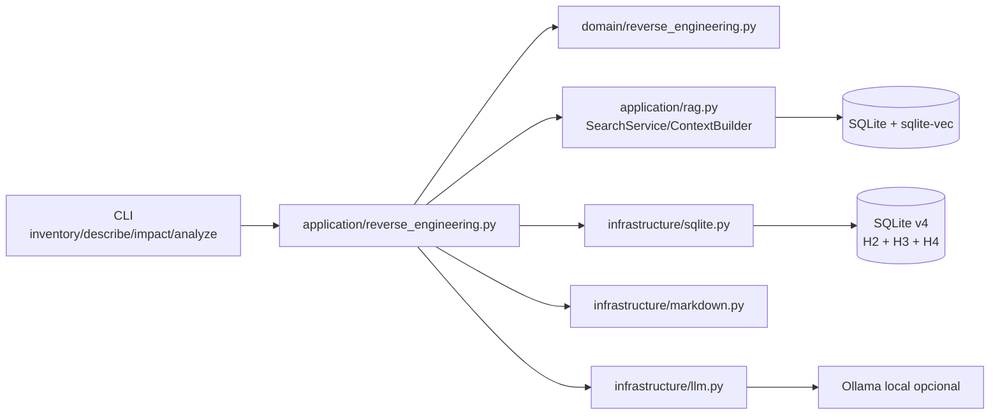
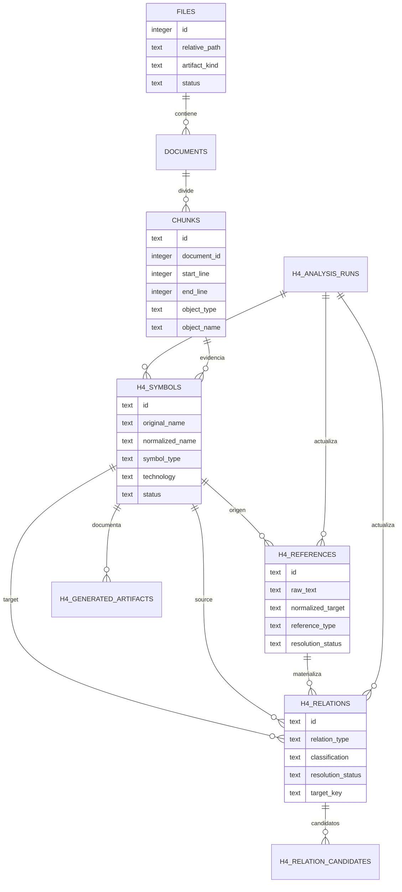
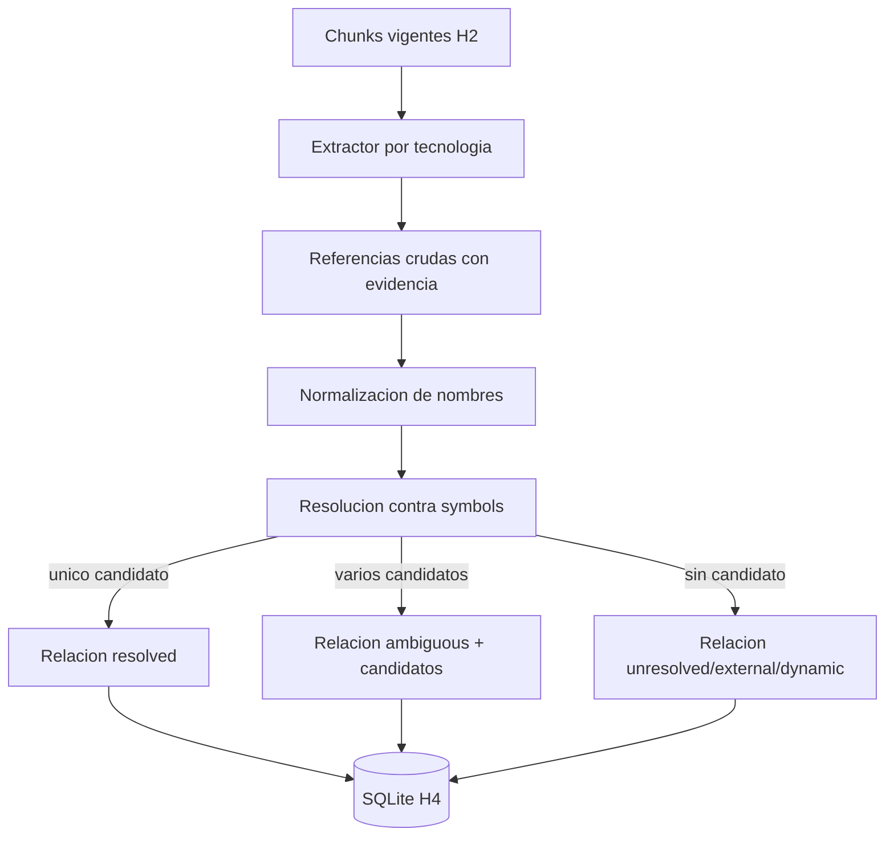
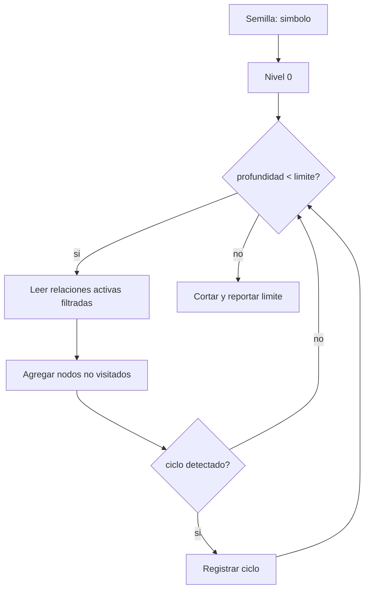
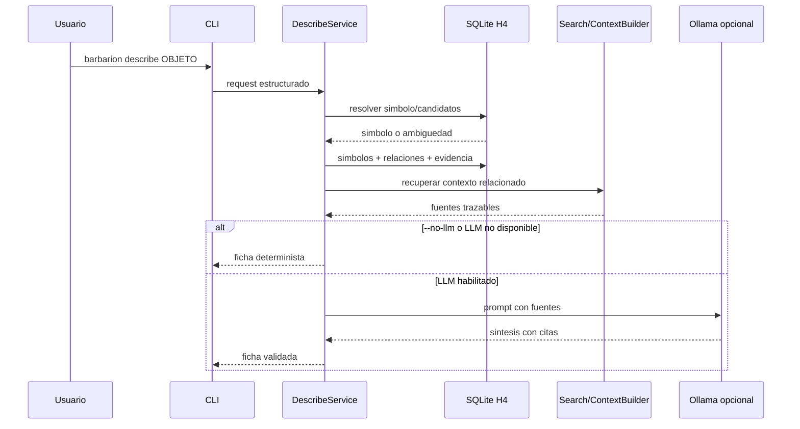
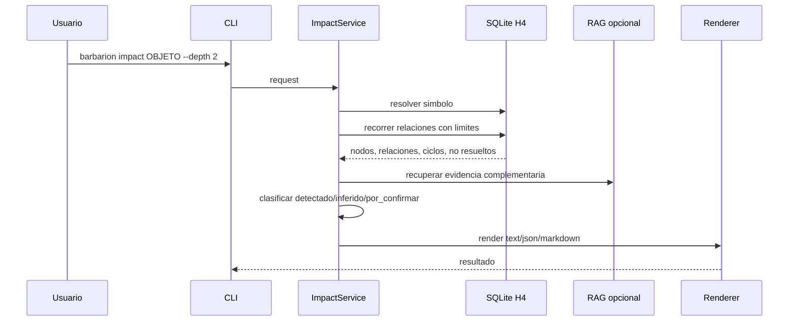

# H4 - ReverseEngineering: Diseno

## 1. Estado actual relevante

Barbarion ya cuenta con:

- CLI local en espanol;
- configuracion TOML validada;
- SQLite versionado con migraciones v1, v2 y v3;
- ingesta incremental H2 con `files`, `documents`, `chunks`, `errors` e `ingestion_runs`;
- parsers heuristicos Oracle/PLSQL y PowerBuilder que extraen unidades logicas y metadata basica;
- RAG H3 sobre SQLite + sqlite-vec;
- `search`, `ask --no-llm`, `ContextBuilder`, metricas y progreso por etapas;
- tabla `symbol_occurrences` reservada para H4, aun insuficiente para relaciones completas.

Inconsistencias detectadas:

- `docs/ARCHITECTURE.md` conserva Qdrant como vector store en secciones historicas;
- `docs/ROADMAP.md` tambien menciona Qdrant en H3;
- `docs/DECISIONS.md` D-014, README, H3 spec y codigo vigente establecen SQLite + sqlite-vec;
- los documentos maestros solicitados por el prompt no existen en raiz; estan en `docs/`, salvo `README.md`.

Precedencia aplicada: DECISIONS y codigo vigente primero. H4 usa SQLite + sqlite-vec, no Qdrant.

## 2. Decisiones de diseno

| ID | Decision | Requisitos |
|---|---|---|
| H4-DD-001 | Mantener arquitectura CLI -> application -> domain -> infrastructure, sin paquete paralelo de reverse engineering fuera de las capas existentes | H4-RF-002, H4-RNF-009 |
| H4-DD-002 | Migrar SQLite a v4 agregando tablas H4 de estado vigente para runs, simbolos, referencias, relaciones, candidatos y artefactos generados | H4-RF-002, H4-RF-005 |
| H4-DD-003 | Publicar simbolos/relaciones incrementalmente por archivo o scope confirmado; H4 no modifica tablas H2 salvo lectura y usa FK/cascadas contra `files`, `documents` y `chunks` | H4-RF-010, H4-RNF-003, H4-RNF-004, H4-RNF-011 |
| H4-DD-004 | `inventory` consulta solo SQLite, no filesystem ni parsers | H4-RF-001 |
| H4-DD-005 | Las tablas H4 representan el estado vigente: `id` es identidad logica determinista y `last_run_id` registra la ultima corrida que actualizo la fila | H4-RF-002, H4-RF-005, H4-RNF-004 |
| H4-DD-006 | Los extractores H4 reutilizan texto normalizado/chunks H2 y complementan parsers con reglas de simbolos/referencias | H4-RF-003 |
| H4-DD-007 | La resolucion es explicita: `resolved`, `ambiguous`, `unresolved`, `external`, `dynamic`; nunca se elige silenciosamente ante multiples candidatos | H4-RF-003, H4-RF-004, H4-RF-005 |
| H4-DD-008 | El inventario combina `files`, `documents`, `chunks`, `symbols` y `relations`, mas conteos RAG cuando aporten contexto | H4-RF-001 |
| H4-DD-009 | Dependencias se recorren con SQL y Python simple, profundidad y nodos limitados, sin base de grafos | H4-RF-006, H4-RNF-006 |
| H4-DD-010 | `describe` tiene modo determinista y modo asistido por LLM; el LLM sintetiza, no crea fuentes | H4-RF-007, H4-RNF-012 |
| H4-DD-011 | `impact` usa relaciones y caminos, no similitud semantica aislada, y clasifica detectado/inferido/por_confirmar | H4-RF-008, H4-RNF-012 |
| H4-DD-012 | Markdown se genera con plantillas versionadas y datos estructurados, validando salida y no sobrescritura | H4-RF-007, H4-RF-008, H4-RF-009, H4-RNF-002, H4-RNF-007 |
| H4-DD-013 | Observabilidad H4 registra runs, conteos, duraciones, limites y errores; operaciones extensas reutilizan progreso H3 | H4-RF-010, H4-RF-011, H4-RNF-005 |
| H4-DD-014 | La calidad se evalua con muestra controlada y revision humana; no se fija precision arbitraria sin muestra | H4-RF-012, H4-RNF-005 |
| H4-DD-015 | Mantener operacion local, privacidad, compatibilidad Windows/Python 3.12 y ausencia de servicios cloud | H4-RNF-001, H4-RNF-002, H4-RNF-008, H4-RNF-010, H4-RNF-011 |

## 3. Arquitectura propuesta



### Componentes nuevos

| Componente | Capa | Responsabilidad |
|---|---|---|
| `domain/reverse_engineering.py` | dominio | value objects, normalizacion, estados, decisiones de resolucion, recorridos |
| `application/reverse_engineering.py` | aplicacion | casos de uso analyze, inventory, describe, impact |
| `infrastructure/extractors/oracle_refs.py` o funciones equivalentes | infraestructura | reglas heuristicas Oracle/PLSQL |
| `infrastructure/extractors/powerbuilder_refs.py` o funciones equivalentes | infraestructura | reglas heuristicas PowerBuilder |
| `infrastructure/markdown.py` | infraestructura | plantillas H4 y escritura segura |

No es obligatorio crear un subpaquete `extractors/` si las funciones caben limpiamente en parsers existentes. Si se crea, debe vivir bajo `infrastructure/`, no como arbol paralelo de aplicacion.

### Componentes modificados

- `database.py`: agregar migracion v4.
- `infrastructure/sqlite.py`: agregar SQL H4 y repositorio H4.
- `domain/ports.py`: agregar puertos minimos para repositorio H4, renderer Markdown y LLM si el contrato actual no alcanza.
- `cli.py`: agregar comandos H4.
- parsers Oracle/PowerBuilder: exponer o reutilizar helpers de masking cuando convenga.

## 4. Modelo de dominio

| Entidad | Descripcion |
|---|---|
| `TechnicalSymbol` | componente tecnico declarado o detectado |
| `TechnicalReference` | mencion textual o estructural aun no necesariamente resuelta |
| `TechnicalRelation` | relacion persistida entre simbolo origen y destino resuelto/textual |
| `ResolutionCandidate` | candidato posible cuando la referencia es ambigua |
| `DependencyPath` | camino acotado entre simbolos |
| `AnalysisFact` | hallazgo clasificado como detectado, inferido o por_confirmar |
| `MarkdownArtifact` | salida generada con plantilla, parametros y fuentes |

Estados principales:

- simbolo: `active`, `stale`, `deleted`, `ambiguous`;
- referencia: `detected`, `heuristic`, `inferred`;
- resolucion: `resolved`, `ambiguous`, `unresolved`, `external`, `dynamic`;
- run: `running`, `completed`, `completed_with_errors`, `failed`, `interrupted`;
- hallazgo: `detectado`, `inferido`, `por_confirmar`.

## 5. Modelo de datos SQLite v4

### Tablas existentes reutilizadas

- `files`: identidad, estado, extension, tipo de artefacto, ruta.
- `documents`: texto normalizado y metadata.
- `chunks`: evidencia, contenido, rangos, objeto y metadata.
- `symbol_occurrences`: reservada por H3; puede migrarse o seguir como vista de ocurrencias simples.
- `rag_queries`: observabilidad de consultas usadas por `describe` o `impact`.
- tablas de embeddings: solo para recuperacion RAG existente.

### Politica de vigencia e historial

H4 adopta explicitamente una politica de **estado vigente incremental**, no historial completo por corrida:

- `symbols`, `symbol_references` y `relations` guardan la version vigente de cada identidad logica;
- `id` es determinista y funciona como identidad logica estable;
- `last_run_id` indica la ultima corrida que creo, actualizo, marco stale/deleted o resolvio la fila;
- `created_at` conserva la primera aparicion y `updated_at` la ultima actualizacion;
- si una corrida vuelve a detectar el mismo simbolo, referencia o relacion, hace upsert sobre la misma fila;
- el historial completo queda resumido en `analysis_runs`; si en el futuro se requiere auditoria por ocurrencia/run, debe agregarse una tabla historica separada como `symbol_events`, no mezclarla con el estado vigente;
- una interrupcion conserva filas ya confirmadas por archivos procesados y revierte solo el archivo/scope en curso.

Esta eleccion evita conflictos entre PK deterministas y `run_id`, y mantiene el catalogo consultable sin filtrar por la ultima corrida completa.

### Nuevas tablas propuestas

#### `analysis_runs`

| Columna | Tipo | Regla |
|---|---|---|
| `id` | INTEGER | PK |
| `mode` | TEXT | `incremental`, `full`, `partial` |
| `status` | TEXT | running/completed/completed_with_errors/failed/interrupted |
| `scope_json` | TEXT | alcance canonico |
| `started_at`, `finished_at` | TEXT | UTC |
| `symbols_detected`, `references_detected`, `relations_resolved` | INTEGER | default 0 |
| `relations_unresolved`, `relations_ambiguous`, `warning_count`, `error_count` | INTEGER | default 0 |
| `duration_ms` | INTEGER | nullable |

#### `symbols`

| Columna | Tipo | Regla |
|---|---|---|
| `id` | TEXT | PK determinista |
| `last_run_id` | INTEGER | FK `analysis_runs`; ultima corrida que actualizo la fila |
| `file_id` | INTEGER | FK `files`, ON DELETE CASCADE |
| `document_id` | INTEGER | FK `documents`, ON DELETE CASCADE |
| `chunk_id` | TEXT | FK `chunks`, ON DELETE SET NULL |
| `original_name` | TEXT | NOT NULL |
| `normalized_name` | TEXT | NOT NULL |
| `symbol_type` | TEXT | NOT NULL |
| `technology` | TEXT | oracle/powerbuilder/document/unknown |
| `parent_symbol_id` | TEXT | FK nullable |
| `container_name` | TEXT | nullable |
| `signature` | TEXT | nullable |
| `start_line`, `end_line` | INTEGER | nullable |
| `extraction_method` | TEXT | parser/heuristic/inferred/manual_fixture |
| `confidence` | TEXT | high/medium/low |
| `status` | TEXT | active/stale/deleted/ambiguous |
| `metadata_json` | TEXT | canonico |
| `created_at`, `updated_at` | TEXT | UTC |

Indices: `(normalized_name)`, `(symbol_type, technology)`, `(file_id)`, `(chunk_id)`, `(status)`, `(parent_symbol_id)`.

Indices obligatorios:

- `symbols(normalized_name, symbol_type, status)`;
- `symbols(container_name, normalized_name, status)`;
- `symbols(file_id, status)`;

#### `symbol_references`

| Columna | Tipo | Regla |
|---|---|---|
| `id` | TEXT | PK determinista |
| `last_run_id` | INTEGER | FK; ultima corrida que actualizo la fila |
| `source_symbol_id` | TEXT | FK nullable |
| `source_file_id` | INTEGER | FK |
| `source_chunk_id` | TEXT | FK nullable |
| `raw_text` | TEXT | NOT NULL |
| `normalized_target` | TEXT | NOT NULL |
| `reference_type` | TEXT | call/table/view/datawindow/open/sql/dynamic/... |
| `technology` | TEXT | oracle/powerbuilder/mixed/unknown |
| `start_line`, `end_line` | INTEGER | nullable |
| `detection_method` | TEXT | direct/heuristic/inferred |
| `confidence` | TEXT | high/medium/low |
| `resolution_status` | TEXT | resolved/ambiguous/unresolved/external/dynamic |
| `metadata_json` | TEXT | canonico |
| `created_at`, `updated_at` | TEXT | UTC |

Indices obligatorios:

- `symbol_references(normalized_target, resolution_status)`;
- `symbol_references(source_file_id, resolution_status)`;
- `symbol_references(source_symbol_id)`;

#### `relations`

| Columna | Tipo | Regla |
|---|---|---|
| `id` | TEXT | PK determinista |
| `last_run_id` | INTEGER | FK; ultima corrida que actualizo la fila |
| `reference_id` | TEXT | FK `symbol_references` |
| `source_symbol_id` | TEXT | FK nullable |
| `target_symbol_id` | TEXT | FK nullable |
| `target_key` | TEXT | textual para unresolved/external |
| `relation_type` | TEXT | calls/reads/writes/uses/opens/contains/documents/... |
| `classification` | TEXT | detectado/inferido/por_confirmar |
| `resolution_status` | TEXT | resolved/ambiguous/unresolved/external/dynamic |
| `confidence` | TEXT | high/medium/low |
| `evidence_file_id` | INTEGER | FK |
| `evidence_chunk_id` | TEXT | FK nullable |
| `start_line`, `end_line` | INTEGER | nullable |
| `notes` | TEXT | nullable |
| `status` | TEXT | active/stale/deleted |
| `created_at`, `updated_at` | TEXT | UTC |

#### `relation_candidates`

| Columna | Tipo | Regla |
|---|---|---|
| `id` | INTEGER | PK |
| `relation_id` | TEXT | FK ON DELETE CASCADE |
| `candidate_symbol_id` | TEXT | FK |
| `rank` | INTEGER | >= 1 |
| `reason` | TEXT | motivo de candidatura |

#### `generated_artifacts`

| Columna | Tipo | Regla |
|---|---|---|
| `id` | INTEGER | PK |
| `artifact_type` | TEXT | inventory/describe/impact |
| `template_version` | TEXT | NOT NULL |
| `target_symbol_id` | TEXT | nullable |
| `output_path` | TEXT | nullable |
| `parameters_json` | TEXT | canonico |
| `sources_json` | TEXT | fuentes usadas |
| `created_at` | TEXT | UTC |

### Diagrama de datos



## 6. Migracion

La version H4 sera schema `4`. La migracion debe:

1. conservar v1/v2/v3;
2. crear tablas H4 e indices;
3. conservar `symbol_occurrences` para compatibilidad H3;
4. habilitar FK y WAL como migraciones previas;
5. fallar ante version futura con el mensaje de `database.py`;
6. no poblar automaticamente H4 durante `doctor`, salvo que se decida crear tablas vacias.

## 7. Extraccion de simbolos

### Oracle/PLSQL

Fuentes:

- `chunks.object_type` y `chunks.object_name`;
- metadata de unidades logicas H2;
- texto normalizado para detectar packages, package bodies, procedures, functions, triggers, views, type specs/bodies, tablas referenciadas.

Reglas:

- package spec/body comparten nombre normalizado pero son simbolos separados por tipo;
- subprogramas dentro de package body tienen contenedor;
- tablas/vistas usadas en SQL pueden crearse como simbolos externos o referencias si no hay declaracion;
- SQL dinamico se marca con `resolution_status = dynamic` y `classification = por_confirmar`.

### PowerBuilder

Fuentes:

- objetos detectados por parser H2: window, userobject, menu, datawindow, function_object, event, function, datawindow_sql;
- texto para detectar llamadas, opens, DataWindows y SQL embebido.

Reglas:

- eventos y funciones conservan contenedor;
- DataWindow `.srd` se trata como simbolo propio;
- SQL dentro de DataWindow produce referencias hacia tablas/procedimientos cuando sea reconocible.

## 8. Extraccion de referencias



Tecnicas:

- reutilizar mascaras de comentarios/literales donde ya existan;
- regex especificas y pequenas;
- listas de palabras reservadas para evitar falsos positivos obvios;
- no ejecutar SQL ni PowerScript;
- guardar `raw_text` y rango para revisar falsos positivos.

## 9. Resolucion de relaciones

Normalizacion:

- `lowercase`;
- quitar comillas externas Oracle;
- compactar espacios alrededor de `.`;
- preservar partes calificadas `schema.package.procedure`;
- normalizar PowerBuilder sin alterar casing original persistido.

Proceso:

1. buscar coincidencia exacta por nombre normalizado y tipo compatible;
2. si la referencia esta calificada, priorizar contenedor/owner compatible;
3. si hay multiples candidatos equivalentes, marcar `ambiguous`;
4. si el destino parece externo o no ingerido, marcar `external`;
5. si viene de string dinamico o concatenacion, marcar `dynamic`;
6. crear relacion activa con candidatos cuando aplique.

Una relacion se almacena una sola vez desde `source_symbol_id` hacia `target_symbol_id` o `target_key`. La direccion es una propiedad de la consulta: para la semilla A, `A calls B` es saliente; para la semilla B, la misma fila es entrante.

### Re-resolucion afectada por cambios de simbolos

La resolucion no depende solo del archivo que contiene la referencia. Una referencia vigente de un archivo sin cambios puede cambiar de estado si aparecen, cambian o desaparecen simbolos destino.

Politica H4:

1. Durante `analyze`, Barbarion procesa y confirma simbolos/referencias de archivos nuevos, modificados o incluidos en el scope.
2. Al confirmar cada archivo o scope, registra claves afectadas por simbolos creados, modificados, reactivados, marcados `deleted` o cuyo `normalized_name`, `symbol_type` o `container_name` cambio.
3. Despues de confirmar los archivos procesados, ejecuta una fase separada de re-resolucion afectada.
4. En modo incremental, esa fase busca referencias vigentes cuyo `normalized_target` coincida con alguna clave afectada o cuyo contenedor/tipo pueda quedar afectado por esas claves.
5. En `--full`, re-resuelve todas las referencias vigentes, aunque sus archivos de origen no hayan cambiado.
6. La re-resolucion recalcula relaciones y candidatos para esas referencias y aplica transiciones como:
   - `unresolved` -> `resolved`;
   - `resolved` -> `ambiguous`;
   - `resolved` -> `unresolved`;
   - `ambiguous` -> `resolved`;
   - `resolved` o `ambiguous` -> `dynamic` solo si la evidencia vigente de la referencia pasa a ser dinamica.
7. La fase se ejecuta en una transaccion independiente despues de confirmar archivos procesados.
8. Si se interrumpe durante la re-resolucion afectada, las referencias conservan su ultimo estado consistente; la siguiente ejecucion vuelve a calcular las claves pendientes desde simbolos activos y referencias vigentes.

Esta fase evita que `archivo_a.pkb` permanezca `unresolved` cuando se agrega despues `pkg_cliente.pkb`, aunque `archivo_a.pkb` no haya cambiado.

## 10. Recorrido de dependencias



El recorrido usa BFS para estabilidad. Orden canonico:

1. profundidad;
2. `relation_type`;
3. tecnologia;
4. nombre normalizado;
5. ID.

Limites:

- profundidad default `1`;
- maximo configurable `5`;
- limite de nodos por defecto `500`;
- referencias unresolved/ambiguous se incluyen como hojas.

## 11. Diseno de CLI

### `barbarion analyze`

Comando explicito propuesto para reconstruir/reconciliar simbolos y relaciones.

```text
barbarion analyze [--full] [--path RUTA] [--document ID] [--chunk-id ID] [--dry-run]
```

Justificacion: no conviene agregar parsing H4 pesado a cada `inventory` o `describe`. El analisis se ejecuta tras ingesta o cuando el usuario lo pida. En una iteracion futura se puede invocar al final de `ingest`, pero H4 MVP debe mantenerlo explicito y controlado.

### `barbarion inventory`

```text
barbarion inventory [--technology oracle|powerbuilder|document|unknown]
                    [--type TIPO]
                    [--name TEXTO]
                    [--path PREFIJO]
                    [--status active|ambiguous|deleted]
                    [--confidence high|medium|low]
                    [--format text|json|markdown]
                    [--output RUTA] [--overwrite]
```

### `barbarion describe <objeto>`

```text
barbarion describe OBJETO [--type TIPO] [--id SYMBOL_ID]
                           [--mode keyword|semantic|hybrid]
                           [--depth N]
                           [--no-llm]
                           [--format text|json|markdown]
                           [--output RUTA] [--overwrite]
                           [--debug]
```

### `barbarion impact <objeto>`

```text
barbarion impact OBJETO [--type TIPO] [--id SYMBOL_ID]
                         [--direction incoming|outgoing|both]
                         [--depth N]
                         [--relation-type TIPO]
                         [--technology oracle|powerbuilder|mixed]
                         [--include-unresolved]
                         [--no-llm]
                         [--format text|json|markdown]
                         [--output RUTA] [--overwrite]
                         [--debug]
```

Codigos de salida:

| Codigo | Significado |
|---:|---|
| 0 | comando completado |
| 1 | error operativo, evidencia insuficiente estricta o analisis con errores recuperables |
| 2 | argumentos/configuracion invalidos |
| 130 | interrupcion por usuario |

## 12. Flujo de `describe`



Secciones minimas:

- Identificacion;
- Ubicacion;
- Proposito tecnico;
- Responsabilidades;
- Entradas/salidas conocidas;
- Dependencias salientes;
- Consumidores;
- Evidencia;
- Inferencias;
- Por confirmar;
- Limitaciones.

## 13. Flujo de `impact`



## 14. Generacion Markdown

Plantillas H4:

- `inventory` version `inventory.v1`;
- `component` version `component.v1`;
- `impact` version `impact.v1`.

Estructura comun:

```markdown
# Titulo

## Metadata
- generado_en:
- template_version:
- parametros:

## Resumen

## Detectado

## Inferido

## Por confirmar

## Evidencia

## Limitaciones
```

Reglas:

- rutas de salida resueltas con `Path.resolve(strict=False)`;
- crear directorio padre solo si esta bajo `output_dir` o ruta explicita valida;
- si existe archivo y no hay `--overwrite`, fallar con codigo `1`;
- nombres seguros: minusculas, guiones, hash corto cuando haga falta.

## 15. Observabilidad, cancelacion y consistencia

`analyze` debe registrar:

- archivos/chunks evaluados;
- simbolos nuevos/actualizados/eliminados;
- claves de simbolos afectadas;
- referencias detectadas;
- referencias re-resueltas por cambios globales de simbolos;
- relaciones resolved/unresolved/ambiguous/dynamic;
- advertencias por archivo;
- duracion por etapa: seleccion, extraccion, resolucion local, persistencia y re-resolucion afectada;
- estado final.

Cancelacion y publicacion:

- usar token cooperativo como H3;
- cerrar run `interrupted`;
- publicar con transacciones por archivo o scope confirmado;
- conservar como vigentes los archivos ya confirmados antes de la interrupcion;
- no reconciliar eliminados si la seleccion de scope no termino;
- rollback de la transaccion del archivo/scope actual.

## 16. Seguridad

- no almacenar contenido fuente completo en logs;
- prompts completos solo con debug explicito y preferiblemente sin contenido completo;
- fixtures sinteticos;
- no ejecutar codigo;
- no conectar Oracle;
- no incorporar servicios cloud.

## 17. Rendimiento

H4 evita reparsear todo:

- selecciona chunks vigentes por `files.status='processed'`;
- compara `content_sha256`, `parser_version`, `chunker_version` y firma H4;
- procesa solo nuevos/cambiados en incremental;
- re-resuelve en incremental solo referencias asociadas a nombres, contenedores o tipos afectados por cambios de simbolos;
- usa indices por `normalized_target`, nombre normalizado, contenedor, tipo, status y source;
- recorridos aplican profundidad y limite de nodos.

Sin linea base actual, H4-T12 debe registrar mediciones full, incremental sin cambios e incremental con cambios en la muestra H4.

## 18. Alternativas descartadas

| Alternativa | Motivo |
|---|---|
| Base de grafos | Sobrecosto operativo; SQLite basta para MVP |
| Qdrant como dependencia H4 | D-014 y codigo vigente usan SQLite + sqlite-vec |
| Ejecutar H4 automaticamente en cada consulta | Rompe latencia y control; se propone `analyze` explicito |
| Parser formal completo | Fuera de alcance; heuristicas honestas aportan valor temprano |
| Resolver ambiguedad por scoring semantico | Riesgo de afirmaciones falsas; se preservan candidatos |
| H5 Spec Mode dentro de H4 | H5 es hito separado |

## 19. Trazabilidad hacia requisitos

| Decision | Requisitos |
|---|---|
| H4-DD-001 | H4-RF-002, H4-RNF-009 |
| H4-DD-002 | H4-RF-002, H4-RF-005 |
| H4-DD-003 | H4-RF-010, H4-RNF-003, H4-RNF-004, H4-RNF-011 |
| H4-DD-004 | H4-RF-001 |
| H4-DD-005 | H4-RF-002, H4-RF-005, H4-RNF-004 |
| H4-DD-006 | H4-RF-003 |
| H4-DD-007 | H4-RF-003, H4-RF-004, H4-RF-005 |
| H4-DD-008 | H4-RF-001 |
| H4-DD-009 | H4-RF-006, H4-RNF-006 |
| H4-DD-010 | H4-RF-007, H4-RNF-012 |
| H4-DD-011 | H4-RF-008, H4-RNF-012 |
| H4-DD-012 | H4-RF-007, H4-RF-008, H4-RF-009, H4-RNF-002, H4-RNF-007 |
| H4-DD-013 | H4-RF-010, H4-RF-011, H4-RNF-005 |
| H4-DD-014 | H4-RF-012, H4-RNF-005 |
| H4-DD-015 | H4-RNF-001, H4-RNF-002, H4-RNF-008, H4-RNF-010, H4-RNF-011 |
