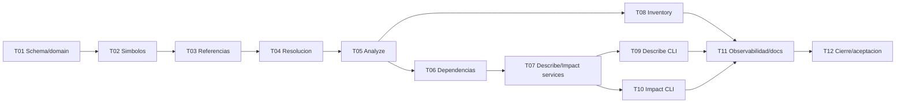

# H4 - ReverseEngineering: Plan de tareas

## 1. Reglas

- Implementar tareas en orden.
- Cada tarea incluye implementacion, pruebas y documentacion operativa cuando corresponda.
- Ninguna tarea debe introducir H5, base de grafos, Qdrant, API HTTP ni UI.
- Los comandos y errores de usuario se escriben en espanol.
- Cada tarea termina con verificaciones ejecutables.
- No concentrar pruebas en la tarea final: cada incremento lleva sus pruebas.

Estados iniciales: `pendiente`.

## 2. Tareas

### H4-T01 - Crear base de dominio y migracion SQLite v4

**Estado:** completado.
**Objetivo:** definir modelos H4, estados, IDs deterministas, migracion v4 y repositorio minimo.  
**Modulos estimados:** `domain/reverse_engineering.py`, `domain/ports.py`, `database.py`, `infrastructure/sqlite.py`.  
**Requisitos:** H4-RF-001, H4-RF-002, H4-RF-005, H4-RF-010, H4-RNF-003, H4-RNF-009.  
**Dependencias:** H3 aceptado.  
**Pruebas exigidas:** migracion nueva, upgrade v3-v4, idempotencia, FK, version futura, IDs deterministas e indices `symbol_references(normalized_target, resolution_status)`, `symbols(normalized_name, symbol_type, status)` y `symbols(container_name, normalized_name, status)`.
**Condicion de finalizacion:** SQLite v4 crea tablas H4 sin romper H1-H3 y el repositorio permite insertar/leer runs, simbolos y relaciones fixture.  
**Checkpoint:** `python -m pytest tests/unit/test_database.py tests/unit/test_domain_models.py`.

### H4-T02 - Implementar normalizacion y catalogo de simbolos

**Estado:** completado.  
**Objetivo:** extraer y persistir simbolos desde metadata/chunks H2 existentes.  
**Modulos estimados:** `domain/reverse_engineering.py`, `application/reverse_engineering.py`, `infrastructure/sqlite.py`.  
**Requisitos:** H4-RF-002.  
**Dependencias:** H4-T01.  
**Pruebas exigidas:** normalizacion Oracle/PowerBuilder, contenedores, confianza, estados, deduplicacion, simbolos desconocidos.  
**Condicion de finalizacion:** una corrida H4 sobre fixtures H2 crea simbolos active con procedencia y sin duplicados.  
**Checkpoint:** `python -m pytest tests/unit/test_h4_symbols.py`.

### H4-T03 - Implementar extractores de referencias Oracle y PowerBuilder

**Estado:** completado.  
**Objetivo:** detectar referencias comunes con evidencia y confianza sin resolverlas aun.  
**Modulos estimados:** `domain/reverse_engineering.py`, `infrastructure/parsers/oracle.py`, `infrastructure/parsers/powerbuilder.py` o extractores bajo `infrastructure/`.  
**Requisitos:** H4-RF-003.  
**Dependencias:** H4-T02.  
**Pruebas exigidas:** llamadas PLSQL, tablas/vistas, triggers, SQL dinamico, `open`, eventos, DataWindows, SQL embebido, strings dinamicos, comentarios/literales.  
**Condicion de finalizacion:** referencias crudas se detectan con rangos y metodo sin afirmar destinos.  
**Checkpoint:** `python -m pytest tests/unit/test_h4_reference_extractors.py`.

### H4-T04 - Resolver referencias y persistir relaciones

**Estado:** completado.  
**Objetivo:** convertir referencias en relaciones resolved/ambiguous/unresolved/external/dynamic.  
**Modulos estimados:** `domain/reverse_engineering.py`, `application/reverse_engineering.py`, `infrastructure/sqlite.py`.  
**Requisitos:** H4-RF-002, H4-RF-003, H4-RF-004, H4-RF-005.  
**Dependencias:** H4-T03.  
**Pruebas exigidas:** exact match, nombres calificados, case-insensitive, multiples candidatos, externos, dinamicos, autorreferencias.  
**Condicion de finalizacion:** relaciones y candidatos quedan persistidos con evidencia y sin resolucion silenciosa.  
**Checkpoint:** `python -m pytest tests/unit/test_h4_resolution.py tests/integration/test_h4_relations_sqlite.py`.

### H4-T05 - Implementar `barbarion analyze` incremental

**Estado:** completado.  
**Objetivo:** ejecutar extraccion/resolucion H4 por alcance, con full, partial, dry-run, progreso y cancelacion.  
**Modulos estimados:** `application/reverse_engineering.py`, `cli.py`, `domain/progress.py`, `infrastructure/sqlite.py`.  
**Requisitos:** H4-RF-001, H4-RF-010, H4-RF-011, H4-RNF-003, H4-RNF-004, H4-RNF-005.  
**Dependencias:** H4-T04.  
**Pruebas exigidas:** full, incremental sin cambios, archivo modificado, archivo eliminado, deteccion de claves de simbolos afectadas, re-resolucion de referencias de otros archivos, transiciones `unresolved -> resolved`, `resolved -> ambiguous`, `resolved -> unresolved`, `ambiguous -> resolved`, dry-run, interrupcion, runs y conteos.  
**Condicion de finalizacion:** `analyze` deja catalogo H4 vigente e idempotente desde SQLite.  
**Checkpoint:** `python -m pytest tests/integration/test_h4_analyze_cli.py`.

### H4-T06 - Implementar navegacion de dependencias

**Estado:** completado.
**Objetivo:** consultar dependencias entrantes/salientes y transitivas con limites.  
**Modulos estimados:** `domain/reverse_engineering.py`, `application/reverse_engineering.py`, `infrastructure/sqlite.py`.  
**Requisitos:** H4-RF-006, H4-RNF-006.  
**Dependencias:** H4-T05.  
**Pruebas exigidas:** depth 0..5, incoming/outgoing/both, ciclos, unresolved, ambiguous, limite de nodos, filtros.  
**Condicion de finalizacion:** servicio devuelve caminos deterministas y reporta ciclos/limites.  
**Checkpoint:** `python -m pytest tests/unit/test_h4_dependency_walk.py`.

### H4-T07 - Implementar servicios `describe` e `impact`

**Estado:** completado.
**Objetivo:** producir resultados estructurados para descripcion e impacto, con modo sin LLM y RAG opcional.  
**Modulos estimados:** `application/reverse_engineering.py`, `application/rag.py`, `domain/reverse_engineering.py`.  
**Requisitos:** H4-RF-007, H4-RF-008, H4-RNF-001, H4-RNF-002, H4-RNF-012.  
**Dependencias:** H4-T06.  
**Pruebas exigidas:** objeto unico, inexistente, ambiguo, evidencia insuficiente, ciclos, LLM fake, `--no-llm`, no impacto por similitud semantica.  
**Condicion de finalizacion:** servicios devuelven DTOs con detectado/inferido/por_confirmar, evidencia y limitaciones.  
**Checkpoint:** `python -m pytest tests/unit/test_h4_describe_impact.py`.

### H4-T08 - Implementar `inventory` CLI y Markdown de inventario

**Estado:** completado.  
**Objetivo:** exponer inventario tecnico en text/json/markdown y escritura segura.  
**Modulos estimados:** `cli.py`, `application/reverse_engineering.py`, `infrastructure/markdown.py`.  
**Requisitos:** H4-RF-001, H4-RF-009, H4-RNF-007.  
**Dependencias:** H4-T05.  
**Pruebas exigidas:** filtros, formatos, salida vacia, output, no overwrite, golden Markdown.  
**Condicion de finalizacion:** `barbarion inventory` consulta solo SQLite y genera inventario versionable.  
**Checkpoint:** `python -m pytest tests/unit/test_h4_inventory_cli.py tests/golden/test_h4_inventory_markdown.py`.

### H4-T09 - Integrar `describe` CLI y ficha Markdown

**Estado:** completado.  
**Objetivo:** exponer `barbarion describe` con formatos, opciones y Markdown estable.  
**Modulos estimados:** `cli.py`, `application/reverse_engineering.py`, `infrastructure/markdown.py`.  
**Requisitos:** H4-RF-007, H4-RF-009, H4-RNF-002, H4-RNF-007.  
**Dependencias:** H4-T07, H4-T08.  
**Pruebas exigidas:** help, argumentos validos/invalidos, candidatos multiples, `--no-llm`, LLM fake, output seguro, golden Markdown.  
**Condicion de finalizacion:** `describe` produce ficha trazable y no sobrescribe archivos sin `--overwrite`.  
**Checkpoint:** `python -m pytest tests/integration/test_describe_cli.py tests/golden/test_component_markdown.py`.

### H4-T10 - Integrar `impact` CLI y Markdown de impacto

**Estado:** completado.  
**Objetivo:** exponer `barbarion impact` con recorridos, filtros, salida y Markdown estable.  
**Modulos estimados:** `cli.py`, `application/reverse_engineering.py`, `infrastructure/markdown.py`.  
**Requisitos:** H4-RF-008, H4-RF-009, H4-RNF-002, H4-RNF-007.  
**Dependencias:** H4-T07, H4-T08.  
**Pruebas exigidas:** incoming/outgoing/both, depth, cruces Oracle-PowerBuilder, unresolved, ciclos, output seguro, golden Markdown.  
**Condicion de finalizacion:** `impact` genera analisis basico con detectado/inferido/por_confirmar.  
**Checkpoint:** `python -m pytest tests/integration/test_impact_cli.py tests/golden/test_impact_markdown.py`.

### H4-T11 - Completar observabilidad, errores y documentacion operativa

**Estado:** completado.  
**Objetivo:** consolidar metricas H4, mensajes, codigos de salida, resumen de `analyze` y docs operativas.  
**Modulos estimados:** `cli.py`, `application/reverse_engineering.py`, `infrastructure/sqlite.py`, `README.md`, `docs/`.  
**Requisitos:** H4-RF-011.  
**Dependencias:** H4-T08, H4-T09, H4-T10.  
**Pruebas exigidas:** errores esperados sin traceback, codigos 0/1/2/130, resumen de `analyze`, consultas de inventario read-only, logs sin contenido fuente, docs vs help.  
**Condicion de finalizacion:** usuario puede diagnosticar estado H4 y ejecutar comandos desde docs.  
**Checkpoint:** `python -m pytest tests/unit/test_h4_observability.py tests/unit/test_readme.py`.

### H4-T12 - Cierre tecnico, evaluacion y aceptacion H4

**Estado:** completado y aceptado.  
**Objetivo:** ejecutar suite completa, smoke, tres casos representativos, metricas, trazabilidad y evidencia final de aceptacion.  
**Modulos estimados:** `tests/fixtures/`, `reports/h4/`, `specs/H4-ReverseEngineering/acceptance.md` durante la ejecucion de esta tarea, no antes.  
**Requisitos:** H4-RF-012, H4-RNF-001, H4-RNF-002, H4-RNF-005, H4-RNF-008, H4-RNF-010, H4-RNF-011, H4-RNF-012.  
**Dependencias:** H4-T01 a H4-T11.  
**Pruebas exigidas:** suite completa, smoke instalado, casos Oracle, PowerBuilder y cruce PB-Oracle, benchmark de simbolos/relaciones, no regresion H1-H3, scan de datos sensibles.  
**Condicion de finalizacion:** evidencia final registrada con comandos, metricas, limitaciones, falsos positivos/negativos conocidos y revision humana recibida.  
**Checkpoint:** `python -m pytest --basetemp .pytest-tmp/h4` y smoke CLI en venv editable.

## 3. Orden de implementacion

## 4. Trazabilidad de tareas

| Tarea | Requisitos |
|---|---|
| H4-T01 | H4-RF-001, H4-RF-002, H4-RF-005, H4-RF-010, H4-RNF-003, H4-RNF-009 |
| H4-T02 | H4-RF-002 |
| H4-T03 | H4-RF-003 |
| H4-T04 | H4-RF-002, H4-RF-003, H4-RF-004, H4-RF-005 |
| H4-T05 | H4-RF-001, H4-RF-010, H4-RF-011, H4-RNF-003, H4-RNF-004, H4-RNF-005 |
| H4-T06 | H4-RF-006, H4-RNF-006 |
| H4-T07 | H4-RF-007, H4-RF-008, H4-RNF-001, H4-RNF-002, H4-RNF-012 |
| H4-T08 | H4-RF-001, H4-RF-009, H4-RNF-007 |
| H4-T09 | H4-RF-007, H4-RF-009, H4-RNF-002, H4-RNF-007 |
| H4-T10 | H4-RF-008, H4-RF-009, H4-RNF-002, H4-RNF-007 |
| H4-T11 | H4-RF-011 |
| H4-T12 | H4-RF-012, H4-RNF-001, H4-RNF-002, H4-RNF-005, H4-RNF-008, H4-RNF-010, H4-RNF-011, H4-RNF-012 |

## 5. Evidencia que debe recopilar la ultima tarea

- commit o version evaluada;
- sistema operativo y Python;
- comando de instalacion editable;
- suite completa y duracion;
- smoke test instalado;
- migracion v3-v4;
- corrida `analyze --full`;
- corrida `analyze` incremental sin cambios;
- salida `inventory`;
- salida `describe` para caso Oracle y PowerBuilder;
- salida `impact` para caso cruzado PowerBuilder-Oracle;
- conteos de simbolos, referencias, relaciones resolved/unresolved/ambiguous;
- conteos de referencias re-resueltas por claves de simbolos afectadas;
- falsos positivos y falsos negativos conocidos;
- limitaciones de SQL dinamico y ambiguedad;
- resultado de revision humana;
- verificacion de no regresion H1/H2/H3;
- confirmacion de privacidad y ausencia de datos sensibles versionados.
