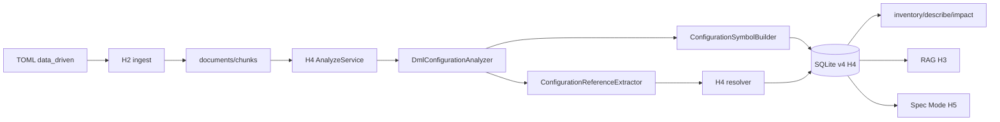
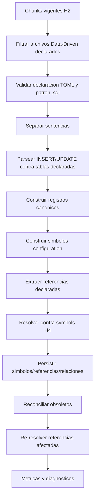

# H4.1 - Configuraciones Data-Driven: Diseno

## 1. Estado actual relevante

Barbarion ya cuenta con:

- aplicacion Python modular de un solo proceso;
- CLI local en espanol;
- configuracion TOML validada con rechazo de claves desconocidas;
- ingesta H2 incremental con `files`, `documents`, `chunks`, `errors` e
  `ingestion_runs`;
- parsers heuristicos Oracle, PowerBuilder, Markdown, texto, PDF y DOCX;
- SQLite schema version `4`;
- RAG H3 sobre SQLite + sqlite-vec;
- reverse engineering H4 con `analyze`, `inventory`, `describe`, `impact`,
  `analysis_runs`, `symbols`, `symbol_references`, `relations`,
  `relation_candidates` y `generated_artifacts`;
- H5 que reutiliza H3/H4 sin crear conocimiento nuevo.

Limitaciones actuales relevantes:

- no existe seccion TOML Data-Driven;
- `.sql` se clasifica como `oracle`;
- OracleParser detecta objetos Oracle y referencias de SQL embebido, pero no
  interpreta registros DML como configuraciones;
- H4 construye simbolos desde chunks y metadatos de parser, no desde filas DML;
- el resolvedor H4 es conservador y ya soporta `resolved`, `ambiguous`,
  `unresolved`, `external` y `dynamic`;
- `generated_artifacts` real difiere de documentos historicos: no tiene
  `template_version` como columna directa, sino metadata JSON.

## 2. Decisiones de diseno

| ID | Decision | Requisitos |
|---|---|---|
| H4.1-DD-001 | Agregar seccion `[data_driven]` en TOML, deshabilitada por defecto y validada como el resto de configuracion | H4.1-REQ-001 |
| H4.1-DD-002 | Exigir declaracion minima por configuracion; no inferir semantica de tablas o columnas sin TOML | H4.1-REQ-001, H4.1-REQ-002 |
| H4.1-DD-003 | Reutilizar ingesta H2 y clasificar archivos `.sql` como `artifact_kind='configuration'` solo si se cumplen `data_driven.enabled`, `file_pattern` declarado y tabla declarada | H4.1-REQ-002 |
| H4.1-DD-004 | Implementar un parser DML pequeno para separar sentencias y parsear solo `INSERT` y `UPDATE` acotados | H4.1-REQ-003, H4.1-REQ-004, H4.1-REQ-005 |
| H4.1-DD-005 | Representar cada sentencia soportada como registro canonico con valores originales, tipos estaticos y metadata de sentencia | H4.1-REQ-003, H4.1-REQ-006 |
| H4.1-DD-006 | Soportar `UPDATE` solo cuando identifica el registro por todas las columnas de identidad declaradas; puede complementar un registro previo del mismo archivo/run o crear representacion parcial marcada en metadata; no reconstruir estado previo | H4.1-REQ-004 |
| H4.1-DD-007 | Construir simbolos `configuration_*` con `technology='configuration'` y IDs deterministas del dominio H4 | H4.1-REQ-006, H4.1-REQ-007 |
| H4.1-DD-008 | Usar jerarquia padre-hijo de `symbols` para entidad, registro y elementos derivados | H4.1-REQ-007 |
| H4.1-DD-009 | Extraer referencias explicitas solo desde columnas declaradas y relaciones estructurales declaradas | H4.1-REQ-008 |
| H4.1-DD-010 | Reutilizar el resolvedor H4, ampliando compatibilidad de tipos y tecnologia `configuration` | H4.1-REQ-008, H4.1-REQ-009 |
| H4.1-DD-011 | Analizar formulas con tokenizacion configurable, sin evaluar ni interpretar funcionalmente el lenguaje | H4.1-REQ-010 |
| H4.1-DD-012 | No agregar migracion ni tabla nueva para registros Data-Driven; persistir simbolos, referencias, relaciones, candidatos y trazabilidad en tablas H4 existentes y `metadata_json` | H4.1-REQ-011 |
| H4.1-DD-013 | Integrar Data-Driven en `AnalyzeService`, con firma propia y re-resolucion afectada | H4.1-REQ-012 |
| H4.1-DD-014 | Registrar metricas y warnings por archivo, sentencia y configuracion, sin volcar valores completos por defecto | H4.1-REQ-005, H4.1-REQ-016 |
| H4.1-DD-015 | Extender servicios y renderers H4 existentes para tecnologia `configuration` | H4.1-REQ-013 |
| H4.1-DD-016 | Integrar H3/H5 solo mediante chunks, metadata, simbolos y relaciones existentes | H4.1-REQ-014 |
| H4.1-DD-017 | No crear comando nuevo; extender `ingest`, `analyze`, `inventory`, `describe`, `impact` y `stats` | H4.1-REQ-015 |
| H4.1-DD-018 | Mantener procesamiento local, no ejecucion y limites de recursos heredados de H2 | H4.1-REQ-017 |

## 3. Configuracion TOML

Solucion inicial concreta:

```toml
[data_driven]
enabled = true
file_patterns = ["config/**/*.sql"]
max_statements_per_file = 10000
max_literal_chars = 200000
token_patterns = ["\\{([A-Za-z_][A-Za-z0-9_]*)\\}", "\\$\\{([^}]+)\\}", ":([A-Za-z_][A-Za-z0-9_]*)"]

[[data_driven.configurations]]
name = "pricing_rules"
symbol_type = "configuration_record"
tables = ["APP_CFG.PRICING_RULES"]
identity_columns = ["RULE_ID"]
default_column_order = ["RULE_ID", "RULE_NAME", "FORMULA", "STATUS"]
name_columns = ["RULE_NAME"]
description_columns = ["DESCRIPTION"]
formula_columns = ["FORMULA"]
variable_columns = ["VARIABLE_CODE"]
parameter_columns = ["PARAMETER_CODE"]
mapping_columns = ["MAPPING_CODE"]
reference_columns = [
  { column = "FUNCTION_NAME", target_technology = "oracle", target_type = "function" },
  { column = "NEXT_STEP_ID", target_configuration = "pricing_rules", relation_type = "precedes" }
]
parent_columns = [{ column = "PARENT_RULE_ID", target_configuration = "pricing_rules" }]
sequence_columns = ["DISPLAY_ORDER"]
status_columns = [{ column = "STATUS", active_values = ["A", "ACTIVE"], inactive_values = ["I", "INACTIVE"] }]
effective_from_columns = ["VALID_FROM"]
effective_to_columns = ["VALID_TO"]
metadata_columns = ["CATEGORY", "OWNER"]
```

Reglas:

- `enabled=false` es el default.
- `file_patterns` limita candidatos globales a archivos `.sql`; cada
  configuracion puede agregar `file_patterns` propios si necesita acotar mas.
- La separacion de sentencias DML no es configurable por TOML: el splitter usa
  `;` como terminador interno solamente cuando aparece fuera de strings,
  identificadores delimitados y comentarios.
- La regla de clasificacion es conjuntiva:

```text
archivo .sql
    + Data-Driven habilitado
    + patron de archivo declarado
    + tabla declarada
    = configuracion Data-Driven
```

- `.sql` conserva su clasificacion y comportamiento Oracle por defecto.
- Mencionar una tabla declarada en codigo Oracle no reclasifica el archivo.
- Una sentencia contra una tabla no declarada se omite para Data-Driven aunque
  el archivo coincida con `file_patterns`.
- `tables` admite nombres con esquema y se normaliza case-insensitive.
- `identity_columns` es obligatorio.
- `default_column_order` solo se usa para `INSERT INTO table VALUES (...)`.
- `reference_columns` es la unica forma inicial de declarar referencias por
  columna. No hay inferencia automatica por nombre de columna.
- `sequence_columns` conserva atributos de orden como metadata; no genera
  relaciones `precedes` por si solo. `precedes` requiere una columna de
  referencia explicita, por ejemplo `NEXT_STEP_ID`, declarada en
  `reference_columns` con `relation_type = "precedes"`.
- El parser conserva valores de columnas no declaradas solo si estan en
  `metadata_columns`; columnas restantes no se copian a metadata para reducir
  ruido y exposicion.

No hay prioridad entre archivos en H4.1. Los duplicados entre archivos quedan
`ambiguous`; una posible resolucion por prioridad queda fuera de alcance hasta
que exista un caso real que la justifique.

## 4. Arquitectura



## 5. Componentes

| Componente | Capa | Responsabilidad |
|---|---|---|
| `DataDrivenSettings` | `config.py` | validar declaracion TOML |
| `ConfigurationDeclaration` | `domain` | representar tabla, columnas y mapeos declarados |
| `DmlStatementSplitter` | `infrastructure/parsers` | separar sentencias sin romper strings/comentarios |
| `DmlConfigurationParser` | `infrastructure/parsers` | parsear `INSERT`/`UPDATE` acotados |
| `ConfigurationRecord` | `domain` | registro canonico derivado de una sentencia |
| `ConfigurationSymbolBuilder` | `application` o `domain` | construir simbolos `configuration_*` |
| `ConfigurationReferenceExtractor` | `application` | construir referencias desde columnas/formulas |
| `DataDrivenAnalyzeStep` | `application/reverse_engineering.py` | integrar al flujo `analyze` |

No se crea un paquete paralelo fuera de las capas existentes. Si se crea un
subpaquete, debe estar bajo `infrastructure/parsers/` o `domain/` segun su
responsabilidad.

## 6. Subconjunto DML

### Separacion de sentencias

La separacion reconoce:

- `;` como terminador interno fijo fuera de literales, comentarios y wrappers
  conocidos;
- comentarios `--` y `/* ... */`;
- strings SQL con comillas simples y escape `''`;
- identificadores con comillas dobles.

Al llegar al final del archivo, la ultima sentencia puede aceptarse sin `;`
solo si el splitter queda en estado cerrado y el parser puede interpretarla de
forma segura. Si hay string, comentario o delimitador abierto, se emite warning
recuperable y el fragmento final se omite.

No interpreta bloques PL/SQL. Si encuentra `BEGIN`, `DECLARE` o estructuras no
soportadas, marca la sentencia como no soportada.

### Literales y valores

Tipos estaticos:

- `string`;
- `number`;
- `null`;
- `date_literal`;
- `timestamp_literal`;
- `function_expression`;
- `placeholder`;
- `raw_expression`;
- `unsupported`.

Las funciones no se evaluan. `TO_DATE(...)` se conserva como texto original con
tipo `function_expression` y, si la columna es de fecha declarada, se etiqueta
como fecha no evaluada.

### INSERT

Soportado:

```sql
INSERT INTO table (a, b) VALUES ('x', 1);
INSERT INTO schema.table VALUES ('id', 'name');
```

No soportado:

```sql
INSERT INTO table SELECT ...
INSERT ALL ...
INSERT INTO table (a) VALUES (SELECT ...)
```

### UPDATE

Soportado:

```sql
UPDATE table SET value = 'x', status = 'A' WHERE id = 'R1';
UPDATE schema.table
   SET formula = '{A}+{B}'
 WHERE id = 'R2' AND version = 1;
```

No soportado:

```sql
UPDATE table SET value = (SELECT ...)
UPDATE table SET value = 'x' WHERE status = 'A'
UPDATE a SET ... FROM ...
```

Reglas adicionales:

- el `WHERE` debe cubrir todas las `identity_columns` declaradas;
- un `UPDATE` identificable puede complementar un registro previamente
  encontrado dentro del mismo archivo y ejecucion;
- si no existe un `INSERT` previo, produce una representacion parcial con la
  identidad y los valores demostrables por el `UPDATE`;
- esa representacion se marca como parcial en `metadata_json`;
- un `UPDATE` no identificable genera advertencia recuperable y no crea ni
  modifica simbolos;
- no se ejecuta la sentencia ni se consulta una base de datos para completar
  informacion faltante.

## 7. Modelo de dominio

| Entidad | Descripcion |
|---|---|
| `ConfigurationEntity` | declaracion logica de una tabla/configuracion |
| `ConfigurationRecord` | registro canonico extraido desde DML |
| `ConfigurationValue` | valor original, tipo estatico, columna y posicion |
| `ConfigurationToken` | token detectado en formula, regla o texto declarado |
| `ConfigurationSymbolPlan` | simbolos que se generaran desde un registro |
| `ConfigurationReferencePlan` | referencias que se generaran desde valores declarados |
| `DataDrivenDiagnostic` | warning/error de archivo, sentencia o columna |

Estos modelos pueden vivir en `domain/reverse_engineering.py` o en un nuevo
archivo de dominio si el tamano lo justifica. Deben mantenerse sin I/O.

## 8. Identidad y nombres

Identidad estable de registro:

```text
sha256(
  "barbarion.configuration.record.v1" +
  configuration_name +
  normalized_table_name +
  canonical_identity_values
)
```

Nombre canonico:

```text
configuration_name.identity_value_1[.identity_value_n]
```

Reglas:

- no incluir ruta absoluta;
- normalizar tabla y columnas case-insensitive;
- conservar original en metadata;
- el hash de contenido de valores detecta modificaciones;
- `configuration_entity` usa identidad basada en `configuration.name` y tabla.
- duplicados con la misma identidad dentro de un archivo se procesan en orden de
  aparicion;
- duplicados con la misma identidad procedentes de archivos diferentes quedan
  como simbolos/registros `ambiguous`;
- H4.1 no define prioridad entre fuentes.

## 9. Simbolos

Mapeo inicial:

| Concepto | `symbol_type` | Padre |
|---|---|---|
| Entidad de configuracion | `configuration_entity` | ninguno |
| Registro | `configuration_record` | entidad |
| Regla | `configuration_rule` | registro |
| Formula | `configuration_formula` | registro |
| Variable | `configuration_variable` | registro o entidad |
| Parametro | `configuration_parameter` | registro o entidad |
| Mapping | `configuration_mapping` | registro |
| Paso/secuencia | `configuration_step` | registro o entidad |

`metadata_json` minimo:

```json
{
  "configuration_name": "pricing_rules",
  "table_name": "APP_CFG.PRICING_RULES",
  "operation": "insert",
  "statement_ordinal": 12,
  "identity": {"RULE_ID": "R001"},
  "display_values": {"RULE_NAME": "Regla R001"},
  "declared_columns": ["RULE_ID", "RULE_NAME", "FORMULA"],
  "source_hash": "..."
}
```

## 10. Referencias y relaciones

Tipos iniciales de referencia:

- `configuration_reference`;
- `configuration_parent`;
- `configuration_sequence`;
- `configuration_formula_token`;
- `configuration_formula_function`;
- `configuration_variable`;
- `configuration_parameter`;
- `oracle_object`;
- `powerbuilder_object`.

Tipos iniciales de relacion:

- `contains`;
- `depends_on`;
- `uses`;
- `references`;
- `parent_of`;
- `precedes`;
- `calls`.

Reglas:

- `contains` se usa para entidad -> registro y registro -> elementos hijos.
- `parent_of` se usa para jerarquia declarada.
- `precedes` se usa solo cuando una columna declarada identifica explicitamente
  otro paso o registro; de lo contrario la secuencia queda como metadata.
- `uses` y `calls` se usan hacia Oracle/PowerBuilder segun tipo declarado.
- Referencias no resueltas no desaparecen; quedan visibles con `target_key`.

## 11. Formulas y tokens

Analisis estatico:

1. conservar texto original;
2. aplicar `token_patterns`;
3. deduplicar tokens por columna y registro;
4. crear simbolos de variable/parametro si la declaracion lo indica;
5. generar referencias hacia variables/parametros conocidos;
6. detectar `NAME(...)` solo si `formula_columns` habilita funcion;
7. marcar concatenacion, placeholder o expresion incompleta como `dynamic` o
   `por_confirmar`.

No se implementa:

- precedencia de operadores;
- AST de expresiones;
- evaluacion de resultados;
- motor de formulas;
- traduccion a codigo ejecutable.

## 12. Persistencia

### Reutilizacion inicial

H4.1 usa:

- `analysis_runs`: corrida `analyze`;
- `symbols`: simbolos de configuracion;
- `symbol_references`: referencias desde columnas/formulas;
- `relations`: relaciones resueltas, ambiguas, dinamicas, externas y no
  resueltas cuando aplique;
- `relation_candidates`: candidatos de ambiguedad;
- `generated_artifacts`: artefactos Markdown existentes si se generan reportes.

No se requiere migracion obligatoria porque:

- `metadata_json` cubre sentencia, registro, columnas y valores relevantes;
- `file_id`, `document_id`, `chunk_id`, `start_line` y `end_line` cubren
  trazabilidad principal;
- H4 ya consulta el estado vigente.

Salvaguarda arquitectonica:

```text
Si durante la implementacion se demuestra mediante evidencia que el modelo H4
existente no puede satisfacer un requisito obligatorio, la implementacion debe
detenerse y el diseno debe actualizarse antes de introducir una nueva tabla o
migracion.
```

La implementacion no debe decidir unilateralmente crear una nueva estructura de
persistencia.

## 13. Pipeline de analisis



Unidad de procesamiento:

- archivo `.sql` declarado mediante `file_patterns`;
- dentro del archivo, sentencia ordinal;
- publicacion por archivo confirmado.

Idempotencia:

- IDs deterministas por configuracion, tabla e identidad;
- `last_run_id` registra la ultima actualizacion;
- registros obsoletos del archivo se marcan `deleted` o se eliminan segun
  politica H4 vigente;
- `--full` re-resuelve todo;
- incremental re-resuelve referencias afectadas por claves de simbolos creadas,
  modificadas o eliminadas.

Errores parciales:

- error de sentencia: warning y continuar;
- declaracion invalida: error operativo de `analyze`;
- archivo malformado completo: error recuperable del archivo;
- interrupcion: run `interrupted`, rollback de archivo/scope actual.

## 14. Integracion con ingesta H2

H2 sigue leyendo archivos y creando documentos/chunks. H4.1 agrega:

- clasificacion `configuration` para archivos `.sql` solo cuando
  `data_driven.enabled=true`, el archivo coincide con `file_patterns` y la
  sentencia afecta una tabla declarada;
- metadatos `data_driven_configuration_names` en documento/chunks;
- sin redisenar fingerprint, normalizacion ni chunking.

H4.1 no reconoce ni introduce la extension `.dml`, y no agrega `.dml` a
`ingestion.extensions`.

## 15. Integracion con H4

`analyze`:

- selecciona chunks de archivos `.sql` que cumplen la regla conjuntiva
  Data-Driven;
- ejecuta extractor Data-Driven ademas de extractores Oracle/PowerBuilder;
- persiste todo en tablas H4 existentes.

`inventory`:

- acepta `--technology configuration`;
- filtra tipos `configuration_*`.

`describe`:

- agrega secciones de columnas clave, formula/regla, tokens, referencias,
  estado, vigencia, evidencia y warnings.

`impact`:

- incluye relaciones entrantes/salientes de configuraciones;
- muestra cruces de tecnologia.

`stats`:

- agrega conteos Data-Driven si existen.

## 16. Integracion con H3 y H5

H3:

- indexa chunks DML como cualquier chunk vigente;
- keyword search funciona por texto original;
- filtros pueden usar `artifact_kind=configuration` para archivos `.sql`
  declarados;
- no cambia ranking.

H5:

- `TechnicalImpactCollector` consume simbolos/relaciones H4 existentes;
- una spec puede citar configuraciones como componentes afectados;
- no se agregan plantillas nuevas obligatorias.

## 17. CLI

No se crea comando nuevo.

Comportamiento esperado:

```text
barbarion ingest
barbarion analyze [--full] [--path PREFIJO] [--dry-run]
barbarion inventory --technology configuration
barbarion describe pricing_rules.R001 --no-llm
barbarion impact PKG_RULES.CALCULATE --direction incoming --technology configuration
barbarion stats --format json
```

Mensajes normales:

```text
Configuraciones Data-Driven: 2 archivos, 148 sentencias, 132 soportadas, 16 omitidas.
Registros de configuracion: 120.
Simbolos Data-Driven: 156.
Referencias Data-Driven: 84.
Relaciones resueltas: 61. Ambiguas: 7. Dinamicas: 9. Externas: 3. No resueltas: 4.
```

Codigos de salida:

| Codigo | Significado |
|---:|---|
| 0 | completado |
| 1 | error operativo o analisis con errores recuperables |
| 2 | argumentos/configuracion invalida |
| 130 | interrupcion por usuario |

## 18. Observabilidad

Metricas por run:

- `data_driven_files`;
- `dml_statements_total`;
- `dml_statements_supported`;
- `dml_statements_skipped`;
- `dml_statement_errors`;
- `configuration_record_symbols`;
- `configuration_symbols`;
- `configuration_references`;
- `configuration_relations_resolved`;
- `configuration_relations_ambiguous`;
- `configuration_relations_dynamic`;
- `configuration_relations_external`;
- `configuration_relations_unresolved`;
- `configuration_reconciled`;
- duraciones por seleccion, parsing, simbolos, referencias, resolucion,
  persistencia y reconciliacion.

Estas metricas pueden almacenarse inicialmente en `analysis_runs.scope_json` y
logs estructurados; una columna nueva solo se justifica si hay consulta
operativa real.

## 19. Seguridad

- Solo lectura de archivos locales autorizados.
- No conexion a Oracle.
- No ejecucion de DML.
- No evaluacion de funciones SQL.
- No ejecucion de formulas.
- No LLM obligatorio.
- Limites de tamano heredados de H2.
- `max_statements_per_file` y `max_literal_chars` evitan consumo excesivo.
- Warnings no incluyen valores completos si superan longitud segura.

## 20. Alternativas descartadas

| Alternativa | Motivo |
|---|---|
| Parser SQL universal | Sobrecosto y contradice heuristicas honestas del MVP |
| Leer una base Oracle directamente | Rompe local/offline y seguridad |
| ETL generico | Alcance demasiado amplio |
| Inferir semantica por nombres de columnas | Riesgo alto de falsos positivos |
| Nueva base de grafos | SQLite H4 cubre relaciones acotadas |
| Nuevo comando `config analyze` | `analyze` ya es la responsabilidad H4 |
| Ejecutar formulas | Fuera de alcance y riesgoso |
| Extension `.dml` | H4.1 analiza sentencias DML dentro de archivos `.sql`; no introduce extensiones |
| Prioridad entre archivos | Sin evidencia real; duplicados entre archivos quedan `ambiguous` |
| Tabla `configuration_records` | El modelo H4 existente es la fuente de verdad de H4.1 |

## 21. Trazabilidad hacia requisitos

| Decision | Requisitos |
|---|---|
| H4.1-DD-001 | H4.1-REQ-001 |
| H4.1-DD-002 | H4.1-REQ-001, H4.1-REQ-002 |
| H4.1-DD-003 | H4.1-REQ-002 |
| H4.1-DD-004 | H4.1-REQ-003, H4.1-REQ-004, H4.1-REQ-005 |
| H4.1-DD-005 | H4.1-REQ-003, H4.1-REQ-006 |
| H4.1-DD-006 | H4.1-REQ-004 |
| H4.1-DD-007 | H4.1-REQ-006, H4.1-REQ-007 |
| H4.1-DD-008 | H4.1-REQ-007 |
| H4.1-DD-009 | H4.1-REQ-008 |
| H4.1-DD-010 | H4.1-REQ-008, H4.1-REQ-009 |
| H4.1-DD-011 | H4.1-REQ-010 |
| H4.1-DD-012 | H4.1-REQ-011 |
| H4.1-DD-013 | H4.1-REQ-012 |
| H4.1-DD-014 | H4.1-REQ-005, H4.1-REQ-016 |
| H4.1-DD-015 | H4.1-REQ-013 |
| H4.1-DD-016 | H4.1-REQ-014 |
| H4.1-DD-017 | H4.1-REQ-015 |
| H4.1-DD-018 | H4.1-REQ-017 |
