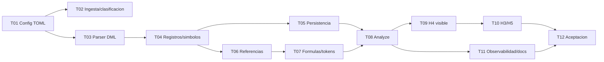

# H4.1 - Configuraciones Data-Driven: Plan de tareas

## 1. Reglas

- Implementar tareas en orden.
- Cada tarea incluye pruebas y documentacion operativa cuando corresponda.
- No implementar codigo productivo durante la elaboracion de esta especificacion.
- No modificar specs H1, H2, H3, H4 o H5 salvo que una tarea futura lo indique
  como actualizacion documental final.
- No crear `acceptance.md` hasta la ultima tarea de implementacion.
- No ejecutar aceptacion durante la elaboracion de esta spec.
- No agregar parsers universales, ETL, motores de reglas, UI, API HTTP,
  agentes, base de grafos ni conexion a bases de datos.
- Mensajes CLI y documentacion de usuario en espanol.
- Identificadores de codigo en ingles; comentarios y docstrings en espanol.
- Cada tarea debe cerrar con verificaciones ejecutables.
- Las pruebas no se concentran solo al final.

Estados iniciales: `pendiente`.

## 2. Tareas

### H4.1-T01 - Agregar configuracion TOML Data-Driven

**Estado:** completado.
**Objetivo:** definir `DataDrivenSettings` y validar declaracion TOML.  
**Descripcion:** Agregar `[data_driven]`, `[[data_driven.configurations]]`,
validacion de claves, patrones, tablas, columnas y limites. Actualizar
`barbarion.example.toml` con ejemplo comentado o documentado.  
**Dependencias:** H5 aceptado, SQLite v4 vigente.  
**Resultado esperado:** configuracion deshabilitada por defecto y validada sin
romper configuraciones existentes.  
**Requisitos:** H4.1-REQ-001, H4.1-REQ-011.  
**Checkpoint:** `python -m pytest tests/unit/test_config.py`.

### H4.1-T02 - Clasificar archivos de configuracion en ingesta

**Estado:** completado.
**Objetivo:** identificar archivos DML declarados sin redisenar H2.  
**Descripcion:** Extender clasificacion de `artifact_kind`, metadata de
documentos/chunks para archivos `.sql` que cumplen simultaneamente
`data_driven.enabled`, `file_pattern` declarado y tabla declarada. Mantener
`.sql` como Oracle por defecto y no introducir extension `.dml`.  
**Dependencias:** H4.1-T01.  
**Resultado esperado:** archivos declarados quedan como `configuration` y los no
declarados conservan comportamiento previo.  
**Requisitos:** H4.1-REQ-002.  
**Checkpoint:** `python -m pytest tests/unit/test_ingestion_service.py tests/integration/test_ingest_incremental_cli.py`.

### H4.1-T03 - Implementar splitter y parser DML acotado

**Estado:** completado.
**Objetivo:** parsear `INSERT` y `UPDATE` soportados como texto estatico.  
**Descripcion:** Crear separador de sentencias con `;` interno fuera de strings
y comentarios, aceptar EOF sin `;` solo cuando sea seguro, parser de valores,
diagnosticos de no soportado, limites `max_statements_per_file` y
`max_literal_chars`. No ejecutar ni evaluar funciones.
**Dependencias:** H4.1-T01.  
**Resultado esperado:** sentencias soportadas producen modelos canonicos y
sentencias no soportadas generan warnings recuperables.  
**Requisitos:** H4.1-REQ-003, H4.1-REQ-004, H4.1-REQ-005, H4.1-REQ-017.  
**Checkpoint:** `python -m pytest tests/unit/test_data_driven_dml_parser.py`.

### H4.1-T04 - Construir registros y simbolos de configuracion

**Estado:** completado.
**Objetivo:** convertir registros canonicos en simbolos `configuration_*`.  
**Descripcion:** Implementar identidad estable, entidad padre, registro,
simbolos derivados de reglas/formulas/variables/parametros/mappings/pasos,
estado activo/inactivo y manejo de incompletos.  
**Dependencias:** H4.1-T03.  
**Resultado esperado:** simbolos Data-Driven activos, ambiguos u omitidos con
metadata trazable.  
**Requisitos:** H4.1-REQ-006, H4.1-REQ-007.  
**Checkpoint:** `python -m pytest tests/unit/test_data_driven_symbols.py`.

### H4.1-T05 - Persistir conocimiento Data-Driven en SQLite H4

**Estado:** pendiente.  
**Objetivo:** guardar simbolos y metadata Data-Driven sin migracion nueva.  
**Descripcion:** Reutilizar `symbols`, `symbol_references`, `relations`,
`relation_candidates` y `metadata_json`. No crear `configuration_records` ni
otra tabla nueva para registros Data-Driven. Si el modelo H4 existente no
satisface un requisito obligatorio, detener la implementacion y actualizar el
diseno antes de proponer una migracion.  
**Dependencias:** H4.1-T04.  
**Resultado esperado:** persistencia idempotente de entidad, registros y
simbolos hijos con FK y trazabilidad.  
**Nota de implementacion:** La unidad de parseo DML es el documento/archivo SQL
completo y ordenado; los chunks se usan solo como evidencia y ubicacion de
origen.
**Requisitos:** H4.1-REQ-002, H4.1-REQ-007, H4.1-REQ-011.  
**Checkpoint:** `python -m pytest tests/unit/test_sqlite_reverse_engineering_repository.py tests/unit/test_data_driven_symbols.py`.

### H4.1-T06 - Extraer referencias explicitas y estructurales

**Estado:** pendiente.  
**Objetivo:** detectar referencias entre configuraciones y hacia Oracle/PB desde
columnas declaradas.  
**Descripcion:** Implementar `reference_columns`, `parent_columns`,
`sequence_columns`, tipos de referencia y target keys conservadoras.  
**Dependencias:** H4.1-T04.  
**Resultado esperado:** `symbol_references` trazables con estados iniciales
correctos.  
**Requisitos:** H4.1-REQ-008, H4.1-REQ-009.  
**Checkpoint:** `python -m pytest tests/unit/test_data_driven_references.py`.

### H4.1-T07 - Analizar formulas, reglas y tokens

**Estado:** pendiente.  
**Objetivo:** extraer tokens y dependencias desde columnas de formula/regla sin
evaluarlas.  
**Descripcion:** Aplicar `token_patterns`, detectar variables, parametros y
funciones candidatas cuando este declarado, marcar dinamico/ambiguo/no resuelto
segun corresponda.  
**Dependencias:** H4.1-T06.  
**Resultado esperado:** referencias de formula conservadoras y valor original
preservado.  
**Requisitos:** H4.1-REQ-009, H4.1-REQ-010.  
**Checkpoint:** `python -m pytest tests/unit/test_data_driven_formula_tokens.py`.

### H4.1-T08 - Integrar Data-Driven en `barbarion analyze`

**Estado:** pendiente.  
**Objetivo:** ejecutar pipeline Data-Driven incremental dentro de H4.  
**Descripcion:** Seleccionar archivos declarados, procesar por archivo/scope,
persistir, reconciliar obsoletos, re-resolver referencias afectadas, soportar
`--full`, `--path`, `--dry-run` y cancelacion.  
**Nota de avance:** La persistencia de simbolos Data-Driven desde
`AnalyzeService` quedo parcialmente adelantada durante T05; T08 conserva
pendiente la integracion completa de referencias, reconciliacion, CLI y casos
incrementales.
**Dependencias:** H4.1-T05, H4.1-T06, H4.1-T07.  
**Resultado esperado:** `analyze` produce simbolos, referencias y relaciones
Data-Driven idempotentes.  
**Requisitos:** H4.1-REQ-012.  
**Checkpoint:** `python -m pytest tests/integration/test_data_driven_analyze_cli.py`.

### H4.1-T09 - Extender inventario, describe, impact, renderers y CLI

**Estado:** pendiente.  
**Objetivo:** hacer visible el conocimiento Data-Driven en capacidades H4.  
**Descripcion:** Agregar tecnologia `configuration`, filtros, secciones de
descripcion, impacto cruzado y salida text/json/markdown. Mantener mensajes en
espanol.  
**Dependencias:** H4.1-T08.  
**Resultado esperado:** `inventory`, `describe` e `impact` operan con
configuraciones.  
**Requisitos:** H4.1-REQ-013, H4.1-REQ-015.  
**Checkpoint:** `python -m pytest tests/unit/test_data_driven_inventory_describe_impact.py tests/golden/test_data_driven_markdown.py`.

### H4.1-T10 - Validar integracion minima con H3 y H5

**Estado:** pendiente.  
**Objetivo:** comprobar que RAG y Spec Mode consumen conocimiento Data-Driven
por contratos existentes.  
**Descripcion:** Cubrir busqueda keyword/hybrid de DML, evidencia en `ask` y
componentes afectados en `spec create` sin redisenar H3/H5.  
**Dependencias:** H4.1-T09.  
**Resultado esperado:** H3 recupera chunks de configuracion y H5 puede citar
impacto Data-Driven.  
**Requisitos:** H4.1-REQ-014.  
**Checkpoint:** `python -m pytest tests/integration/test_data_driven_h3_h5_integration.py`.

### H4.1-T11 - Completar observabilidad, errores y documentacion operativa

**Estado:** pendiente.  
**Objetivo:** consolidar metricas, warnings, logs, `stats` y documentacion.  
**Descripcion:** Reportar archivos DML, sentencias, registros, simbolos,
referencias, relaciones, reconciliacion, duraciones, errores parciales y
sugerencias accionables. Actualizar README/docs solo al final de la
implementacion funcional.  
**Dependencias:** H4.1-T08, H4.1-T09.  
**Resultado esperado:** usuario puede diagnosticar que se proceso, omitio y por
que, sin tracebacks en errores esperados.  
**Requisitos:** H4.1-REQ-005, H4.1-REQ-015, H4.1-REQ-016.  
**Checkpoint:** `python -m pytest tests/unit/test_data_driven_observability.py tests/unit/test_readme.py`.

### H4.1-T12 - Validacion y aceptacion tecnica H4.1

**Estado:** pendiente.  
**Objetivo:** ejecutar aceptacion tecnica integral solo despues de concluir la
implementacion.  
**Descripcion:** Ejecutar pruebas, validar criterios de aceptacion, correr
regresion H1-H5, smoke test instalado, consolidar resultados, registrar
limitaciones, falsos positivos/falsos negativos, scan de datos sensibles y
actualizacion documental final. Crear `specs/H4.1-DataDrivenConfigurations/acceptance.md`
solo durante esta tarea.  
**Dependencias:** H4.1-T01 a H4.1-T11.  
**Resultado esperado:** H4.1 queda aceptado tecnicamente o pendiente con
bloqueos reales documentados.  
**Requisitos:** H4.1-REQ-017 y requisitos no funcionales H4.1-RNF-001 a
H4.1-RNF-010.  
**Checkpoint:** `python -m pytest --basetemp .pytest-tmp/h41` y smoke CLI en
venv editable.

## 3. Orden de implementacion

## 4. Trazabilidad de tareas

| Tarea | Requisitos |
|---|---|
| H4.1-T01 | H4.1-REQ-001, H4.1-REQ-011 |
| H4.1-T02 | H4.1-REQ-002 |
| H4.1-T03 | H4.1-REQ-003, H4.1-REQ-004, H4.1-REQ-005, H4.1-REQ-017 |
| H4.1-T04 | H4.1-REQ-006, H4.1-REQ-007 |
| H4.1-T05 | H4.1-REQ-002, H4.1-REQ-007, H4.1-REQ-011 |
| H4.1-T06 | H4.1-REQ-008, H4.1-REQ-009 |
| H4.1-T07 | H4.1-REQ-009, H4.1-REQ-010 |
| H4.1-T08 | H4.1-REQ-012 |
| H4.1-T09 | H4.1-REQ-013, H4.1-REQ-015 |
| H4.1-T10 | H4.1-REQ-014 |
| H4.1-T11 | H4.1-REQ-005, H4.1-REQ-015, H4.1-REQ-016 |
| H4.1-T12 | H4.1-REQ-017, RNF-001..RNF-010 |

## 5. Evidencia que debe recopilar la ultima tarea

- commit o version evaluada;
- sistema operativo y Python;
- instalacion editable;
- suite completa y duracion;
- smoke test instalado;
- regresion H1-H5;
- corpus sintetico Data-Driven;
- configuracion TOML usada;
- `ingest` con archivos `.sql` declarados como Data-Driven;
- `analyze --full`;
- `analyze` incremental sin cambios;
- `analyze` incremental con archivo `.sql` Data-Driven modificado;
- `inventory --technology configuration`;
- `describe` de registro de configuracion;
- `impact` cruzando configuracion con Oracle y PowerBuilder;
- `search` o `ask --no-llm` recuperando DML;
- `spec create --no-llm` con componente Data-Driven afectado;
- metricas de parsing y relaciones;
- warnings por sentencias no soportadas;
- falsos positivos y falsos negativos conocidos;
- scan de datos sensibles;
- confirmacion de que no se ejecuto SQL ni formulas;
- revision humana o decision pendiente documentada.
