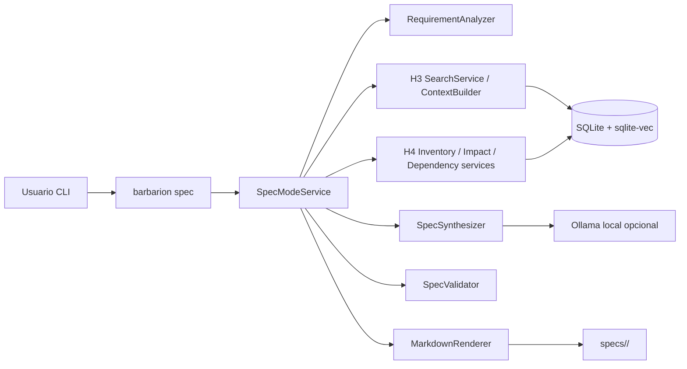
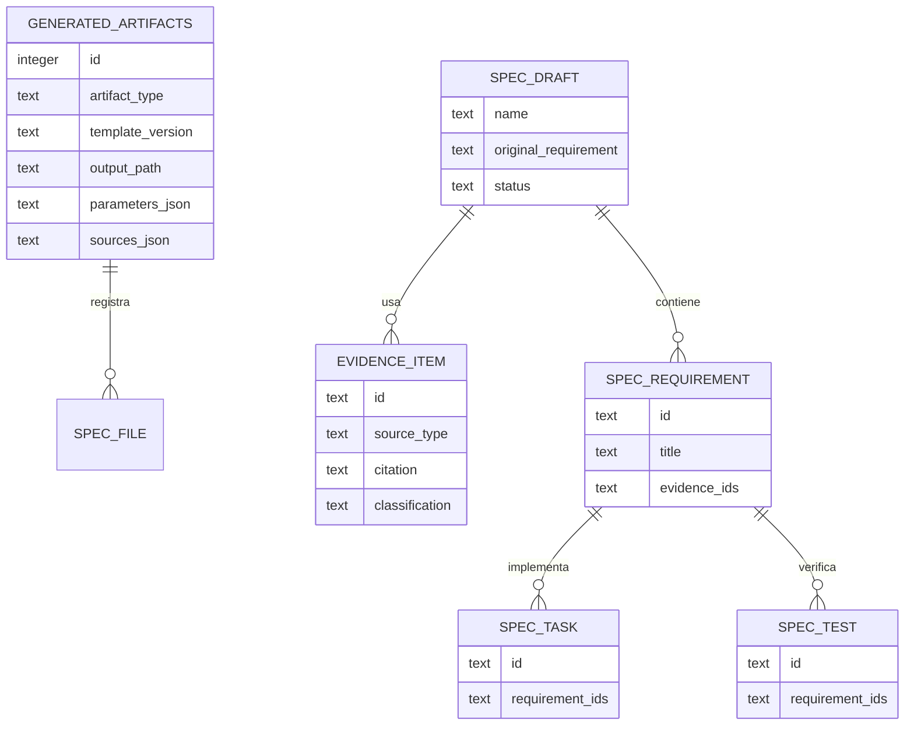
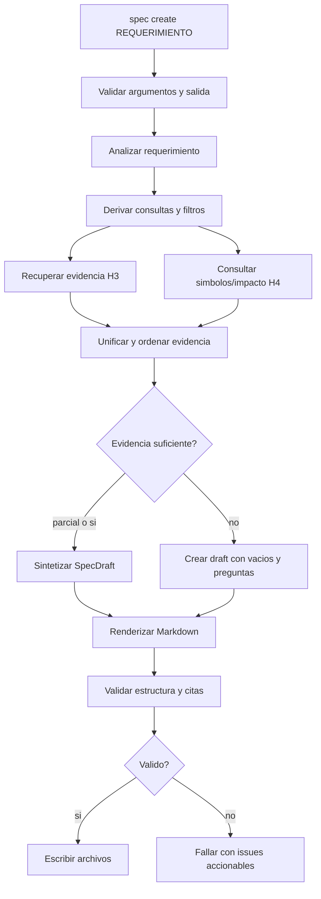

# H5 - SpecMode: Diseno

## 1. Estado actual relevante

Barbarion ya cuenta con:

- CLI local en espanol;
- configuracion TOML validada;
- SQLite versionado como fuente de verdad local;
- ingesta incremental H2 con archivos, documentos, chunks y rangos trazables;
- RAG H3 sobre SQLite + sqlite-vec, con `search`, `ask`, `ContextBuilder`, citas y metricas;
- reverse engineering H4 con `analyze`, `inventory`, `describe`, `impact`, simbolos, referencias, relaciones, recorridos e impacto tecnico;
- generacion Markdown para artefactos tecnicos H4;
- operacion on-premise y uso opcional de Ollama local.

H5 se apoya en esas capacidades. No debe reimplementar busqueda, contexto, extraccion de simbolos ni analisis de impacto. Su responsabilidad es orquestar evidencia existente y producir una spec trazable.

## 2. Decisiones de diseno

| ID | Decision | Requisitos |
|---|---|---|
| H5-DD-001 | Agregar `spec create` y `spec validate` bajo la CLI existente, sin servidor ni UI | H5-RF-001 |
| H5-DD-002 | Representar el requerimiento como DTO estructurado con texto original, terminos, entidades, restricciones, supuestos y preguntas | H5-RF-002 |
| H5-DD-003 | Reutilizar RAG H3 para recuperacion documental y tecnica; H5 no implementa un retriever nuevo | H5-RF-003 |
| H5-DD-004 | Reutilizar H4 para simbolos, dependencias e impacto; similitud semantica sola no basta para declarar afectacion | H5-RF-003, H5-RF-004 |
| H5-DD-005 | Sintetizar reglas existentes solo desde evidencia citada; si falta evidencia, declarar vacio o pregunta abierta | H5-RF-005 |
| H5-DD-006 | Construir un modelo intermedio `SpecDraft` antes de renderizar Markdown | H5-RF-004, H5-RF-006 |
| H5-DD-007 | Usar plantillas Markdown versionadas con estructura fija para los cuatro documentos | H5-RF-005, H5-RF-006 |
| H5-DD-008 | Asignar IDs deterministas a requisitos, decisiones, tareas, pruebas y fuentes dentro de cada generacion | H5-RF-006, H5-RF-007, H5-RF-009 |
| H5-DD-009 | Validar estructura y citas con un validador propio pequeno, no con un framework documental externo | H5-RF-007, H5-RF-008 |
| H5-DD-010 | Mantener errores esperados en espanol, sin traceback, y progreso por etapas compatible con comandos previos | H5-RF-001, H5-RF-008, H5-RF-010 |
| H5-DD-011 | Reutilizar `generated_artifacts` si alcanza; agregar migracion solo si aparece una necesidad persistente no cubierta | H5-RF-009 |
| H5-DD-012 | La salida sin LLM debe ser util aunque menos rica; el LLM sintetiza, no crea evidencia | H5-RF-010 |
| H5-DD-013 | La aceptacion se define con spec piloto, suite, smoke, trazabilidad y revision humana en la ultima tarea | H5-RF-011 |

## 3. Arquitectura funcional



La CLI solo interpreta argumentos y presenta resultados. La aplicacion coordina el pipeline. Dominio contiene modelos y reglas de validacion. Infraestructura consulta SQLite, RAG, LLM y filesystem.

## 4. Integracion con modulos existentes

### H3 RAG

H5 usa H3 para:

- busqueda `keyword`, `semantic` e `hybrid`;
- armado de contexto con presupuesto configurable;
- fuentes numeradas;
- validacion de citas cuando exista contrato reutilizable;
- metricas de consulta.

H5 no cambia el ranking H3 salvo filtros y terminos derivados del requerimiento.

### H4 Reverse Engineering

H5 usa H4 para:

- resolver nombres mencionados contra simbolos;
- consultar dependencias entrantes, salientes y transitivas;
- identificar referencias ambiguas, dinamicas o no resueltas;
- reutilizar resultados de `describe` o `impact` cuando aporten contexto;
- clasificar impacto como detectado, inferido o por confirmar.

H5 no crea nuevos simbolos ni relaciones. Si el catalogo H4 no esta actualizado, debe indicarlo y sugerir `barbarion analyze`.

### Markdown y artefactos

H5 reutiliza el renderer o patrones de escritura segura existentes. Las plantillas H5 son nuevas, pero no requieren otro motor si el actual basta.

## 5. Componentes

| Componente | Capa | Responsabilidad |
|---|---|---|
| `SpecModeService` | aplicacion | coordinar interpretacion, evidencia, sintesis, render, validacion y escritura |
| `RequirementAnalyzer` | dominio/aplicacion | estructurar el requerimiento y derivar consultas |
| `EvidenceCollector` | aplicacion | combinar RAG H3, simbolos y relaciones H4 |
| `ImpactCollector` | aplicacion | pedir recorridos H4 con profundidad y filtros |
| `SpecSynthesizer` | aplicacion | construir `SpecDraft` con o sin LLM |
| `SpecValidator` | dominio | validar secciones, IDs, citas y trazabilidad |
| `SpecMarkdownRenderer` | infraestructura | renderizar documentos H5 versionados |
| `SafeSpecWriter` | infraestructura | crear directorios y escribir sin sobrescribir por defecto |

No es obligatorio crear todos como archivos separados si el codigo queda mas claro agrupado. La frontera importante es que la logica de spec no viva en `cli.py`.

## 6. Modelo de dominio

| Entidad | Descripcion |
|---|---|
| `SpecRequest` | entrada del usuario: requerimiento, nombre, modo, limites y salida |
| `RequirementIntent` | texto original, objetivos, acciones, entidades, restricciones y preguntas |
| `EvidenceItem` | fuente recuperada con ID `[F#]`, tipo, archivo, chunk, simbolo, relacion y rango |
| `AffectedComponent` | componente directo, consumidor, dependencia o indirecto con evidencia |
| `ExistingRule` | regla o comportamiento existente observado, inferido o por confirmar |
| `SpecDraft` | modelo intermedio de requisitos, diseno, tareas, pruebas, riesgos y fuentes |
| `TraceLink` | enlace entre requisito, decision, tarea, prueba y evidencia |
| `ValidationIssue` | error o advertencia estructural |

Clasificaciones:

- evidencia: `codigo`, `documentacion`, `simbolo`, `relacion`, `impacto`;
- conclusion: `detectado`, `inferido`, `supuesto`, `por_confirmar`;
- severidad de validacion: `error`, `warning`.

## 7. Modelo de datos

H5 no necesita una migracion obligatoria si `generated_artifacts` cubre el registro de artefactos. En ese caso:

- `artifact_type = spec`;
- `template_version = spec.v1`;
- `output_path` apunta al directorio generado;
- `parameters_json` contiene requerimiento, modo, depth, limites y no-llm;
- `sources_json` contiene IDs de fuentes, chunks, simbolos y relaciones usadas.

Si durante implementacion se demuestra que se requieren consultas historicas de specs, se puede agregar una migracion pequena posterior con una tabla `spec_runs`. Para el MVP, los archivos Markdown son la fuente principal del resultado.



El diagrama muestra el modelo logico de H5, no tablas obligatorias.

## 8. Flujo completo



## 9. Pipeline interno

1. **Preparacion:** cargar configuracion, resolver salida, validar no sobrescritura.
2. **Interpretacion:** conservar texto original y derivar terminos, entidades, verbos y restricciones.
3. **Recuperacion:** ejecutar busquedas H3 y consultas H4 con limites.
4. **Normalizacion de evidencia:** asignar `[F#]`, deduplicar, ordenar y clasificar.
5. **Sintesis:** construir requisitos, diseno, tareas, pruebas, riesgos, supuestos y preguntas.
6. **Trazabilidad:** enlazar cada item con evidencia y requerimientos.
7. **Render:** generar Markdown desde plantillas.
8. **Validacion:** revisar estructura, IDs, citas y reglas de aceptacion.
9. **Escritura:** escribir archivos y registrar artefacto si corresponde.
10. **Resumen:** mostrar ruta, conteos, advertencias y proximo paso humano.

## 10. CLI propuesta

### `barbarion spec create`

```text
barbarion spec create "REQUERIMIENTO"
                      [--name NOMBRE]
                      [--output RUTA]
                      [--mode keyword|semantic|hybrid]
                      [--depth N]
                      [--top-k N]
                      [--no-llm]
                      [--overwrite]
                      [--debug]
```

Reglas:

- `--name` define la carpeta; si falta, se genera slug desde el requerimiento;
- `--output` por defecto apunta a `specs/<name>`;
- `--depth` usa limites H4;
- `--top-k` limita fuentes RAG;
- `--no-llm` produce una spec estructurada con sintesis minima;
- `--overwrite` permite reemplazar una carpeta existente despues de validaciones de ruta.

### `barbarion spec validate`

```text
barbarion spec validate RUTA
                        [--strict]
                        [--format text|json]
```

Valida documentos H5 o specs generadas por el mismo formato.

### Codigos de salida

| Codigo | Significado |
|---:|---|
| 0 | comando completado |
| 1 | error operativo, validacion fallida o evidencia insuficiente bloqueante |
| 2 | argumentos/configuracion invalidos |
| 130 | interrupcion por usuario |

## 11. Plantillas Markdown

Version inicial: `spec.v1`.

### `requirements.md`

Secciones:

- Objetivo;
- Alcance;
- Fuera de alcance;
- Historias de usuario;
- Requisitos funcionales;
- Requisitos no funcionales;
- Supuestos;
- Preguntas abiertas;
- Evidencia;
- Trazabilidad.

### `design.md`

Secciones:

- Contexto;
- Arquitectura funcional;
- Integracion con sistema existente;
- Flujo propuesto;
- Componentes afectados;
- Cambios propuestos;
- Modelo de datos si aplica;
- CLI o interfaz si aplica;
- Manejo de errores;
- Decisiones tecnicas;
- Riesgos y limites;
- Diagramas Mermaid;
- Evidencia.

### `tasks.md`

Secciones:

- Reglas;
- Tareas implementables;
- Orden de ejecucion;
- Trazabilidad;
- Ultima tarea de validacion y aceptacion integral.

### `test-plan.md`

Secciones:

- Estrategia;
- Unitarias;
- Integracion;
- CLI;
- Regresion;
- Casos negativos;
- Golden files si aplica;
- Evidencia esperada;
- Matriz requisito-prueba.

## 12. Manejo de evidencia

Cada fuente se registra como:

```text
[F1] tipo=chunk archivo=sources/... lineas=10-25 chunk_id=...
[F2] tipo=relacion source=... target=... relation_type=calls estado=resolved
```

Reglas:

- una cita en el cuerpo debe existir en la lista de evidencia;
- no se permite una conclusion `detectado` sin cita;
- una fuente puede respaldar varias conclusiones;
- fuentes ambiguas o dinamicas se pueden citar, pero la conclusion queda `por_confirmar`;
- si el LLM devuelve citas inexistentes, se rechaza o se degrada la seccion a `por_confirmar`.

## 13. Manejo de errores

| Caso | Comportamiento |
|---|---|
| Sin DB inicializada | mensaje indica ejecutar `barbarion doctor` |
| Sin ingesta | mensaje indica ejecutar `barbarion ingest` |
| Sin indice RAG | mensaje indica ejecutar `barbarion index` o usar modo keyword si aplica |
| Sin catalogo H4 | advertencia y sugerencia `barbarion analyze` |
| LLM no disponible | usar `--no-llm` o informar configuracion Ollama |
| Evidencia insuficiente | generar spec parcial si hay estructura minima, con preguntas abiertas |
| Ruta existente | fallar sin `--overwrite` |
| Citas invalidas | fallar validacion con lista de IDs |

Errores esperados no muestran traceback. El traceback queda reservado para debug explicito o fallas inesperadas en logs.

## 14. Seguridad y privacidad

- no ejecutar codigo ingerido;
- no conectar a Oracle productivo;
- no enviar corpus fuera del equipo local;
- no incluir prompts completos en logs por defecto;
- no versionar rutas personales ni datos sensibles;
- sanitizar nombres de spec y archivos;
- fixtures y ejemplos publicos deben ser sinteticos.

## 15. Rendimiento y limites

Limites recomendados:

- `top_k` default: 12 fuentes RAG;
- fuentes finales maximas: 20;
- profundidad H4 default: 1;
- profundidad maxima: la permitida por H4, usualmente 5;
- limite de componentes afectados: 50;
- limite de preguntas abiertas: 20;
- presupuesto de contexto heredado de H3.

Si se alcanza un limite, la spec debe indicarlo en limitaciones.

## 16. Alternativas descartadas

| Alternativa | Motivo |
|---|---|
| Generar codigo desde H5 | Fuera del MVP; H5 prepara analisis, no implementa |
| Workflow autonomo multiagente | Sobrecosto y contradice CLI-first local |
| Crear un motor RAG nuevo | H3 ya provee recuperacion y contexto |
| Recalcular reverse engineering dentro de Spec Mode | H4 ya tiene `analyze`; H5 debe reutilizarlo |
| Base de grafos | H4 usa SQLite y recorridos acotados suficientes para MVP |
| API HTTP | No aporta al flujo CLI de un usuario local |
| Plantillas multiples en MVP | Debe quedar como evolucion futura, no requisito inicial |

## 17. Evoluciones futuras

Identificadas pero fuera del MVP H5:

- multiples plantillas por tipo de cambio;
- perfiles por dominio funcional;
- integracion con generacion de codigo;
- aprobaciones o estados de workflow;
- exportacion hacia herramientas externas;
- comparacion entre versiones de spec;
- recomendaciones de implementacion mas detalladas;
- validaciones funcionales asistidas por expertos.

## 18. Trazabilidad hacia requisitos

| Decision | Requisitos |
|---|---|
| H5-DD-001 | H5-RF-001 |
| H5-DD-002 | H5-RF-002 |
| H5-DD-003 | H5-RF-003 |
| H5-DD-004 | H5-RF-003, H5-RF-004 |
| H5-DD-005 | H5-RF-005 |
| H5-DD-006 | H5-RF-004, H5-RF-006 |
| H5-DD-007 | H5-RF-005, H5-RF-006 |
| H5-DD-008 | H5-RF-006, H5-RF-007, H5-RF-009 |
| H5-DD-009 | H5-RF-007, H5-RF-008 |
| H5-DD-010 | H5-RF-001, H5-RF-008, H5-RF-010 |
| H5-DD-011 | H5-RF-009 |
| H5-DD-012 | H5-RF-010 |
| H5-DD-013 | H5-RF-011 |
