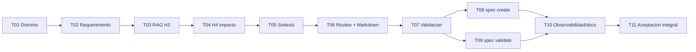

# H5 - SpecMode: Plan de tareas

## 1. Reglas

- Implementar tareas en orden.
- Cada tarea incluye pruebas y documentacion operativa cuando corresponda.
- Ninguna tarea debe implementar generacion automatica de codigo, agentes, API HTTP, UI, Qdrant ni base de grafos.
- Los comandos y errores de usuario se escriben en espanol.
- Cada tarea termina con verificaciones ejecutables.
- No concentrar todas las pruebas en la tarea final: cada incremento lleva pruebas propias.
- La aceptacion integral del hito aparece solo en la ultima tarea.

Estados iniciales: `pendiente`.

## 2. Tareas

### H5-T01 - Definir base de dominio y contratos Spec Mode

**Estado:** completado.  
**Objetivo:** crear modelos y contratos minimos para representar solicitudes, evidencia, draft de spec, Review, trazabilidad y errores de validacion.
**Descripcion:** Definir `SpecRequest`, `RequirementIntent`, `EvidenceItem`, `AffectedComponent`, `ExistingRule`, `SpecDraft`, `TraceLink`, `ReviewIssue` y `ValidationIssue` o equivalentes. Mantenerlos independientes de Typer/CLI y de detalles SQLite.
**Dependencias:** H4 aceptado.  
**Resultado esperado:** dominio H5 testeable, sin acceso a filesystem ni sintesis asistida, con IDs estables y clasificaciones `detectado`, `inferido`, `supuesto`, `por_confirmar`.
**Requisitos:** H5-RF-001, H5-RF-007, H5-RNF-004, H5-RNF-007.  
**Checkpoint:** `python -m pytest tests/unit/test_h5_domain.py`.

### H5-T02 - Implementar interpretacion inicial del requerimiento

**Estado:** completado.  
**Objetivo:** convertir el texto del usuario en una intencion estructurada y consultas candidatas.  
**Descripcion:** Conservar el texto original, extraer terminos, entidades, acciones, restricciones, supuestos y preguntas abiertas con reglas deterministas y sintesis asistida opcional.
**Dependencias:** H5-T01.  
**Resultado esperado:** un requerimiento ambiguo produce preguntas abiertas en vez de alcance inventado; un requerimiento concreto produce terminos de busqueda y entidades candidatas.  
**Requisitos:** H5-RF-002.  
**Checkpoint:** `python -m pytest tests/unit/test_h5_requirement_analyzer.py`.

### H5-T03 - Integrar recuperacion RAG H3 para evidencia documental

**Estado:** completado.  
**Objetivo:** recuperar chunks y documentos relevantes reutilizando H3.  
**Descripcion:** Invocar `SearchService`, `ContextBuilder` o contratos equivalentes con modo `keyword|semantic|hybrid`, `top-k`, filtros y presupuesto de contexto. Deduplicar fuentes y asignar IDs `[F#]`.  
**Dependencias:** H5-T02.  
**Resultado esperado:** EvidenceCollector devuelve evidencia documental ordenada, trazable y con aviso cuando no hay fuentes suficientes.  
**Requisitos:** H5-RF-003, H5-RNF-002, H5-RNF-010.  
**Checkpoint:** `python -m pytest tests/unit/test_h5_evidence_rag.py`.

### H5-T04 - Integrar simbolos, dependencias e impacto H4

**Estado:** completado.  
**Objetivo:** complementar la evidencia con catalogo tecnico, relaciones y componentes afectados.  
**Descripcion:** Resolver nombres contra H4, consultar dependencias con profundidad limitada, incorporar relaciones resolved/ambiguous/unresolved/dynamic y clasificar afectacion. No ejecutar `analyze` automaticamente.  
**Dependencias:** H5-T03.  
**Resultado esperado:** lista de componentes afectados con evidencia, limites aplicados y advertencias si el catalogo H4 no esta disponible o esta vacio.  
**Requisitos:** H5-RF-003, H5-RF-004.  
**Checkpoint:** `python -m pytest tests/unit/test_h5_h4_integration.py`.

### H5-T05 - Sintetizar reglas, riesgos, supuestos y preguntas abiertas

**Estado:** completado.  
**Objetivo:** construir contenido analitico de la spec sin inventar informacion.  
**Descripcion:** Generar reglas existentes, riesgos, dependencias tecnicas, supuestos, vacios y preguntas abiertas desde evidencia citada. La sintesis asistida es opcional; en modo `--no-llm`, producir sintesis conservadora.
**Dependencias:** H5-T04.  
**Resultado esperado:** `SpecDraft` contiene hallazgos clasificados y toda conclusion factual referencia fuentes existentes.  
**Requisitos:** H5-RF-005, H5-RNF-002, H5-RNF-005.  
**Checkpoint:** `python -m pytest tests/unit/test_h5_synthesis.py`.

### H5-T06 - Implementar Review y renderizar documentos Markdown H5

**Estado:** completado.  
**Objetivo:** revisar automaticamente `SpecDraft` y generar `requirements.md`, `design.md`, `tasks.md` y `test-plan.md` solo si el draft es consistente o degradable.
**Descripcion:** Implementar Review interno antes de Markdown y plantillas `spec.v1` con secciones obligatorias, Mermaid en diseno, tareas pequenas y una unica ultima tarea de aceptacion integral. Mantener estructura determinista.
**Dependencias:** H5-T05.  
**Resultado esperado:** Review detecta inconsistencias, evidencia insuficiente, tareas/pruebas sin requisito, citas invalidas y contradicciones; cuando procede, se generan cuatro documentos Markdown estables, editables y sin rutas personales, cubiertos por golden files.
**Requisitos:** H5-RF-006, H5-RF-009, H5-RNF-003, H5-RNF-004, H5-RNF-008.  
**Checkpoint:** `python -m pytest tests/unit/test_h5_review.py tests/golden/test_h5_markdown.py`.

### H5-T07 - Implementar validacion de estructura, IDs y citas

**Estado:** completado.  
**Objetivo:** detectar specs incompletas o sin trazabilidad antes de considerarlas generadas.  
**Descripcion:** Validar documentos renderizados requeridos, secciones, IDs duplicados, enlaces requisito-diseno-tarea-prueba, citas `[F#]`, conclusiones detectadas sin fuente y tarea final unica de aceptacion. Mantener coherencia con el Review interno, pero aplicado a archivos ya generados o editados.
**Dependencias:** H5-T06.  
**Resultado esperado:** `SpecValidator` devuelve errores y advertencias accionables en texto y JSON.  
**Requisitos:** H5-RF-006, H5-RF-007, H5-RF-008.  
**Checkpoint:** `python -m pytest tests/unit/test_h5_spec_validator.py`.

### H5-T08 - Exponer CLI `spec create` con escritura segura

**Estado:** completado.  
**Objetivo:** permitir generar una spec desde la CLI local.  
**Descripcion:** Agregar `barbarion spec create` con opciones `--name`, `--output`, `--mode`, `--depth`, `--top-k`, `--no-llm`, `--overwrite` y `--debug`. Validar rutas y no sobrescribir por defecto. Registrar artifact si el contrato existente lo permite.  
**Dependencias:** H5-T07.  
**Resultado esperado:** una ejecucion genera los cuatro archivos en ruta segura y muestra resumen con fuentes, advertencias y preguntas abiertas.  
**Requisitos:** H5-RF-001, H5-RF-009, H5-RF-010.  
**Checkpoint:** `python -m pytest tests/integration/test_h5_spec_create_cli.py`.

### H5-T09 - Exponer CLI `spec validate`

**Estado:** completado.
**Objetivo:** validar una spec existente desde la CLI.  
**Descripcion:** Agregar `barbarion spec validate RUTA [--strict] [--format text|json]` usando el mismo validador interno. Cubrir errores esperados, formato JSON y codigos de salida.  
**Dependencias:** H5-T07.  
**Resultado esperado:** el usuario puede verificar specs generadas o editadas manualmente sin regenerarlas.  
**Requisitos:** H5-RF-008, H5-RF-010.  
**Checkpoint:** `python -m pytest tests/integration/test_h5_spec_validate_cli.py`.

### H5-T10 - Completar observabilidad, errores y documentacion operativa

**Estado:** completado.
**Objetivo:** consolidar mensajes, progreso, logs y documentacion de uso de Spec Mode.  
**Descripcion:** Reportar etapas, conteos, limites, Review, sintesis asistida no disponible, evidencia insuficiente y sugerencias accionables. Actualizar README/docs de CLI solo si el flujo ya esta implementado.
**Dependencias:** H5-T08, H5-T09.  
**Resultado esperado:** usuario puede diagnosticar por que una spec quedo parcial o invalida, sin ver tracebacks en errores esperados.  
**Requisitos:** H5-RF-010, H5-RNF-001, H5-RNF-008, H5-RNF-009.  
**Checkpoint:** `python -m pytest tests/unit/test_h5_observability.py tests/unit/test_readme.py`.
**Observacion previa a H5-T11:** en el entorno Codex actual, el Python empaquetado no tiene `pytest` instalado y la venv local apunta a un interprete removido. Antes de la aceptacion integral se debe cerrar esta brecha con una venv editable funcional y `--basetemp .pytest-tmp/h5`.

### H5-T11 - Validacion y aceptacion integral H5

**Estado:** pendiente.  
**Objetivo:** ejecutar validacion final, spec piloto, evidencia, revision humana y aceptacion del hito.  
**Descripcion:** Ejecutar suite completa, smoke instalado, regresion H1-H4, generacion de spec piloto sobre caso autorizado, validacion de citas, revision humana, scan de datos sensibles y registro de limitaciones. Crear o actualizar `specs/H5-SpecMode/acceptance.md` solo durante esta tarea.  
**Dependencias:** H5-T01 a H5-T10.  
**Resultado esperado:** H5 queda aceptado o pendiente de feedback con evidencia concreta, sin distribuir aceptacion en tareas previas.  
**Requisitos:** H5-RF-011, H5-RNF-001, H5-RNF-002, H5-RNF-004, H5-RNF-005, H5-RNF-006, H5-RNF-008, H5-RNF-009.  
**Checkpoint:** `python -m pytest --basetemp .pytest-tmp/h5` y smoke CLI en venv editable.

## 3. Orden de implementacion

## 4. Trazabilidad de tareas

| Tarea | Requisitos |
|---|---|
| H5-T01 | H5-RF-001, H5-RF-007, H5-RNF-004, H5-RNF-007 |
| H5-T02 | H5-RF-002 |
| H5-T03 | H5-RF-003, H5-RNF-002, H5-RNF-010 |
| H5-T04 | H5-RF-003, H5-RF-004 |
| H5-T05 | H5-RF-005, H5-RNF-002, H5-RNF-005 |
| H5-T06 | H5-RF-006, H5-RF-009, H5-RNF-003, H5-RNF-004, H5-RNF-008 |
| H5-T07 | H5-RF-006, H5-RF-007, H5-RF-008 |
| H5-T08 | H5-RF-001, H5-RF-009, H5-RF-010 |
| H5-T09 | H5-RF-008, H5-RF-010 |
| H5-T10 | H5-RF-010, H5-RNF-001, H5-RNF-008, H5-RNF-009 |
| H5-T11 | H5-RF-011, H5-RNF-001, H5-RNF-002, H5-RNF-004, H5-RNF-005, H5-RNF-006, H5-RNF-008, H5-RNF-009 |

## 5. Evidencia que debe recopilar la ultima tarea

- commit o version evaluada;
- sistema operativo y Python;
- comando de instalacion editable;
- suite completa y duracion;
- smoke test instalado;
- comandos `spec create` y `spec validate`;
- spec piloto generada;
- resultado de Review automatico;
- validacion de estructura e IDs;
- validacion de citas `[F#]`;
- conteos de fuentes RAG, simbolos, relaciones y componentes afectados;
- evidencia insuficiente y preguntas abiertas registradas;
- salida con `--no-llm`;
- comportamiento con sintesis fake;
- no regresion de H1-H4;
- revision humana de utilidad y accionabilidad;
- falsos positivos, falsos negativos y limitaciones conocidas;
- confirmacion de privacidad y ausencia de datos sensibles versionados.
