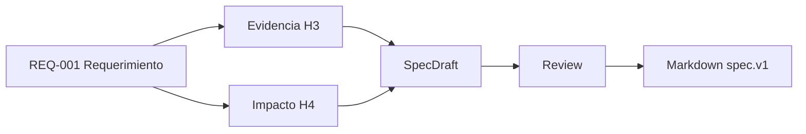

# Diseno - limite-credito

## Metadata
- generado_en: 2026-01-01T00:00:00+00:00
- template_version: spec.v1
- draft_id: aaaaaaaaaaaaaaaaaaaaaaaaaaaaaaaaaaaaaaaaaaaaaaaaaaaaaaaaaaaaaaaa

## Contexto
- requerimiento: Validar limite de credito antes de aprobar pedidos

## Arquitectura funcional
- Spec Mode coordina evidencia documental H3, impacto H4 y sintesis conservadora.

## Integracion con sistema existente
- `pkg_credito` rol=directo tecnologia=oracle clasificacion=detectado evidencia=[F111111111111]

## Flujo propuesto
1. Confirmar reglas existentes con evidencia citada.
2. Revisar componentes afectados y relaciones por confirmar.
3. Implementar el cambio manteniendo pruebas asociadas a REQ-001.

## Componentes afectados
- `pkg_credito` rol=directo tecnologia=oracle clasificacion=detectado evidencia=[F111111111111]

## Cambios propuestos
- REG-001 Evidencia documental indica validar relacionado con limite_credito: validar limite_credito antes de aprobar [F111111111111]

## Modelo de datos si aplica
- por confirmar durante diseno detallado

## CLI o interfaz si aplica
- por confirmar durante refinamiento

## Manejo de errores
- fallar con mensajes accionables en espanol para errores esperados

## Decisiones tecnicas
- sin decisiones tecnicas adicionales

## Riesgos y limites
- El impacto cruza tecnologia Oracle y requiere regresion.

## Diagramas Mermaid

## Evidencia
- [F111111111111] chunk: F1 sources/oracle/pkg_credito.sql; [F1] sources/oracle/pkg_credito.sql lineas=10-12
