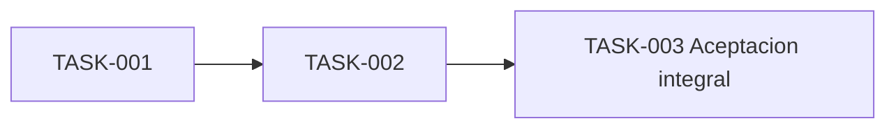

# Tareas - limite-credito

## Metadata
- generado_en: 2026-01-01T00:00:00+00:00
- template_version: spec.v1
- draft_id: aaaaaaaaaaaaaaaaaaaaaaaaaaaaaaaaaaaaaaaaaaaaaaaaaaaaaaaaaaaaaaaa

## Reglas
- implementar tareas en orden
- no generar codigo automaticamente fuera del alcance de la spec
- mantener trazabilidad con REQ-001

## Tareas implementables
### TASK-001 - Analizar alcance detallado
**Objetivo:** confirmar alcance y evidencia de REQ-001.
**Descripcion:** revisar reglas, componentes afectados, riesgos y preguntas abiertas.
**Dependencias:** ninguna.
**Resultado esperado:** alcance confirmado o vacios documentados.
**Requisito:** REQ-001.

### TASK-002 - Implementar cambio funcional
**Objetivo:** aplicar el cambio de REQ-001.
**Descripcion:** modificar solo los componentes confirmados y conservar trazabilidad.
**Dependencias:** TASK-001.
**Resultado esperado:** cambio implementado con pruebas unitarias o de integracion.
**Requisito:** REQ-001.

### TASK-003 - Validacion y aceptacion integral
**Objetivo:** ejecutar validacion final de REQ-001.
**Descripcion:** correr pruebas, revisar evidencia, validar regresion y registrar aceptacion humana.
**Dependencias:** TASK-002.
**Resultado esperado:** spec lista para aceptacion o feedback documentado.
**Requisito:** REQ-001.

## Orden de ejecucion

## Trazabilidad
| Tarea | Requisito | Prueba |
|---|---|---|
| TASK-001 | REQ-001 | TEST-001 |
| TASK-002 | REQ-001 | TEST-002 |
| TASK-003 | REQ-001 | TEST-003 |

## Ultima tarea de validacion y aceptacion integral
- TASK-003 concentra la aceptacion integral.
